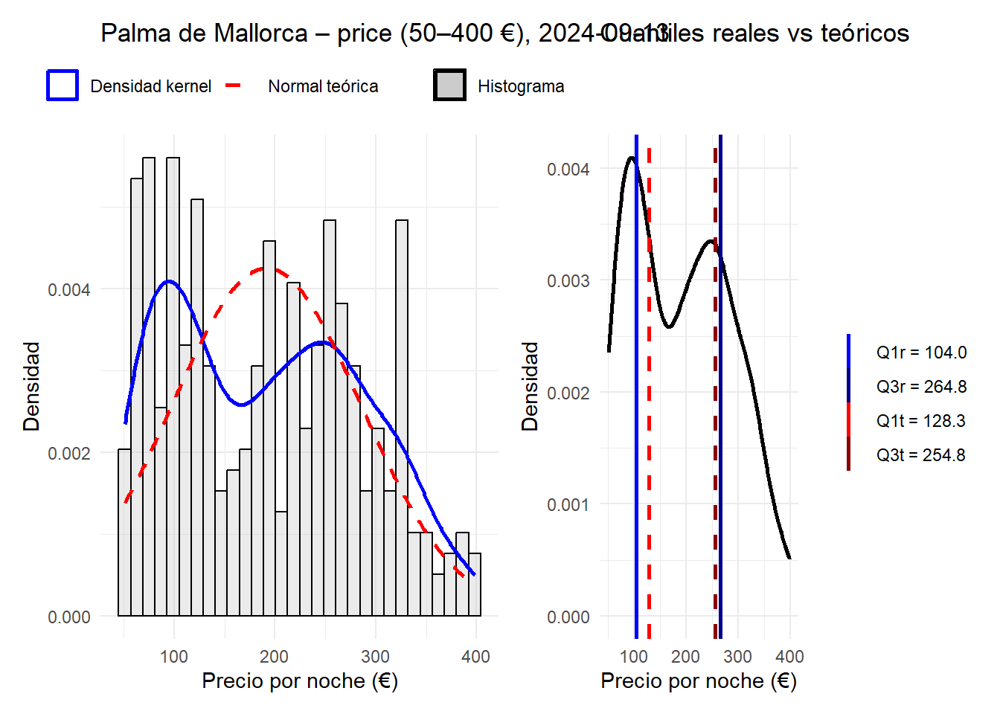
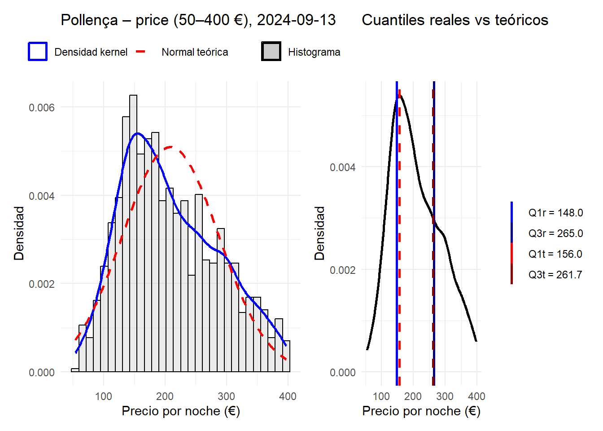
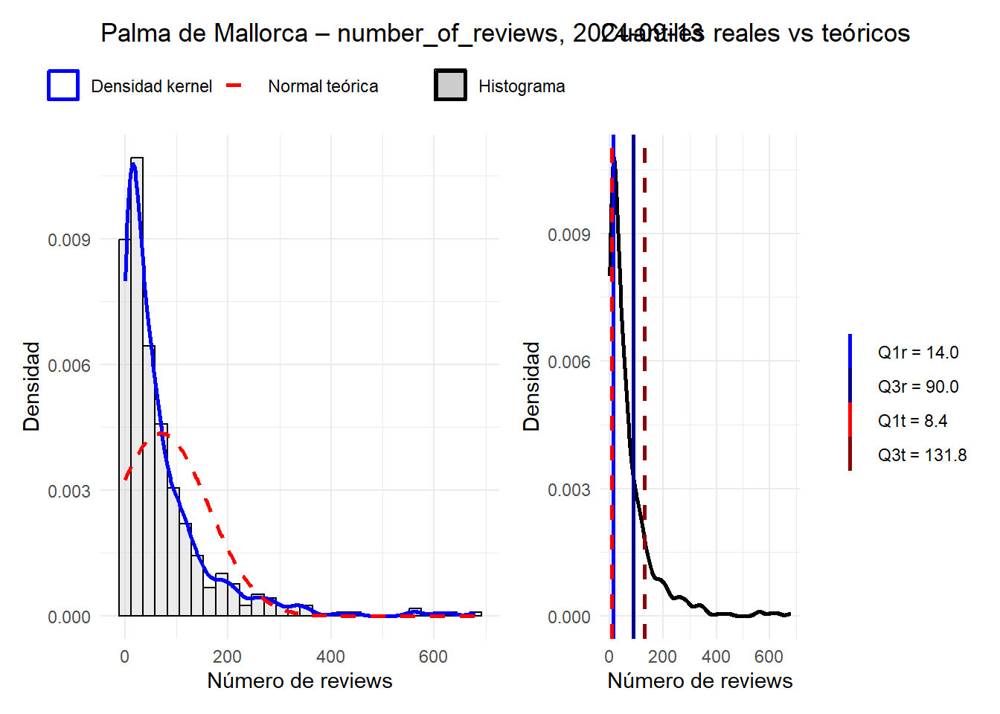
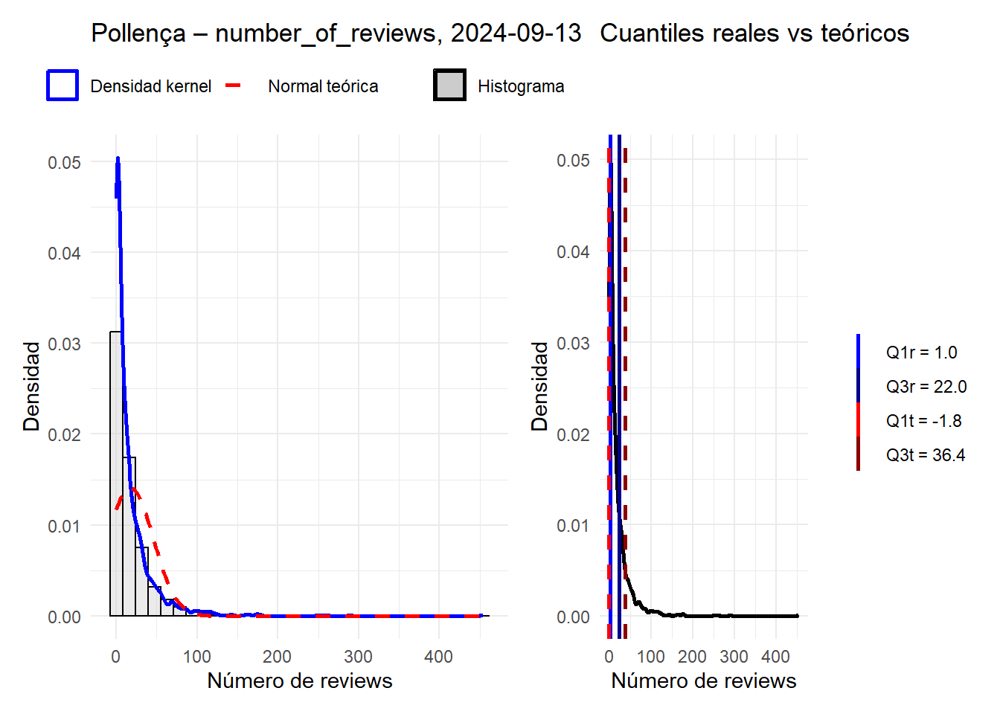
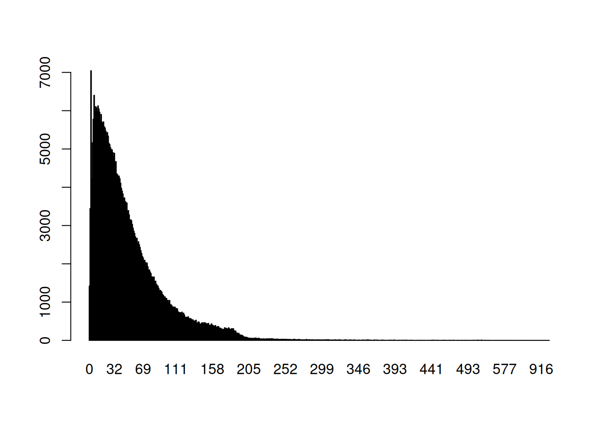
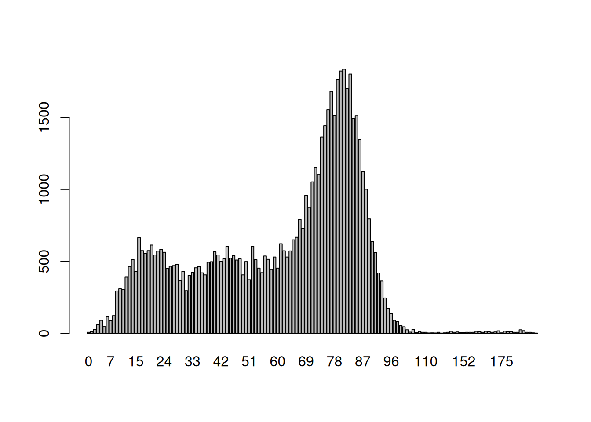

# Instrucciones para el taller

Se entrega en grupos que deben de estar constituidos en la actividad de grupos. Los grupos son de 2 o 3 ESTUDIANTES, loa caso especiales consultadlos con el profesor para que los autorice.

**Enlaces y Bibliografía**

-   [R for data science, Hadley Wickham, Garret Grolemund.](https://r4ds.had.co.nz/)
-   [Fundamentos de ciencia de datos con R.](https://cdr-book.github.io/)
-   [Tablas avanzadas: kable, KableExtra.](https://haozhu233.github.io/kableExtra/awesome_table_in_html.html)
-   [Geocomputation with R, Robin Lovelace, Jakub Nowosad, Jannes Muenchow](https://r.geocompx.org/)
-   Apuntes de R-basico y tidyverse moodel MAT3.

## Objetivo MALLORCA

Leeremos los siguientes datos de la zona de etiqueta `mallorca` con el código siguiente:


::: {.cell}

```{.r .cell-code}
load("clean_data/mallorca/listing_common0.RData")
ls()
```

::: {.cell-output .cell-output-stdout}

```
[1] "listings_common0"
```


:::

```{.r .cell-code}
listings0 = listings_common0 %>%
  select(id, scrape_id, listing_url,
         neighbourhood_cleansed, price,
         number_of_reviews,
         review_scores_rating,
         review_scores_rating,
         review_scores_cleanliness,
         review_scores_location,
         review_scores_value,
         number_of_reviews,
         accommodates,
         bathrooms_text,
         bedrooms,
         beds,
         minimum_nights,
         description,
         latitude,
         longitude,
         property_type,
         room_type)
```
:::


**listings**

Generamos la  tibble `listings0` con datos DE  8 periodos  DE  apartamentos de inside Airbnb de Mallorca Y  seleccionando cuantas variables nos parecen más interesantes.

Separararemos la fecha del scrapping que es en la que se observaron  los datos de cada apartamento  nos quedaremos con los apartamentos que aparecen en las 8 periodos "scrapeados".


::: {.cell}

```{.r .cell-code}
listings0= listings0 %>% 
  mutate(date=as.Date(substr(
    as.character(scrape_id),1,8),
    format="%Y%m%d"),
    .after=id)
```
:::


Ahora  analizamos  las fechas de los scrapings y el número de veces que aparecen 
 cada  apartamentos.


::: {.cell}

```{.r .cell-code}
table(listings0$date)
```

::: {.cell-output .cell-output-stdout}

```

2023-12-17 2024-03-23 2024-06-19 2024-09-13 2024-12-14 2025-03-07 2025-06-15 
      9197       9197       9197       9197       9197       9197       9197 
2025-09-21 
      9197 
```


:::
:::


Hay 8 periodos de scrapping y vamos a quedarnos con los apartamentos que aparecen en todos los periodos


Vemos que cada apartamento aparece 8 veces una por periodo.


::: {.cell}

```{.r .cell-code}
table(table(listings0$id))
```

::: {.cell-output .cell-output-stdout}

```

   8 
9197 
```


:::
:::


Notemos que cada apartamento:

-   queda identificado por id y por date que nos da el periodo en la que apareció el dato.
-   así que cada apartamento aparece 8 veces ya que hemos elegido solo los apartamentos que aparecen en las 8 muestras.
-   Las muestras son 2023-12-17, 2024-03-23, 2024-06-19, 2024-09-13, 2024-12-14, 2025-03-07, 2025-06-15, 2025-09-21,


::: {.cell}

```{.r .cell-code}
unique(listings0$date)
```

::: {.cell-output .cell-output-stdout}

```
[1] "2023-12-17" "2024-03-23" "2024-06-19" "2024-09-13" "2024-12-14"
[6] "2025-03-07" "2025-06-15" "2025-09-21"
```


:::
:::


**reviews**

Estos datos necesitan leerse de forma adecuada, las columnas 1, 2 y 4 deben ser de tipo `character` las otras son correctas


::: {.cell}

```{.r .cell-code}
reviews=read_csv("data/mallorca/2025-09-21/reviews.csv.gz")
str(reviews)
```

::: {.cell-output .cell-output-stdout}

```
spc_tbl_ [398,782 × 6] (S3: spec_tbl_df/tbl_df/tbl/data.frame)
 $ listing_id   : num [1:398782] 69998 69998 69998 69998 69998 ...
 $ id           : num [1:398782] 881474 4007103 4170371 4408459 4485779 ...
 $ date         : Date[1:398782], format: "2012-01-24" "2013-04-02" ...
 $ reviewer_id  : num [1:398782] 1595616 3868130 5730759 5921885 810469 ...
 $ reviewer_name: chr [1:398782] "Jean-Pierre" "Jo And Mike" "Elizabeth" "Jone" ...
 $ comments     : chr [1:398782] "This place was charming! Lorenzo himself is a very warm and engaging host and made us feel very welcome. \r<br/"| __truncated__ "We had a four night stay at this gorgeous apartment and it was absolutely perfect. It's really pretty, beautifu"| __truncated__ "Lor's apartment looks exactly like the pictures! It is perfectly located for historic Palma - close to the Cath"| __truncated__ "Wonderful place! 10/10. Charming, spacious and comfortable. Looks even more splendid than in the pictures. The "| __truncated__ ...
 - attr(*, "spec")=
  .. cols(
  ..   listing_id = col_double(),
  ..   id = col_double(),
  ..   date = col_date(format = ""),
  ..   reviewer_id = col_double(),
  ..   reviewer_name = col_character(),
  ..   comments = col_character()
  .. )
 - attr(*, "problems")=<externalptr> 
```


:::

```{.r .cell-code}
head(reviews)
```

::: {.cell-output .cell-output-stdout}

```
# A tibble: 6 × 6
  listing_id      id date       reviewer_id reviewer_name comments              
       <dbl>   <dbl> <date>           <dbl> <chr>         <chr>                 
1      69998  881474 2012-01-24     1595616 Jean-Pierre   "This place was charm…
2      69998 4007103 2013-04-02     3868130 Jo And Mike   "We had a four night …
3      69998 4170371 2013-04-15     5730759 Elizabeth     "Lor's apartment look…
4      69998 4408459 2013-05-03     5921885 Jone          "Wonderful place! 10/…
5      69998 4485779 2013-05-07      810469 Andrea        "My boyfriend and I, …
6      69998 4619699 2013-05-15     3318059 Devii         "We had a very last m…
```


:::
:::


**neighbourhoods.csv**

Son dos columnas y la primera es una agrupación de municipios (están NA) y la segunda es el nombre del municipio


::: {.cell}

```{.r .cell-code}
municipios=read_csv("data/mallorca/2025-09-21/neighbourhoods.csv")
str(municipios)
```

::: {.cell-output .cell-output-stdout}

```
spc_tbl_ [53 × 2] (S3: spec_tbl_df/tbl_df/tbl/data.frame)
 $ neighbourhood_group: logi [1:53] NA NA NA NA NA NA ...
 $ neighbourhood      : chr [1:53] "Alaró" "Alcúdia" "Algaida" "Andratx" ...
 - attr(*, "spec")=
  .. cols(
  ..   neighbourhood_group = col_logical(),
  ..   neighbourhood = col_character()
  .. )
 - attr(*, "problems")=<externalptr> 
```


:::

```{.r .cell-code}
head(municipios)
```

::: {.cell-output .cell-output-stdout}

```
# A tibble: 6 × 2
  neighbourhood_group neighbourhood
  <lgl>               <chr>        
1 NA                  Alaró        
2 NA                  Alcúdia      
3 NA                  Algaida      
4 NA                  Andratx      
5 NA                  Ariany       
6 NA                  Artà         
```


:::
:::


**neighbourhoods.geojson**

Es el mapa de Mallorca, o podemos leer así:


::: {.cell}

```{.r .cell-code}
library(sf)
library(tmap)

# Leer el archivo GeoJSON
geojson_sf <- sf::st_read("data/mallorca/2025-09-21/neighbourhoods.geojson")
```

::: {.cell-output .cell-output-stdout}

```
Reading layer `neighbourhoods' from data source 
  `C:\Users\Bruno\OneDrive\Escritorio\Algoritmos_Punteros\taller1_algoritmia\tallerMat3_25_26\data\mallorca\2025-09-21\neighbourhoods.geojson' 
  using driver `GeoJSON'
Simple feature collection with 53 features and 2 fields
Geometry type: MULTIPOLYGON
Dimension:     XY
Bounding box:  xmin: 2.303195 ymin: 39.26403 xmax: 3.479028 ymax: 39.96236
Geodetic CRS:  WGS 84
```


:::

```{.r .cell-code}
# Crear un mapa

# interactivo
tmap_mode("plot") # Cambiar a modo  view/plot   que es interactivo/estático
tm_shape(geojson_sf) +
  tm_polygons(col = "cyan", alpha = 0.6) +
  tm_layout(title = "Mapa - GeoJSON Mallorca con municipios")
```

::: {.cell-output-display}
{width=672}
:::
:::


Tenéis que consultar en la documentación de inside Airbnb para saber que significa cada variable. Os puede ser útil leer los ficheros [DATA_ABB_modelo_de_datos.html](DATA_ABB_modelo_de_datos.html) y [DATA_ABB_modelo_de_datos.pdf](DATA_ABB_modelo_de_datos.html) en los que se explica el modelo de datos de inside Airbnb y como se cargan en el espacio de trabajo.

Responder las siguientes preguntas con formato Rmarkdown (.Rmd) o quarto (.qmd) y entregad la fuente un fichero en formato html como salida del informe. Se puntúa la claridad de la respuesta, la calidad de la redacción y la corrección de la respuesta.

## Pregunta 1 (**1punto**)

Del fichero con los datos de listings `listings0` calcula los estadísticos descriptivos de las variable `price` y de la variable `number_of_reviews` agrupados por municipio y por periodo.

Presenta los resultados con una tabla de kableExtra.


::: {.cell}

```{.r .cell-code}
# ---------------------------------------------------------------
# PREGUNTA 1
# Estadísticos descriptivos de:
#   - price
#   - number_of_reviews
# agrupados por:
#   - municipio (neighbourhood_cleansed)
#   - periodo (date)
# Tabla de salida con kableExtra
# ---------------------------------------------------------------

# IMPORTANTE:
# Aquí asumimos que:
#  - listings0 ya está creado según el enunciado
#  - listings0 tiene la columna 'date'
#  - 'price' es numérica (si no lo es, habría que convertirla en otro chunk)
library(dplyr)
library(kableExtra)

# 1. Calcular los estadísticos descriptivos por municipio y periodo.
#    group_by(): forma grupos por municipio y fecha de scraping
#    summarise(): calcula los resúmenes para cada grupo
resumen_p1 <- listings0 %>%
  group_by(neighbourhood_cleansed, date) %>%
  summarise(
    # Tamaño de muestra en cada grupo
    n = n(),
    
    # ---- Estadísticos para 'price' ----
    mean_price = mean(price, na.rm = TRUE),              # media
    sd_price   = sd(price, na.rm = TRUE),                # desviación estándar
    min_price  = min(price, na.rm = TRUE),               # mínimo
    q1_price   = quantile(price, 0.25, na.rm = TRUE),    # cuartil 1
    med_price  = median(price, na.rm = TRUE),            # mediana
    q3_price   = quantile(price, 0.75, na.rm = TRUE),    # cuartil 3
    max_price  = max(price, na.rm = TRUE),               # máximo
    
    # ---- Estadísticos para 'number_of_reviews' ----
    mean_reviews = mean(number_of_reviews, na.rm = TRUE),   # media
    sd_reviews   = sd(number_of_reviews, na.rm = TRUE),     # desviación estándar
    med_reviews  = median(number_of_reviews, na.rm = TRUE), # mediana
    
    # Indicar a dplyr que "desagrupe" al terminar
    .groups = "drop"
  )

# (Opcional) ver una muestra de la tabla en la consola
# head(resumen_p1)

# 2. Ordenar y mostrar la tabla con kableExtra


# Opcional: que los NA aparezcan como vacío en la tabla
options(knitr.kable.NA = "")

tabla_p1 <- resumen_p1 %>%
  arrange(neighbourhood_cleansed, date) %>%              # ordenar municipio/fecha
  mutate(across(where(is.numeric), ~ round(., 2)))       # redondear numéricos

tabla_p1 %>%
  kbl(
    caption = "Estadísticos descriptivos de price y number_of_reviews por municipio y periodo",
    col.names = c(
      "Municipio", "Periodo", "n",
      "Media", "SD", "Mín.", "Q1", "Mediana", "Q3", "Máx.",
      "Media", "SD", "Mediana"
    ),
    align    = c("l", "c", "r", rep("r", 10)),           # alineación columnas
    booktabs = TRUE
  ) %>%
  # Cabeceras agrupadas: primeras 3 columnas sin grupo,
  # luego 7 para price y 3 para number_of_reviews
  add_header_above(c(" " = 3, "Price" = 7, "Number of reviews" = 3)) %>%
  kable_styling(
    full_width        = FALSE,
    bootstrap_options = c("striped", "hover", "condensed", "responsive")
  ) %>%
  column_spec(1, bold = TRUE) %>%                        # municipio en negrita
  collapse_rows(columns = 1, valign = "top")             # unir filas por municipio
```

::: {.cell-output-display}

`````{=html}
<table class="table table-striped table-hover table-condensed table-responsive" style="width: auto !important; margin-left: auto; margin-right: auto;">
<caption>Estadísticos descriptivos de price y number_of_reviews por municipio y periodo</caption>
 <thead>
<tr>
<th style="empty-cells: hide;border-bottom:hidden;" colspan="3"></th>
<th style="border-bottom:hidden;padding-bottom:0; padding-left:3px;padding-right:3px;text-align: center; " colspan="7"><div style="border-bottom: 1px solid #ddd; padding-bottom: 5px; ">Price</div></th>
<th style="border-bottom:hidden;padding-bottom:0; padding-left:3px;padding-right:3px;text-align: center; " colspan="3"><div style="border-bottom: 1px solid #ddd; padding-bottom: 5px; ">Number of reviews</div></th>
</tr>
  <tr>
   <th style="text-align:left;"> Municipio </th>
   <th style="text-align:center;"> Periodo </th>
   <th style="text-align:right;"> n </th>
   <th style="text-align:right;"> Media </th>
   <th style="text-align:right;"> SD </th>
   <th style="text-align:right;"> Mín. </th>
   <th style="text-align:right;"> Q1 </th>
   <th style="text-align:right;"> Mediana </th>
   <th style="text-align:right;"> Q3 </th>
   <th style="text-align:right;"> Máx. </th>
   <th style="text-align:right;"> Media </th>
   <th style="text-align:right;"> SD </th>
   <th style="text-align:right;"> Mediana </th>
  </tr>
 </thead>
<tbody>
  <tr>
   <td style="text-align:left;font-weight: bold;vertical-align: top !important;" rowspan="8"> Alaró </td>
   <td style="text-align:center;"> 2023-12-17 </td>
   <td style="text-align:right;"> 62 </td>
   <td style="text-align:right;"> 425.23 </td>
   <td style="text-align:right;"> 884.07 </td>
   <td style="text-align:right;"> 60 </td>
   <td style="text-align:right;"> 138.50 </td>
   <td style="text-align:right;"> 194.0 </td>
   <td style="text-align:right;"> 335.25 </td>
   <td style="text-align:right;"> 5000 </td>
   <td style="text-align:right;"> 39.11 </td>
   <td style="text-align:right;"> 65.62 </td>
   <td style="text-align:right;"> 19.5 </td>
  </tr>
  <tr>
   
   <td style="text-align:center;"> 2024-03-23 </td>
   <td style="text-align:right;"> 62 </td>
   <td style="text-align:right;"> 400.15 </td>
   <td style="text-align:right;"> 771.30 </td>
   <td style="text-align:right;"> 67 </td>
   <td style="text-align:right;"> 150.00 </td>
   <td style="text-align:right;"> 187.5 </td>
   <td style="text-align:right;"> 313.00 </td>
   <td style="text-align:right;"> 5000 </td>
   <td style="text-align:right;"> 39.95 </td>
   <td style="text-align:right;"> 68.46 </td>
   <td style="text-align:right;"> 20.0 </td>
  </tr>
  <tr>
   
   <td style="text-align:center;"> 2024-06-19 </td>
   <td style="text-align:right;"> 63 </td>
   <td style="text-align:right;"> 439.57 </td>
   <td style="text-align:right;"> 831.16 </td>
   <td style="text-align:right;"> 70 </td>
   <td style="text-align:right;"> 165.00 </td>
   <td style="text-align:right;"> 221.0 </td>
   <td style="text-align:right;"> 347.00 </td>
   <td style="text-align:right;"> 5000 </td>
   <td style="text-align:right;"> 41.92 </td>
   <td style="text-align:right;"> 71.49 </td>
   <td style="text-align:right;"> 20.0 </td>
  </tr>
  <tr>
   
   <td style="text-align:center;"> 2024-09-13 </td>
   <td style="text-align:right;"> 62 </td>
   <td style="text-align:right;"> 599.92 </td>
   <td style="text-align:right;"> 1496.86 </td>
   <td style="text-align:right;"> 70 </td>
   <td style="text-align:right;"> 175.00 </td>
   <td style="text-align:right;"> 220.0 </td>
   <td style="text-align:right;"> 361.00 </td>
   <td style="text-align:right;"> 9999 </td>
   <td style="text-align:right;"> 46.32 </td>
   <td style="text-align:right;"> 75.31 </td>
   <td style="text-align:right;"> 22.5 </td>
  </tr>
  <tr>
   
   <td style="text-align:center;"> 2024-12-14 </td>
   <td style="text-align:right;"> 62 </td>
   <td style="text-align:right;"> 567.16 </td>
   <td style="text-align:right;"> 1487.23 </td>
   <td style="text-align:right;"> 56 </td>
   <td style="text-align:right;"> 130.00 </td>
   <td style="text-align:right;"> 206.0 </td>
   <td style="text-align:right;"> 347.00 </td>
   <td style="text-align:right;"> 9999 </td>
   <td style="text-align:right;"> 48.82 </td>
   <td style="text-align:right;"> 78.39 </td>
   <td style="text-align:right;"> 25.0 </td>
  </tr>
  <tr>
   
   <td style="text-align:center;"> 2025-03-07 </td>
   <td style="text-align:right;"> 62 </td>
   <td style="text-align:right;"> 537.38 </td>
   <td style="text-align:right;"> 1321.93 </td>
   <td style="text-align:right;"> 64 </td>
   <td style="text-align:right;"> 160.00 </td>
   <td style="text-align:right;"> 220.0 </td>
   <td style="text-align:right;"> 366.00 </td>
   <td style="text-align:right;"> 9000 </td>
   <td style="text-align:right;"> 49.56 </td>
   <td style="text-align:right;"> 80.49 </td>
   <td style="text-align:right;"> 25.0 </td>
  </tr>
  <tr>
   
   <td style="text-align:center;"> 2025-06-15 </td>
   <td style="text-align:right;"> 62 </td>
   <td style="text-align:right;"> 724.13 </td>
   <td style="text-align:right;"> 1795.41 </td>
   <td style="text-align:right;"> 67 </td>
   <td style="text-align:right;"> 180.00 </td>
   <td style="text-align:right;"> 231.5 </td>
   <td style="text-align:right;"> 390.75 </td>
   <td style="text-align:right;"> 9999 </td>
   <td style="text-align:right;"> 52.89 </td>
   <td style="text-align:right;"> 83.90 </td>
   <td style="text-align:right;"> 29.0 </td>
  </tr>
  <tr>
   
   <td style="text-align:center;"> 2025-09-21 </td>
   <td style="text-align:right;"> 62 </td>
   <td style="text-align:right;"> 851.35 </td>
   <td style="text-align:right;"> 2020.01 </td>
   <td style="text-align:right;"> 67 </td>
   <td style="text-align:right;"> 180.00 </td>
   <td style="text-align:right;"> 253.5 </td>
   <td style="text-align:right;"> 406.00 </td>
   <td style="text-align:right;"> 9999 </td>
   <td style="text-align:right;"> 56.24 </td>
   <td style="text-align:right;"> 85.96 </td>
   <td style="text-align:right;"> 33.0 </td>
  </tr>
  <tr>
   <td style="text-align:left;font-weight: bold;vertical-align: top !important;" rowspan="8"> Alcúdia </td>
   <td style="text-align:center;"> 2023-12-17 </td>
   <td style="text-align:right;"> 956 </td>
   <td style="text-align:right;"> 210.38 </td>
   <td style="text-align:right;"> 164.43 </td>
   <td style="text-align:right;"> 34 </td>
   <td style="text-align:right;"> 114.00 </td>
   <td style="text-align:right;"> 169.0 </td>
   <td style="text-align:right;"> 251.00 </td>
   <td style="text-align:right;"> 1758 </td>
   <td style="text-align:right;"> 20.68 </td>
   <td style="text-align:right;"> 33.54 </td>
   <td style="text-align:right;"> 10.0 </td>
  </tr>
  <tr>
   
   <td style="text-align:center;"> 2024-03-23 </td>
   <td style="text-align:right;"> 955 </td>
   <td style="text-align:right;"> 209.82 </td>
   <td style="text-align:right;"> 170.98 </td>
   <td style="text-align:right;"> 34 </td>
   <td style="text-align:right;"> 119.00 </td>
   <td style="text-align:right;"> 166.0 </td>
   <td style="text-align:right;"> 239.50 </td>
   <td style="text-align:right;"> 1758 </td>
   <td style="text-align:right;"> 21.36 </td>
   <td style="text-align:right;"> 34.50 </td>
   <td style="text-align:right;"> 10.0 </td>
  </tr>
  <tr>
   
   <td style="text-align:center;"> 2024-06-19 </td>
   <td style="text-align:right;"> 955 </td>
   <td style="text-align:right;"> 272.23 </td>
   <td style="text-align:right;"> 196.04 </td>
   <td style="text-align:right;"> 47 </td>
   <td style="text-align:right;"> 157.00 </td>
   <td style="text-align:right;"> 219.0 </td>
   <td style="text-align:right;"> 329.00 </td>
   <td style="text-align:right;"> 1658 </td>
   <td style="text-align:right;"> 23.73 </td>
   <td style="text-align:right;"> 37.38 </td>
   <td style="text-align:right;"> 11.0 </td>
  </tr>
  <tr>
   
   <td style="text-align:center;"> 2024-09-13 </td>
   <td style="text-align:right;"> 955 </td>
   <td style="text-align:right;"> 284.61 </td>
   <td style="text-align:right;"> 485.23 </td>
   <td style="text-align:right;"> 47 </td>
   <td style="text-align:right;"> 156.00 </td>
   <td style="text-align:right;"> 219.5 </td>
   <td style="text-align:right;"> 322.75 </td>
   <td style="text-align:right;"> 9999 </td>
   <td style="text-align:right;"> 26.21 </td>
   <td style="text-align:right;"> 39.91 </td>
   <td style="text-align:right;"> 13.0 </td>
  </tr>
  <tr>
   
   <td style="text-align:center;"> 2024-12-14 </td>
   <td style="text-align:right;"> 953 </td>
   <td style="text-align:right;"> 259.89 </td>
   <td style="text-align:right;"> 583.91 </td>
   <td style="text-align:right;"> 10 </td>
   <td style="text-align:right;"> 117.00 </td>
   <td style="text-align:right;"> 178.0 </td>
   <td style="text-align:right;"> 260.00 </td>
   <td style="text-align:right;"> 9999 </td>
   <td style="text-align:right;"> 28.24 </td>
   <td style="text-align:right;"> 42.38 </td>
   <td style="text-align:right;"> 15.0 </td>
  </tr>
  <tr>
   
   <td style="text-align:center;"> 2025-03-07 </td>
   <td style="text-align:right;"> 955 </td>
   <td style="text-align:right;"> 753.86 </td>
   <td style="text-align:right;"> 2151.10 </td>
   <td style="text-align:right;"> 42 </td>
   <td style="text-align:right;"> 127.00 </td>
   <td style="text-align:right;"> 186.0 </td>
   <td style="text-align:right;"> 300.00 </td>
   <td style="text-align:right;"> 10000 </td>
   <td style="text-align:right;"> 28.69 </td>
   <td style="text-align:right;"> 43.02 </td>
   <td style="text-align:right;"> 15.0 </td>
  </tr>
  <tr>
   
   <td style="text-align:center;"> 2025-06-15 </td>
   <td style="text-align:right;"> 955 </td>
   <td style="text-align:right;"> 909.07 </td>
   <td style="text-align:right;"> 2309.24 </td>
   <td style="text-align:right;"> 50 </td>
   <td style="text-align:right;"> 175.00 </td>
   <td style="text-align:right;"> 249.0 </td>
   <td style="text-align:right;"> 397.50 </td>
   <td style="text-align:right;"> 10000 </td>
   <td style="text-align:right;"> 31.45 </td>
   <td style="text-align:right;"> 46.42 </td>
   <td style="text-align:right;"> 17.0 </td>
  </tr>
  <tr>
   
   <td style="text-align:center;"> 2025-09-21 </td>
   <td style="text-align:right;"> 955 </td>
   <td style="text-align:right;"> 816.68 </td>
   <td style="text-align:right;"> 2158.36 </td>
   <td style="text-align:right;"> 58 </td>
   <td style="text-align:right;"> 169.00 </td>
   <td style="text-align:right;"> 242.0 </td>
   <td style="text-align:right;"> 381.00 </td>
   <td style="text-align:right;"> 10053 </td>
   <td style="text-align:right;"> 34.00 </td>
   <td style="text-align:right;"> 49.41 </td>
   <td style="text-align:right;"> 19.0 </td>
  </tr>
  <tr>
   <td style="text-align:left;font-weight: bold;vertical-align: top !important;" rowspan="8"> Algaida </td>
   <td style="text-align:center;"> 2023-12-17 </td>
   <td style="text-align:right;"> 61 </td>
   <td style="text-align:right;"> 279.00 </td>
   <td style="text-align:right;"> 402.79 </td>
   <td style="text-align:right;"> 70 </td>
   <td style="text-align:right;"> 145.75 </td>
   <td style="text-align:right;"> 187.0 </td>
   <td style="text-align:right;"> 295.25 </td>
   <td style="text-align:right;"> 3125 </td>
   <td style="text-align:right;"> 22.89 </td>
   <td style="text-align:right;"> 33.27 </td>
   <td style="text-align:right;"> 11.0 </td>
  </tr>
  <tr>
   
   <td style="text-align:center;"> 2024-03-23 </td>
   <td style="text-align:right;"> 61 </td>
   <td style="text-align:right;"> 255.95 </td>
   <td style="text-align:right;"> 261.49 </td>
   <td style="text-align:right;"> 77 </td>
   <td style="text-align:right;"> 141.00 </td>
   <td style="text-align:right;"> 187.0 </td>
   <td style="text-align:right;"> 297.00 </td>
   <td style="text-align:right;"> 1994 </td>
   <td style="text-align:right;"> 23.11 </td>
   <td style="text-align:right;"> 33.68 </td>
   <td style="text-align:right;"> 11.0 </td>
  </tr>
  <tr>
   
   <td style="text-align:center;"> 2024-06-19 </td>
   <td style="text-align:right;"> 60 </td>
   <td style="text-align:right;"> 313.19 </td>
   <td style="text-align:right;"> 397.38 </td>
   <td style="text-align:right;"> 108 </td>
   <td style="text-align:right;"> 177.50 </td>
   <td style="text-align:right;"> 232.5 </td>
   <td style="text-align:right;"> 311.25 </td>
   <td style="text-align:right;"> 3085 </td>
   <td style="text-align:right;"> 25.17 </td>
   <td style="text-align:right;"> 35.61 </td>
   <td style="text-align:right;"> 12.5 </td>
  </tr>
  <tr>
   
   <td style="text-align:center;"> 2024-09-13 </td>
   <td style="text-align:right;"> 60 </td>
   <td style="text-align:right;"> 310.71 </td>
   <td style="text-align:right;"> 403.79 </td>
   <td style="text-align:right;"> 108 </td>
   <td style="text-align:right;"> 165.00 </td>
   <td style="text-align:right;"> 224.5 </td>
   <td style="text-align:right;"> 300.00 </td>
   <td style="text-align:right;"> 3125 </td>
   <td style="text-align:right;"> 27.45 </td>
   <td style="text-align:right;"> 36.98 </td>
   <td style="text-align:right;"> 14.0 </td>
  </tr>
  <tr>
   
   <td style="text-align:center;"> 2024-12-14 </td>
   <td style="text-align:right;"> 60 </td>
   <td style="text-align:right;"> 300.39 </td>
   <td style="text-align:right;"> 301.83 </td>
   <td style="text-align:right;"> 77 </td>
   <td style="text-align:right;"> 151.50 </td>
   <td style="text-align:right;"> 203.0 </td>
   <td style="text-align:right;"> 335.00 </td>
   <td style="text-align:right;"> 2188 </td>
   <td style="text-align:right;"> 28.92 </td>
   <td style="text-align:right;"> 38.31 </td>
   <td style="text-align:right;"> 14.0 </td>
  </tr>
  <tr>
   
   <td style="text-align:center;"> 2025-03-07 </td>
   <td style="text-align:right;"> 60 </td>
   <td style="text-align:right;"> 1372.37 </td>
   <td style="text-align:right;"> 3014.46 </td>
   <td style="text-align:right;"> 89 </td>
   <td style="text-align:right;"> 152.25 </td>
   <td style="text-align:right;"> 240.0 </td>
   <td style="text-align:right;"> 423.50 </td>
   <td style="text-align:right;"> 10000 </td>
   <td style="text-align:right;"> 29.18 </td>
   <td style="text-align:right;"> 38.94 </td>
   <td style="text-align:right;"> 14.0 </td>
  </tr>
  <tr>
   
   <td style="text-align:center;"> 2025-06-15 </td>
   <td style="text-align:right;"> 60 </td>
   <td style="text-align:right;"> 1536.37 </td>
   <td style="text-align:right;"> 3190.42 </td>
   <td style="text-align:right;"> 110 </td>
   <td style="text-align:right;"> 191.25 </td>
   <td style="text-align:right;"> 232.0 </td>
   <td style="text-align:right;"> 447.00 </td>
   <td style="text-align:right;"> 10000 </td>
   <td style="text-align:right;"> 31.13 </td>
   <td style="text-align:right;"> 40.88 </td>
   <td style="text-align:right;"> 17.5 </td>
  </tr>
  <tr>
   
   <td style="text-align:center;"> 2025-09-21 </td>
   <td style="text-align:right;"> 60 </td>
   <td style="text-align:right;"> 1380.87 </td>
   <td style="text-align:right;"> 2952.53 </td>
   <td style="text-align:right;"> 118 </td>
   <td style="text-align:right;"> 190.75 </td>
   <td style="text-align:right;"> 233.0 </td>
   <td style="text-align:right;"> 454.75 </td>
   <td style="text-align:right;"> 10000 </td>
   <td style="text-align:right;"> 33.47 </td>
   <td style="text-align:right;"> 42.71 </td>
   <td style="text-align:right;"> 21.0 </td>
  </tr>
  <tr>
   <td style="text-align:left;font-weight: bold;vertical-align: top !important;" rowspan="8"> Andratx </td>
   <td style="text-align:center;"> 2023-12-17 </td>
   <td style="text-align:right;"> 136 </td>
   <td style="text-align:right;"> 586.34 </td>
   <td style="text-align:right;"> 1058.44 </td>
   <td style="text-align:right;"> 60 </td>
   <td style="text-align:right;"> 122.50 </td>
   <td style="text-align:right;"> 221.0 </td>
   <td style="text-align:right;"> 493.50 </td>
   <td style="text-align:right;"> 6711 </td>
   <td style="text-align:right;"> 27.76 </td>
   <td style="text-align:right;"> 49.86 </td>
   <td style="text-align:right;"> 11.5 </td>
  </tr>
  <tr>
   
   <td style="text-align:center;"> 2024-03-23 </td>
   <td style="text-align:right;"> 136 </td>
   <td style="text-align:right;"> 584.71 </td>
   <td style="text-align:right;"> 933.90 </td>
   <td style="text-align:right;"> 50 </td>
   <td style="text-align:right;"> 128.00 </td>
   <td style="text-align:right;"> 223.5 </td>
   <td style="text-align:right;"> 518.50 </td>
   <td style="text-align:right;"> 4756 </td>
   <td style="text-align:right;"> 28.65 </td>
   <td style="text-align:right;"> 50.87 </td>
   <td style="text-align:right;"> 11.5 </td>
  </tr>
  <tr>
   
   <td style="text-align:center;"> 2024-06-19 </td>
   <td style="text-align:right;"> 136 </td>
   <td style="text-align:right;"> 752.56 </td>
   <td style="text-align:right;"> 1253.32 </td>
   <td style="text-align:right;"> 70 </td>
   <td style="text-align:right;"> 182.00 </td>
   <td style="text-align:right;"> 311.0 </td>
   <td style="text-align:right;"> 612.75 </td>
   <td style="text-align:right;"> 8403 </td>
   <td style="text-align:right;"> 31.03 </td>
   <td style="text-align:right;"> 52.96 </td>
   <td style="text-align:right;"> 13.0 </td>
  </tr>
  <tr>
   
   <td style="text-align:center;"> 2024-09-13 </td>
   <td style="text-align:right;"> 136 </td>
   <td style="text-align:right;"> 795.60 </td>
   <td style="text-align:right;"> 1415.74 </td>
   <td style="text-align:right;"> 70 </td>
   <td style="text-align:right;"> 180.00 </td>
   <td style="text-align:right;"> 317.0 </td>
   <td style="text-align:right;"> 615.75 </td>
   <td style="text-align:right;"> 9999 </td>
   <td style="text-align:right;"> 33.74 </td>
   <td style="text-align:right;"> 54.70 </td>
   <td style="text-align:right;"> 15.0 </td>
  </tr>
  <tr>
   
   <td style="text-align:center;"> 2024-12-14 </td>
   <td style="text-align:right;"> 136 </td>
   <td style="text-align:right;"> 693.70 </td>
   <td style="text-align:right;"> 1350.73 </td>
   <td style="text-align:right;"> 60 </td>
   <td style="text-align:right;"> 128.00 </td>
   <td style="text-align:right;"> 260.0 </td>
   <td style="text-align:right;"> 557.75 </td>
   <td style="text-align:right;"> 9999 </td>
   <td style="text-align:right;"> 35.54 </td>
   <td style="text-align:right;"> 56.09 </td>
   <td style="text-align:right;"> 15.0 </td>
  </tr>
  <tr>
   
   <td style="text-align:center;"> 2025-03-07 </td>
   <td style="text-align:right;"> 136 </td>
   <td style="text-align:right;"> 930.99 </td>
   <td style="text-align:right;"> 1866.29 </td>
   <td style="text-align:right;"> 50 </td>
   <td style="text-align:right;"> 133.00 </td>
   <td style="text-align:right;"> 262.0 </td>
   <td style="text-align:right;"> 674.00 </td>
   <td style="text-align:right;"> 9999 </td>
   <td style="text-align:right;"> 36.12 </td>
   <td style="text-align:right;"> 56.91 </td>
   <td style="text-align:right;"> 15.5 </td>
  </tr>
  <tr>
   
   <td style="text-align:center;"> 2025-06-15 </td>
   <td style="text-align:right;"> 136 </td>
   <td style="text-align:right;"> 1020.52 </td>
   <td style="text-align:right;"> 1844.39 </td>
   <td style="text-align:right;"> 75 </td>
   <td style="text-align:right;"> 182.00 </td>
   <td style="text-align:right;"> 326.0 </td>
   <td style="text-align:right;"> 668.50 </td>
   <td style="text-align:right;"> 9000 </td>
   <td style="text-align:right;"> 38.69 </td>
   <td style="text-align:right;"> 59.57 </td>
   <td style="text-align:right;"> 17.5 </td>
  </tr>
  <tr>
   
   <td style="text-align:center;"> 2025-09-21 </td>
   <td style="text-align:right;"> 136 </td>
   <td style="text-align:right;"> 1120.12 </td>
   <td style="text-align:right;"> 2070.25 </td>
   <td style="text-align:right;"> 75 </td>
   <td style="text-align:right;"> 180.00 </td>
   <td style="text-align:right;"> 326.0 </td>
   <td style="text-align:right;"> 670.00 </td>
   <td style="text-align:right;"> 9999 </td>
   <td style="text-align:right;"> 41.06 </td>
   <td style="text-align:right;"> 61.25 </td>
   <td style="text-align:right;"> 18.0 </td>
  </tr>
  <tr>
   <td style="text-align:left;font-weight: bold;vertical-align: top !important;" rowspan="8"> Ariany </td>
   <td style="text-align:center;"> 2023-12-17 </td>
   <td style="text-align:right;"> 46 </td>
   <td style="text-align:right;"> 218.38 </td>
   <td style="text-align:right;"> 154.56 </td>
   <td style="text-align:right;"> 50 </td>
   <td style="text-align:right;"> 125.00 </td>
   <td style="text-align:right;"> 151.0 </td>
   <td style="text-align:right;"> 246.00 </td>
   <td style="text-align:right;"> 689 </td>
   <td style="text-align:right;"> 8.41 </td>
   <td style="text-align:right;"> 11.32 </td>
   <td style="text-align:right;"> 4.0 </td>
  </tr>
  <tr>
   
   <td style="text-align:center;"> 2024-03-23 </td>
   <td style="text-align:right;"> 46 </td>
   <td style="text-align:right;"> 211.93 </td>
   <td style="text-align:right;"> 150.06 </td>
   <td style="text-align:right;"> 50 </td>
   <td style="text-align:right;"> 121.25 </td>
   <td style="text-align:right;"> 153.0 </td>
   <td style="text-align:right;"> 240.50 </td>
   <td style="text-align:right;"> 675 </td>
   <td style="text-align:right;"> 8.57 </td>
   <td style="text-align:right;"> 11.40 </td>
   <td style="text-align:right;"> 4.0 </td>
  </tr>
  <tr>
   
   <td style="text-align:center;"> 2024-06-19 </td>
   <td style="text-align:right;"> 46 </td>
   <td style="text-align:right;"> 256.52 </td>
   <td style="text-align:right;"> 195.54 </td>
   <td style="text-align:right;"> 60 </td>
   <td style="text-align:right;"> 153.25 </td>
   <td style="text-align:right;"> 190.5 </td>
   <td style="text-align:right;"> 256.75 </td>
   <td style="text-align:right;"> 987 </td>
   <td style="text-align:right;"> 9.65 </td>
   <td style="text-align:right;"> 12.38 </td>
   <td style="text-align:right;"> 5.0 </td>
  </tr>
  <tr>
   
   <td style="text-align:center;"> 2024-09-13 </td>
   <td style="text-align:right;"> 46 </td>
   <td style="text-align:right;"> 243.30 </td>
   <td style="text-align:right;"> 179.95 </td>
   <td style="text-align:right;"> 75 </td>
   <td style="text-align:right;"> 151.25 </td>
   <td style="text-align:right;"> 180.5 </td>
   <td style="text-align:right;"> 256.25 </td>
   <td style="text-align:right;"> 987 </td>
   <td style="text-align:right;"> 11.48 </td>
   <td style="text-align:right;"> 13.77 </td>
   <td style="text-align:right;"> 6.0 </td>
  </tr>
  <tr>
   
   <td style="text-align:center;"> 2024-12-14 </td>
   <td style="text-align:right;"> 46 </td>
   <td style="text-align:right;"> 222.39 </td>
   <td style="text-align:right;"> 122.51 </td>
   <td style="text-align:right;"> 50 </td>
   <td style="text-align:right;"> 138.75 </td>
   <td style="text-align:right;"> 165.0 </td>
   <td style="text-align:right;"> 296.50 </td>
   <td style="text-align:right;"> 579 </td>
   <td style="text-align:right;"> 12.30 </td>
   <td style="text-align:right;"> 14.48 </td>
   <td style="text-align:right;"> 6.5 </td>
  </tr>
  <tr>
   
   <td style="text-align:center;"> 2025-03-07 </td>
   <td style="text-align:right;"> 46 </td>
   <td style="text-align:right;"> 2705.76 </td>
   <td style="text-align:right;"> 4159.36 </td>
   <td style="text-align:right;"> 48 </td>
   <td style="text-align:right;"> 156.00 </td>
   <td style="text-align:right;"> 283.0 </td>
   <td style="text-align:right;"> 9000.00 </td>
   <td style="text-align:right;"> 10000 </td>
   <td style="text-align:right;"> 12.39 </td>
   <td style="text-align:right;"> 14.61 </td>
   <td style="text-align:right;"> 6.5 </td>
  </tr>
  <tr>
   
   <td style="text-align:center;"> 2025-06-15 </td>
   <td style="text-align:right;"> 46 </td>
   <td style="text-align:right;"> 3069.37 </td>
   <td style="text-align:right;"> 4268.56 </td>
   <td style="text-align:right;"> 62 </td>
   <td style="text-align:right;"> 202.00 </td>
   <td style="text-align:right;"> 276.0 </td>
   <td style="text-align:right;"> 8875.00 </td>
   <td style="text-align:right;"> 10000 </td>
   <td style="text-align:right;"> 13.65 </td>
   <td style="text-align:right;"> 15.79 </td>
   <td style="text-align:right;"> 7.0 </td>
  </tr>
  <tr>
   
   <td style="text-align:center;"> 2025-09-21 </td>
   <td style="text-align:right;"> 46 </td>
   <td style="text-align:right;"> 2861.72 </td>
   <td style="text-align:right;"> 4136.70 </td>
   <td style="text-align:right;"> 62 </td>
   <td style="text-align:right;"> 189.25 </td>
   <td style="text-align:right;"> 285.5 </td>
   <td style="text-align:right;"> 8875.00 </td>
   <td style="text-align:right;"> 10000 </td>
   <td style="text-align:right;"> 15.20 </td>
   <td style="text-align:right;"> 17.46 </td>
   <td style="text-align:right;"> 7.5 </td>
  </tr>
  <tr>
   <td style="text-align:left;font-weight: bold;vertical-align: top !important;" rowspan="8"> Artà </td>
   <td style="text-align:center;"> 2023-12-17 </td>
   <td style="text-align:right;"> 173 </td>
   <td style="text-align:right;"> 244.51 </td>
   <td style="text-align:right;"> 226.57 </td>
   <td style="text-align:right;"> 35 </td>
   <td style="text-align:right;"> 141.50 </td>
   <td style="text-align:right;"> 200.0 </td>
   <td style="text-align:right;"> 266.25 </td>
   <td style="text-align:right;"> 1590 </td>
   <td style="text-align:right;"> 13.66 </td>
   <td style="text-align:right;"> 24.48 </td>
   <td style="text-align:right;"> 4.0 </td>
  </tr>
  <tr>
   
   <td style="text-align:center;"> 2024-03-23 </td>
   <td style="text-align:right;"> 173 </td>
   <td style="text-align:right;"> 248.78 </td>
   <td style="text-align:right;"> 230.45 </td>
   <td style="text-align:right;"> 35 </td>
   <td style="text-align:right;"> 139.00 </td>
   <td style="text-align:right;"> 202.0 </td>
   <td style="text-align:right;"> 273.00 </td>
   <td style="text-align:right;"> 1610 </td>
   <td style="text-align:right;"> 14.00 </td>
   <td style="text-align:right;"> 24.81 </td>
   <td style="text-align:right;"> 5.0 </td>
  </tr>
  <tr>
   
   <td style="text-align:center;"> 2024-06-19 </td>
   <td style="text-align:right;"> 173 </td>
   <td style="text-align:right;"> 247.18 </td>
   <td style="text-align:right;"> 132.03 </td>
   <td style="text-align:right;"> 55 </td>
   <td style="text-align:right;"> 158.00 </td>
   <td style="text-align:right;"> 225.0 </td>
   <td style="text-align:right;"> 300.00 </td>
   <td style="text-align:right;"> 1036 </td>
   <td style="text-align:right;"> 15.20 </td>
   <td style="text-align:right;"> 26.14 </td>
   <td style="text-align:right;"> 5.0 </td>
  </tr>
  <tr>
   
   <td style="text-align:center;"> 2024-09-13 </td>
   <td style="text-align:right;"> 173 </td>
   <td style="text-align:right;"> 298.43 </td>
   <td style="text-align:right;"> 750.50 </td>
   <td style="text-align:right;"> 55 </td>
   <td style="text-align:right;"> 158.00 </td>
   <td style="text-align:right;"> 229.0 </td>
   <td style="text-align:right;"> 301.00 </td>
   <td style="text-align:right;"> 9999 </td>
   <td style="text-align:right;"> 17.13 </td>
   <td style="text-align:right;"> 27.71 </td>
   <td style="text-align:right;"> 6.0 </td>
  </tr>
  <tr>
   
   <td style="text-align:center;"> 2024-12-14 </td>
   <td style="text-align:right;"> 173 </td>
   <td style="text-align:right;"> 291.50 </td>
   <td style="text-align:right;"> 757.48 </td>
   <td style="text-align:right;"> 35 </td>
   <td style="text-align:right;"> 138.00 </td>
   <td style="text-align:right;"> 224.0 </td>
   <td style="text-align:right;"> 296.50 </td>
   <td style="text-align:right;"> 9999 </td>
   <td style="text-align:right;"> 18.21 </td>
   <td style="text-align:right;"> 28.89 </td>
   <td style="text-align:right;"> 7.0 </td>
  </tr>
  <tr>
   
   <td style="text-align:center;"> 2025-03-07 </td>
   <td style="text-align:right;"> 173 </td>
   <td style="text-align:right;"> 1611.71 </td>
   <td style="text-align:right;"> 3306.08 </td>
   <td style="text-align:right;"> 37 </td>
   <td style="text-align:right;"> 153.00 </td>
   <td style="text-align:right;"> 251.0 </td>
   <td style="text-align:right;"> 359.75 </td>
   <td style="text-align:right;"> 10000 </td>
   <td style="text-align:right;"> 18.50 </td>
   <td style="text-align:right;"> 29.29 </td>
   <td style="text-align:right;"> 7.0 </td>
  </tr>
  <tr>
   
   <td style="text-align:center;"> 2025-06-15 </td>
   <td style="text-align:right;"> 173 </td>
   <td style="text-align:right;"> 2329.95 </td>
   <td style="text-align:right;"> 3843.43 </td>
   <td style="text-align:right;"> 52 </td>
   <td style="text-align:right;"> 179.75 </td>
   <td style="text-align:right;"> 275.0 </td>
   <td style="text-align:right;"> 463.00 </td>
   <td style="text-align:right;"> 10018 </td>
   <td style="text-align:right;"> 19.88 </td>
   <td style="text-align:right;"> 30.69 </td>
   <td style="text-align:right;"> 8.0 </td>
  </tr>
  <tr>
   
   <td style="text-align:center;"> 2025-09-21 </td>
   <td style="text-align:right;"> 173 </td>
   <td style="text-align:right;"> 1954.48 </td>
   <td style="text-align:right;"> 3570.04 </td>
   <td style="text-align:right;"> 60 </td>
   <td style="text-align:right;"> 177.00 </td>
   <td style="text-align:right;"> 285.0 </td>
   <td style="text-align:right;"> 410.00 </td>
   <td style="text-align:right;"> 10016 </td>
   <td style="text-align:right;"> 21.66 </td>
   <td style="text-align:right;"> 32.14 </td>
   <td style="text-align:right;"> 9.0 </td>
  </tr>
  <tr>
   <td style="text-align:left;font-weight: bold;vertical-align: top !important;" rowspan="8"> Banyalbufar </td>
   <td style="text-align:center;"> 2023-12-17 </td>
   <td style="text-align:right;"> 44 </td>
   <td style="text-align:right;"> 213.86 </td>
   <td style="text-align:right;"> 161.27 </td>
   <td style="text-align:right;"> 70 </td>
   <td style="text-align:right;"> 119.00 </td>
   <td style="text-align:right;"> 167.0 </td>
   <td style="text-align:right;"> 231.00 </td>
   <td style="text-align:right;"> 871 </td>
   <td style="text-align:right;"> 64.41 </td>
   <td style="text-align:right;"> 84.45 </td>
   <td style="text-align:right;"> 27.0 </td>
  </tr>
  <tr>
   
   <td style="text-align:center;"> 2024-03-23 </td>
   <td style="text-align:right;"> 44 </td>
   <td style="text-align:right;"> 219.20 </td>
   <td style="text-align:right;"> 168.24 </td>
   <td style="text-align:right;"> 65 </td>
   <td style="text-align:right;"> 130.75 </td>
   <td style="text-align:right;"> 159.5 </td>
   <td style="text-align:right;"> 232.25 </td>
   <td style="text-align:right;"> 999 </td>
   <td style="text-align:right;"> 66.25 </td>
   <td style="text-align:right;"> 86.80 </td>
   <td style="text-align:right;"> 31.0 </td>
  </tr>
  <tr>
   
   <td style="text-align:center;"> 2024-06-19 </td>
   <td style="text-align:right;"> 44 </td>
   <td style="text-align:right;"> 258.55 </td>
   <td style="text-align:right;"> 233.55 </td>
   <td style="text-align:right;"> 74 </td>
   <td style="text-align:right;"> 149.75 </td>
   <td style="text-align:right;"> 188.0 </td>
   <td style="text-align:right;"> 292.50 </td>
   <td style="text-align:right;"> 1500 </td>
   <td style="text-align:right;"> 70.50 </td>
   <td style="text-align:right;"> 90.22 </td>
   <td style="text-align:right;"> 32.0 </td>
  </tr>
  <tr>
   
   <td style="text-align:center;"> 2024-09-13 </td>
   <td style="text-align:right;"> 44 </td>
   <td style="text-align:right;"> 257.61 </td>
   <td style="text-align:right;"> 169.13 </td>
   <td style="text-align:right;"> 80 </td>
   <td style="text-align:right;"> 158.00 </td>
   <td style="text-align:right;"> 202.0 </td>
   <td style="text-align:right;"> 320.00 </td>
   <td style="text-align:right;"> 875 </td>
   <td style="text-align:right;"> 75.52 </td>
   <td style="text-align:right;"> 93.93 </td>
   <td style="text-align:right;"> 34.5 </td>
  </tr>
  <tr>
   
   <td style="text-align:center;"> 2024-12-14 </td>
   <td style="text-align:right;"> 44 </td>
   <td style="text-align:right;"> 244.64 </td>
   <td style="text-align:right;"> 206.85 </td>
   <td style="text-align:right;"> 65 </td>
   <td style="text-align:right;"> 131.25 </td>
   <td style="text-align:right;"> 183.0 </td>
   <td style="text-align:right;"> 268.75 </td>
   <td style="text-align:right;"> 1159 </td>
   <td style="text-align:right;"> 78.75 </td>
   <td style="text-align:right;"> 96.97 </td>
   <td style="text-align:right;"> 37.0 </td>
  </tr>
  <tr>
   
   <td style="text-align:center;"> 2025-03-07 </td>
   <td style="text-align:right;"> 44 </td>
   <td style="text-align:right;"> 666.24 </td>
   <td style="text-align:right;"> 2033.87 </td>
   <td style="text-align:right;"> 62 </td>
   <td style="text-align:right;"> 134.00 </td>
   <td style="text-align:right;"> 172.0 </td>
   <td style="text-align:right;"> 268.00 </td>
   <td style="text-align:right;"> 10000 </td>
   <td style="text-align:right;"> 80.34 </td>
   <td style="text-align:right;"> 99.04 </td>
   <td style="text-align:right;"> 37.5 </td>
  </tr>
  <tr>
   
   <td style="text-align:center;"> 2025-06-15 </td>
   <td style="text-align:right;"> 44 </td>
   <td style="text-align:right;"> 660.95 </td>
   <td style="text-align:right;"> 1849.59 </td>
   <td style="text-align:right;"> 77 </td>
   <td style="text-align:right;"> 156.75 </td>
   <td style="text-align:right;"> 202.0 </td>
   <td style="text-align:right;"> 350.00 </td>
   <td style="text-align:right;"> 9000 </td>
   <td style="text-align:right;"> 85.57 </td>
   <td style="text-align:right;"> 102.83 </td>
   <td style="text-align:right;"> 43.0 </td>
  </tr>
  <tr>
   
   <td style="text-align:center;"> 2025-09-21 </td>
   <td style="text-align:right;"> 44 </td>
   <td style="text-align:right;"> 647.61 </td>
   <td style="text-align:right;"> 1849.15 </td>
   <td style="text-align:right;"> 70 </td>
   <td style="text-align:right;"> 162.75 </td>
   <td style="text-align:right;"> 208.5 </td>
   <td style="text-align:right;"> 353.50 </td>
   <td style="text-align:right;"> 9000 </td>
   <td style="text-align:right;"> 91.18 </td>
   <td style="text-align:right;"> 107.34 </td>
   <td style="text-align:right;"> 55.0 </td>
  </tr>
  <tr>
   <td style="text-align:left;font-weight: bold;vertical-align: top !important;" rowspan="8"> Binissalem </td>
   <td style="text-align:center;"> 2023-12-17 </td>
   <td style="text-align:right;"> 56 </td>
   <td style="text-align:right;"> 259.07 </td>
   <td style="text-align:right;"> 194.74 </td>
   <td style="text-align:right;"> 60 </td>
   <td style="text-align:right;"> 144.50 </td>
   <td style="text-align:right;"> 222.5 </td>
   <td style="text-align:right;"> 331.25 </td>
   <td style="text-align:right;"> 977 </td>
   <td style="text-align:right;"> 26.07 </td>
   <td style="text-align:right;"> 39.77 </td>
   <td style="text-align:right;"> 10.0 </td>
  </tr>
  <tr>
   
   <td style="text-align:center;"> 2024-03-23 </td>
   <td style="text-align:right;"> 56 </td>
   <td style="text-align:right;"> 264.00 </td>
   <td style="text-align:right;"> 193.16 </td>
   <td style="text-align:right;"> 60 </td>
   <td style="text-align:right;"> 147.00 </td>
   <td style="text-align:right;"> 195.0 </td>
   <td style="text-align:right;"> 336.00 </td>
   <td style="text-align:right;"> 963 </td>
   <td style="text-align:right;"> 26.48 </td>
   <td style="text-align:right;"> 40.20 </td>
   <td style="text-align:right;"> 10.0 </td>
  </tr>
  <tr>
   
   <td style="text-align:center;"> 2024-06-19 </td>
   <td style="text-align:right;"> 56 </td>
   <td style="text-align:right;"> 281.20 </td>
   <td style="text-align:right;"> 198.79 </td>
   <td style="text-align:right;"> 59 </td>
   <td style="text-align:right;"> 172.00 </td>
   <td style="text-align:right;"> 235.0 </td>
   <td style="text-align:right;"> 334.00 </td>
   <td style="text-align:right;"> 963 </td>
   <td style="text-align:right;"> 28.16 </td>
   <td style="text-align:right;"> 41.95 </td>
   <td style="text-align:right;"> 11.0 </td>
  </tr>
  <tr>
   
   <td style="text-align:center;"> 2024-09-13 </td>
   <td style="text-align:right;"> 56 </td>
   <td style="text-align:right;"> 294.39 </td>
   <td style="text-align:right;"> 221.81 </td>
   <td style="text-align:right;"> 60 </td>
   <td style="text-align:right;"> 174.75 </td>
   <td style="text-align:right;"> 235.0 </td>
   <td style="text-align:right;"> 342.75 </td>
   <td style="text-align:right;"> 1277 </td>
   <td style="text-align:right;"> 30.82 </td>
   <td style="text-align:right;"> 44.04 </td>
   <td style="text-align:right;"> 11.5 </td>
  </tr>
  <tr>
   
   <td style="text-align:center;"> 2024-12-14 </td>
   <td style="text-align:right;"> 56 </td>
   <td style="text-align:right;"> 281.25 </td>
   <td style="text-align:right;"> 256.97 </td>
   <td style="text-align:right;"> 60 </td>
   <td style="text-align:right;"> 144.75 </td>
   <td style="text-align:right;"> 197.5 </td>
   <td style="text-align:right;"> 333.00 </td>
   <td style="text-align:right;"> 1350 </td>
   <td style="text-align:right;"> 32.39 </td>
   <td style="text-align:right;"> 45.37 </td>
   <td style="text-align:right;"> 12.5 </td>
  </tr>
  <tr>
   
   <td style="text-align:center;"> 2025-03-07 </td>
   <td style="text-align:right;"> 56 </td>
   <td style="text-align:right;"> 969.56 </td>
   <td style="text-align:right;"> 2428.47 </td>
   <td style="text-align:right;"> 58 </td>
   <td style="text-align:right;"> 175.50 </td>
   <td style="text-align:right;"> 239.5 </td>
   <td style="text-align:right;"> 380.75 </td>
   <td style="text-align:right;"> 10000 </td>
   <td style="text-align:right;"> 32.68 </td>
   <td style="text-align:right;"> 45.72 </td>
   <td style="text-align:right;"> 12.5 </td>
  </tr>
  <tr>
   
   <td style="text-align:center;"> 2025-06-15 </td>
   <td style="text-align:right;"> 57 </td>
   <td style="text-align:right;"> 1000.42 </td>
   <td style="text-align:right;"> 2372.78 </td>
   <td style="text-align:right;"> 60 </td>
   <td style="text-align:right;"> 195.50 </td>
   <td style="text-align:right;"> 261.0 </td>
   <td style="text-align:right;"> 370.25 </td>
   <td style="text-align:right;"> 9143 </td>
   <td style="text-align:right;"> 34.96 </td>
   <td style="text-align:right;"> 47.59 </td>
   <td style="text-align:right;"> 15.0 </td>
  </tr>
  <tr>
   
   <td style="text-align:center;"> 2025-09-21 </td>
   <td style="text-align:right;"> 56 </td>
   <td style="text-align:right;"> 1124.80 </td>
   <td style="text-align:right;"> 2600.39 </td>
   <td style="text-align:right;"> 60 </td>
   <td style="text-align:right;"> 192.50 </td>
   <td style="text-align:right;"> 266.0 </td>
   <td style="text-align:right;"> 393.25 </td>
   <td style="text-align:right;"> 10000 </td>
   <td style="text-align:right;"> 37.52 </td>
   <td style="text-align:right;"> 50.31 </td>
   <td style="text-align:right;"> 17.0 </td>
  </tr>
  <tr>
   <td style="text-align:left;font-weight: bold;vertical-align: top !important;" rowspan="8"> Bunyola </td>
   <td style="text-align:center;"> 2023-12-17 </td>
   <td style="text-align:right;"> 43 </td>
   <td style="text-align:right;"> 288.28 </td>
   <td style="text-align:right;"> 230.47 </td>
   <td style="text-align:right;"> 52 </td>
   <td style="text-align:right;"> 151.50 </td>
   <td style="text-align:right;"> 235.0 </td>
   <td style="text-align:right;"> 334.00 </td>
   <td style="text-align:right;"> 1257 </td>
   <td style="text-align:right;"> 35.47 </td>
   <td style="text-align:right;"> 48.23 </td>
   <td style="text-align:right;"> 18.0 </td>
  </tr>
  <tr>
   
   <td style="text-align:center;"> 2024-03-23 </td>
   <td style="text-align:right;"> 43 </td>
   <td style="text-align:right;"> 298.51 </td>
   <td style="text-align:right;"> 223.69 </td>
   <td style="text-align:right;"> 52 </td>
   <td style="text-align:right;"> 174.00 </td>
   <td style="text-align:right;"> 250.0 </td>
   <td style="text-align:right;"> 350.00 </td>
   <td style="text-align:right;"> 1300 </td>
   <td style="text-align:right;"> 36.16 </td>
   <td style="text-align:right;"> 48.74 </td>
   <td style="text-align:right;"> 19.0 </td>
  </tr>
  <tr>
   
   <td style="text-align:center;"> 2024-06-19 </td>
   <td style="text-align:right;"> 43 </td>
   <td style="text-align:right;"> 354.19 </td>
   <td style="text-align:right;"> 269.21 </td>
   <td style="text-align:right;"> 52 </td>
   <td style="text-align:right;"> 171.00 </td>
   <td style="text-align:right;"> 289.0 </td>
   <td style="text-align:right;"> 485.00 </td>
   <td style="text-align:right;"> 1400 </td>
   <td style="text-align:right;"> 38.81 </td>
   <td style="text-align:right;"> 50.50 </td>
   <td style="text-align:right;"> 19.0 </td>
  </tr>
  <tr>
   
   <td style="text-align:center;"> 2024-09-13 </td>
   <td style="text-align:right;"> 43 </td>
   <td style="text-align:right;"> 350.88 </td>
   <td style="text-align:right;"> 269.17 </td>
   <td style="text-align:right;"> 52 </td>
   <td style="text-align:right;"> 202.00 </td>
   <td style="text-align:right;"> 300.0 </td>
   <td style="text-align:right;"> 403.50 </td>
   <td style="text-align:right;"> 1400 </td>
   <td style="text-align:right;"> 42.56 </td>
   <td style="text-align:right;"> 52.37 </td>
   <td style="text-align:right;"> 23.0 </td>
  </tr>
  <tr>
   
   <td style="text-align:center;"> 2024-12-14 </td>
   <td style="text-align:right;"> 43 </td>
   <td style="text-align:right;"> 316.35 </td>
   <td style="text-align:right;"> 271.64 </td>
   <td style="text-align:right;"> 52 </td>
   <td style="text-align:right;"> 142.50 </td>
   <td style="text-align:right;"> 236.0 </td>
   <td style="text-align:right;"> 371.00 </td>
   <td style="text-align:right;"> 1400 </td>
   <td style="text-align:right;"> 44.77 </td>
   <td style="text-align:right;"> 54.05 </td>
   <td style="text-align:right;"> 24.0 </td>
  </tr>
  <tr>
   
   <td style="text-align:center;"> 2025-03-07 </td>
   <td style="text-align:right;"> 42 </td>
   <td style="text-align:right;"> 752.64 </td>
   <td style="text-align:right;"> 1832.92 </td>
   <td style="text-align:right;"> 52 </td>
   <td style="text-align:right;"> 182.25 </td>
   <td style="text-align:right;"> 297.0 </td>
   <td style="text-align:right;"> 425.75 </td>
   <td style="text-align:right;"> 9000 </td>
   <td style="text-align:right;"> 46.29 </td>
   <td style="text-align:right;"> 55.04 </td>
   <td style="text-align:right;"> 25.5 </td>
  </tr>
  <tr>
   
   <td style="text-align:center;"> 2025-06-15 </td>
   <td style="text-align:right;"> 42 </td>
   <td style="text-align:right;"> 786.49 </td>
   <td style="text-align:right;"> 1845.50 </td>
   <td style="text-align:right;"> 52 </td>
   <td style="text-align:right;"> 227.00 </td>
   <td style="text-align:right;"> 323.0 </td>
   <td style="text-align:right;"> 479.00 </td>
   <td style="text-align:right;"> 9000 </td>
   <td style="text-align:right;"> 49.12 </td>
   <td style="text-align:right;"> 57.33 </td>
   <td style="text-align:right;"> 27.0 </td>
  </tr>
  <tr>
   
   <td style="text-align:center;"> 2025-09-21 </td>
   <td style="text-align:right;"> 42 </td>
   <td style="text-align:right;"> 769.86 </td>
   <td style="text-align:right;"> 1823.79 </td>
   <td style="text-align:right;"> 90 </td>
   <td style="text-align:right;"> 221.75 </td>
   <td style="text-align:right;"> 319.0 </td>
   <td style="text-align:right;"> 484.50 </td>
   <td style="text-align:right;"> 9000 </td>
   <td style="text-align:right;"> 53.33 </td>
   <td style="text-align:right;"> 59.50 </td>
   <td style="text-align:right;"> 29.5 </td>
  </tr>
  <tr>
   <td style="text-align:left;font-weight: bold;vertical-align: top !important;" rowspan="8"> Búger </td>
   <td style="text-align:center;"> 2023-12-17 </td>
   <td style="text-align:right;"> 98 </td>
   <td style="text-align:right;"> 254.64 </td>
   <td style="text-align:right;"> 146.96 </td>
   <td style="text-align:right;"> 66 </td>
   <td style="text-align:right;"> 154.00 </td>
   <td style="text-align:right;"> 196.5 </td>
   <td style="text-align:right;"> 349.75 </td>
   <td style="text-align:right;"> 772 </td>
   <td style="text-align:right;"> 10.94 </td>
   <td style="text-align:right;"> 21.53 </td>
   <td style="text-align:right;"> 2.0 </td>
  </tr>
  <tr>
   
   <td style="text-align:center;"> 2024-03-23 </td>
   <td style="text-align:right;"> 98 </td>
   <td style="text-align:right;"> 252.61 </td>
   <td style="text-align:right;"> 145.21 </td>
   <td style="text-align:right;"> 79 </td>
   <td style="text-align:right;"> 151.00 </td>
   <td style="text-align:right;"> 203.0 </td>
   <td style="text-align:right;"> 349.75 </td>
   <td style="text-align:right;"> 693 </td>
   <td style="text-align:right;"> 11.07 </td>
   <td style="text-align:right;"> 21.74 </td>
   <td style="text-align:right;"> 2.0 </td>
  </tr>
  <tr>
   
   <td style="text-align:center;"> 2024-06-19 </td>
   <td style="text-align:right;"> 98 </td>
   <td style="text-align:right;"> 297.86 </td>
   <td style="text-align:right;"> 171.24 </td>
   <td style="text-align:right;"> 79 </td>
   <td style="text-align:right;"> 180.00 </td>
   <td style="text-align:right;"> 238.5 </td>
   <td style="text-align:right;"> 357.00 </td>
   <td style="text-align:right;"> 861 </td>
   <td style="text-align:right;"> 11.92 </td>
   <td style="text-align:right;"> 22.80 </td>
   <td style="text-align:right;"> 2.0 </td>
  </tr>
  <tr>
   
   <td style="text-align:center;"> 2024-09-13 </td>
   <td style="text-align:right;"> 98 </td>
   <td style="text-align:right;"> 305.36 </td>
   <td style="text-align:right;"> 182.89 </td>
   <td style="text-align:right;"> 79 </td>
   <td style="text-align:right;"> 181.00 </td>
   <td style="text-align:right;"> 236.5 </td>
   <td style="text-align:right;"> 378.75 </td>
   <td style="text-align:right;"> 861 </td>
   <td style="text-align:right;"> 13.20 </td>
   <td style="text-align:right;"> 24.64 </td>
   <td style="text-align:right;"> 2.0 </td>
  </tr>
  <tr>
   
   <td style="text-align:center;"> 2024-12-14 </td>
   <td style="text-align:right;"> 98 </td>
   <td style="text-align:right;"> 283.96 </td>
   <td style="text-align:right;"> 168.52 </td>
   <td style="text-align:right;"> 79 </td>
   <td style="text-align:right;"> 165.00 </td>
   <td style="text-align:right;"> 223.0 </td>
   <td style="text-align:right;"> 381.50 </td>
   <td style="text-align:right;"> 1037 </td>
   <td style="text-align:right;"> 13.91 </td>
   <td style="text-align:right;"> 25.49 </td>
   <td style="text-align:right;"> 3.0 </td>
  </tr>
  <tr>
   
   <td style="text-align:center;"> 2025-03-07 </td>
   <td style="text-align:right;"> 98 </td>
   <td style="text-align:right;"> 851.95 </td>
   <td style="text-align:right;"> 2223.10 </td>
   <td style="text-align:right;"> 79 </td>
   <td style="text-align:right;"> 172.50 </td>
   <td style="text-align:right;"> 227.0 </td>
   <td style="text-align:right;"> 409.50 </td>
   <td style="text-align:right;"> 10000 </td>
   <td style="text-align:right;"> 13.98 </td>
   <td style="text-align:right;"> 25.61 </td>
   <td style="text-align:right;"> 3.0 </td>
  </tr>
  <tr>
   
   <td style="text-align:center;"> 2025-06-15 </td>
   <td style="text-align:right;"> 98 </td>
   <td style="text-align:right;"> 718.56 </td>
   <td style="text-align:right;"> 1838.50 </td>
   <td style="text-align:right;"> 79 </td>
   <td style="text-align:right;"> 206.00 </td>
   <td style="text-align:right;"> 265.0 </td>
   <td style="text-align:right;"> 413.00 </td>
   <td style="text-align:right;"> 10000 </td>
   <td style="text-align:right;"> 14.84 </td>
   <td style="text-align:right;"> 26.56 </td>
   <td style="text-align:right;"> 3.0 </td>
  </tr>
  <tr>
   
   <td style="text-align:center;"> 2025-09-21 </td>
   <td style="text-align:right;"> 98 </td>
   <td style="text-align:right;"> 784.13 </td>
   <td style="text-align:right;"> 2025.52 </td>
   <td style="text-align:right;"> 79 </td>
   <td style="text-align:right;"> 201.75 </td>
   <td style="text-align:right;"> 277.5 </td>
   <td style="text-align:right;"> 405.50 </td>
   <td style="text-align:right;"> 10000 </td>
   <td style="text-align:right;"> 16.09 </td>
   <td style="text-align:right;"> 28.38 </td>
   <td style="text-align:right;"> 3.0 </td>
  </tr>
  <tr>
   <td style="text-align:left;font-weight: bold;vertical-align: top !important;" rowspan="8"> Calvià </td>
   <td style="text-align:center;"> 2023-12-17 </td>
   <td style="text-align:right;"> 183 </td>
   <td style="text-align:right;"> 462.89 </td>
   <td style="text-align:right;"> 600.58 </td>
   <td style="text-align:right;"> 31 </td>
   <td style="text-align:right;"> 129.50 </td>
   <td style="text-align:right;"> 245.0 </td>
   <td style="text-align:right;"> 500.00 </td>
   <td style="text-align:right;"> 3700 </td>
   <td style="text-align:right;"> 38.69 </td>
   <td style="text-align:right;"> 91.97 </td>
   <td style="text-align:right;"> 15.0 </td>
  </tr>
  <tr>
   
   <td style="text-align:center;"> 2024-03-23 </td>
   <td style="text-align:right;"> 183 </td>
   <td style="text-align:right;"> 448.31 </td>
   <td style="text-align:right;"> 543.37 </td>
   <td style="text-align:right;"> 37 </td>
   <td style="text-align:right;"> 126.00 </td>
   <td style="text-align:right;"> 240.0 </td>
   <td style="text-align:right;"> 517.50 </td>
   <td style="text-align:right;"> 3125 </td>
   <td style="text-align:right;"> 40.19 </td>
   <td style="text-align:right;"> 96.68 </td>
   <td style="text-align:right;"> 16.0 </td>
  </tr>
  <tr>
   
   <td style="text-align:center;"> 2024-06-19 </td>
   <td style="text-align:right;"> 183 </td>
   <td style="text-align:right;"> 508.48 </td>
   <td style="text-align:right;"> 490.07 </td>
   <td style="text-align:right;"> 37 </td>
   <td style="text-align:right;"> 188.25 </td>
   <td style="text-align:right;"> 332.0 </td>
   <td style="text-align:right;"> 637.00 </td>
   <td style="text-align:right;"> 3146 </td>
   <td style="text-align:right;"> 45.68 </td>
   <td style="text-align:right;"> 110.76 </td>
   <td style="text-align:right;"> 17.0 </td>
  </tr>
  <tr>
   
   <td style="text-align:center;"> 2024-09-13 </td>
   <td style="text-align:right;"> 183 </td>
   <td style="text-align:right;"> 510.79 </td>
   <td style="text-align:right;"> 533.10 </td>
   <td style="text-align:right;"> 37 </td>
   <td style="text-align:right;"> 189.00 </td>
   <td style="text-align:right;"> 294.0 </td>
   <td style="text-align:right;"> 685.50 </td>
   <td style="text-align:right;"> 3305 </td>
   <td style="text-align:right;"> 51.07 </td>
   <td style="text-align:right;"> 122.70 </td>
   <td style="text-align:right;"> 19.0 </td>
  </tr>
  <tr>
   
   <td style="text-align:center;"> 2024-12-14 </td>
   <td style="text-align:right;"> 183 </td>
   <td style="text-align:right;"> 451.72 </td>
   <td style="text-align:right;"> 510.44 </td>
   <td style="text-align:right;"> 35 </td>
   <td style="text-align:right;"> 130.00 </td>
   <td style="text-align:right;"> 250.0 </td>
   <td style="text-align:right;"> 551.00 </td>
   <td style="text-align:right;"> 3125 </td>
   <td style="text-align:right;"> 54.77 </td>
   <td style="text-align:right;"> 129.53 </td>
   <td style="text-align:right;"> 22.0 </td>
  </tr>
  <tr>
   
   <td style="text-align:center;"> 2025-03-07 </td>
   <td style="text-align:right;"> 183 </td>
   <td style="text-align:right;"> 740.86 </td>
   <td style="text-align:right;"> 1731.77 </td>
   <td style="text-align:right;"> 37 </td>
   <td style="text-align:right;"> 125.50 </td>
   <td style="text-align:right;"> 239.0 </td>
   <td style="text-align:right;"> 594.50 </td>
   <td style="text-align:right;"> 10000 </td>
   <td style="text-align:right;"> 55.60 </td>
   <td style="text-align:right;"> 131.52 </td>
   <td style="text-align:right;"> 23.0 </td>
  </tr>
  <tr>
   
   <td style="text-align:center;"> 2025-06-15 </td>
   <td style="text-align:right;"> 183 </td>
   <td style="text-align:right;"> 791.22 </td>
   <td style="text-align:right;"> 1538.36 </td>
   <td style="text-align:right;"> 47 </td>
   <td style="text-align:right;"> 196.75 </td>
   <td style="text-align:right;"> 356.5 </td>
   <td style="text-align:right;"> 800.75 </td>
   <td style="text-align:right;"> 10000 </td>
   <td style="text-align:right;"> 60.68 </td>
   <td style="text-align:right;"> 139.63 </td>
   <td style="text-align:right;"> 25.0 </td>
  </tr>
  <tr>
   
   <td style="text-align:center;"> 2025-09-21 </td>
   <td style="text-align:right;"> 183 </td>
   <td style="text-align:right;"> 833.80 </td>
   <td style="text-align:right;"> 1760.20 </td>
   <td style="text-align:right;"> 47 </td>
   <td style="text-align:right;"> 184.50 </td>
   <td style="text-align:right;"> 315.0 </td>
   <td style="text-align:right;"> 696.50 </td>
   <td style="text-align:right;"> 10000 </td>
   <td style="text-align:right;"> 64.74 </td>
   <td style="text-align:right;"> 146.25 </td>
   <td style="text-align:right;"> 28.0 </td>
  </tr>
  <tr>
   <td style="text-align:left;font-weight: bold;vertical-align: top !important;" rowspan="8"> Campanet </td>
   <td style="text-align:center;"> 2023-12-17 </td>
   <td style="text-align:right;"> 97 </td>
   <td style="text-align:right;"> 195.73 </td>
   <td style="text-align:right;"> 123.24 </td>
   <td style="text-align:right;"> 68 </td>
   <td style="text-align:right;"> 128.75 </td>
   <td style="text-align:right;"> 160.0 </td>
   <td style="text-align:right;"> 212.00 </td>
   <td style="text-align:right;"> 1032 </td>
   <td style="text-align:right;"> 23.06 </td>
   <td style="text-align:right;"> 33.90 </td>
   <td style="text-align:right;"> 9.0 </td>
  </tr>
  <tr>
   
   <td style="text-align:center;"> 2024-03-23 </td>
   <td style="text-align:right;"> 97 </td>
   <td style="text-align:right;"> 200.32 </td>
   <td style="text-align:right;"> 154.02 </td>
   <td style="text-align:right;"> 68 </td>
   <td style="text-align:right;"> 131.00 </td>
   <td style="text-align:right;"> 164.0 </td>
   <td style="text-align:right;"> 212.00 </td>
   <td style="text-align:right;"> 1483 </td>
   <td style="text-align:right;"> 23.36 </td>
   <td style="text-align:right;"> 34.32 </td>
   <td style="text-align:right;"> 9.0 </td>
  </tr>
  <tr>
   
   <td style="text-align:center;"> 2024-06-19 </td>
   <td style="text-align:right;"> 97 </td>
   <td style="text-align:right;"> 244.54 </td>
   <td style="text-align:right;"> 207.37 </td>
   <td style="text-align:right;"> 82 </td>
   <td style="text-align:right;"> 165.00 </td>
   <td style="text-align:right;"> 216.0 </td>
   <td style="text-align:right;"> 277.00 </td>
   <td style="text-align:right;"> 2088 </td>
   <td style="text-align:right;"> 25.34 </td>
   <td style="text-align:right;"> 36.46 </td>
   <td style="text-align:right;"> 12.0 </td>
  </tr>
  <tr>
   
   <td style="text-align:center;"> 2024-09-13 </td>
   <td style="text-align:right;"> 97 </td>
   <td style="text-align:right;"> 240.07 </td>
   <td style="text-align:right;"> 204.85 </td>
   <td style="text-align:right;"> 82 </td>
   <td style="text-align:right;"> 149.75 </td>
   <td style="text-align:right;"> 209.0 </td>
   <td style="text-align:right;"> 272.25 </td>
   <td style="text-align:right;"> 1993 </td>
   <td style="text-align:right;"> 28.46 </td>
   <td style="text-align:right;"> 39.43 </td>
   <td style="text-align:right;"> 14.0 </td>
  </tr>
  <tr>
   
   <td style="text-align:center;"> 2024-12-14 </td>
   <td style="text-align:right;"> 97 </td>
   <td style="text-align:right;"> 220.01 </td>
   <td style="text-align:right;"> 131.41 </td>
   <td style="text-align:right;"> 82 </td>
   <td style="text-align:right;"> 140.00 </td>
   <td style="text-align:right;"> 192.0 </td>
   <td style="text-align:right;"> 265.00 </td>
   <td style="text-align:right;"> 1079 </td>
   <td style="text-align:right;"> 30.33 </td>
   <td style="text-align:right;"> 41.76 </td>
   <td style="text-align:right;"> 15.0 </td>
  </tr>
  <tr>
   
   <td style="text-align:center;"> 2025-03-07 </td>
   <td style="text-align:right;"> 97 </td>
   <td style="text-align:right;"> 1423.48 </td>
   <td style="text-align:right;"> 3129.20 </td>
   <td style="text-align:right;"> 85 </td>
   <td style="text-align:right;"> 151.50 </td>
   <td style="text-align:right;"> 210.0 </td>
   <td style="text-align:right;"> 303.25 </td>
   <td style="text-align:right;"> 10000 </td>
   <td style="text-align:right;"> 30.46 </td>
   <td style="text-align:right;"> 41.82 </td>
   <td style="text-align:right;"> 15.0 </td>
  </tr>
  <tr>
   
   <td style="text-align:center;"> 2025-06-15 </td>
   <td style="text-align:right;"> 97 </td>
   <td style="text-align:right;"> 1365.45 </td>
   <td style="text-align:right;"> 2983.56 </td>
   <td style="text-align:right;"> 111 </td>
   <td style="text-align:right;"> 187.00 </td>
   <td style="text-align:right;"> 258.5 </td>
   <td style="text-align:right;"> 350.00 </td>
   <td style="text-align:right;"> 10000 </td>
   <td style="text-align:right;"> 32.84 </td>
   <td style="text-align:right;"> 44.99 </td>
   <td style="text-align:right;"> 17.0 </td>
  </tr>
  <tr>
   
   <td style="text-align:center;"> 2025-09-21 </td>
   <td style="text-align:right;"> 97 </td>
   <td style="text-align:right;"> 1299.56 </td>
   <td style="text-align:right;"> 2918.05 </td>
   <td style="text-align:right;"> 82 </td>
   <td style="text-align:right;"> 183.00 </td>
   <td style="text-align:right;"> 255.0 </td>
   <td style="text-align:right;"> 351.00 </td>
   <td style="text-align:right;"> 10000 </td>
   <td style="text-align:right;"> 35.54 </td>
   <td style="text-align:right;"> 47.98 </td>
   <td style="text-align:right;"> 20.0 </td>
  </tr>
  <tr>
   <td style="text-align:left;font-weight: bold;vertical-align: top !important;" rowspan="8"> Campos </td>
   <td style="text-align:center;"> 2023-12-17 </td>
   <td style="text-align:right;"> 311 </td>
   <td style="text-align:right;"> 263.56 </td>
   <td style="text-align:right;"> 245.69 </td>
   <td style="text-align:right;"> 69 </td>
   <td style="text-align:right;"> 143.00 </td>
   <td style="text-align:right;"> 191.0 </td>
   <td style="text-align:right;"> 275.00 </td>
   <td style="text-align:right;"> 2171 </td>
   <td style="text-align:right;"> 14.60 </td>
   <td style="text-align:right;"> 21.49 </td>
   <td style="text-align:right;"> 7.0 </td>
  </tr>
  <tr>
   
   <td style="text-align:center;"> 2024-03-23 </td>
   <td style="text-align:right;"> 311 </td>
   <td style="text-align:right;"> 260.82 </td>
   <td style="text-align:right;"> 216.54 </td>
   <td style="text-align:right;"> 70 </td>
   <td style="text-align:right;"> 149.00 </td>
   <td style="text-align:right;"> 197.0 </td>
   <td style="text-align:right;"> 279.00 </td>
   <td style="text-align:right;"> 1650 </td>
   <td style="text-align:right;"> 14.84 </td>
   <td style="text-align:right;"> 21.73 </td>
   <td style="text-align:right;"> 7.0 </td>
  </tr>
  <tr>
   
   <td style="text-align:center;"> 2024-06-19 </td>
   <td style="text-align:right;"> 310 </td>
   <td style="text-align:right;"> 293.29 </td>
   <td style="text-align:right;"> 230.80 </td>
   <td style="text-align:right;"> 60 </td>
   <td style="text-align:right;"> 166.00 </td>
   <td style="text-align:right;"> 235.0 </td>
   <td style="text-align:right;"> 324.75 </td>
   <td style="text-align:right;"> 2150 </td>
   <td style="text-align:right;"> 16.08 </td>
   <td style="text-align:right;"> 22.86 </td>
   <td style="text-align:right;"> 8.0 </td>
  </tr>
  <tr>
   
   <td style="text-align:center;"> 2024-09-13 </td>
   <td style="text-align:right;"> 310 </td>
   <td style="text-align:right;"> 322.70 </td>
   <td style="text-align:right;"> 599.78 </td>
   <td style="text-align:right;"> 95 </td>
   <td style="text-align:right;"> 164.50 </td>
   <td style="text-align:right;"> 239.5 </td>
   <td style="text-align:right;"> 309.00 </td>
   <td style="text-align:right;"> 9999 </td>
   <td style="text-align:right;"> 17.82 </td>
   <td style="text-align:right;"> 24.25 </td>
   <td style="text-align:right;"> 9.0 </td>
  </tr>
  <tr>
   
   <td style="text-align:center;"> 2024-12-14 </td>
   <td style="text-align:right;"> 310 </td>
   <td style="text-align:right;"> 323.22 </td>
   <td style="text-align:right;"> 609.11 </td>
   <td style="text-align:right;"> 45 </td>
   <td style="text-align:right;"> 150.00 </td>
   <td style="text-align:right;"> 220.0 </td>
   <td style="text-align:right;"> 347.75 </td>
   <td style="text-align:right;"> 9999 </td>
   <td style="text-align:right;"> 19.00 </td>
   <td style="text-align:right;"> 25.37 </td>
   <td style="text-align:right;"> 9.5 </td>
  </tr>
  <tr>
   
   <td style="text-align:center;"> 2025-03-07 </td>
   <td style="text-align:right;"> 311 </td>
   <td style="text-align:right;"> 1171.16 </td>
   <td style="text-align:right;"> 2777.68 </td>
   <td style="text-align:right;"> 80 </td>
   <td style="text-align:right;"> 150.00 </td>
   <td style="text-align:right;"> 237.0 </td>
   <td style="text-align:right;"> 409.50 </td>
   <td style="text-align:right;"> 10000 </td>
   <td style="text-align:right;"> 19.12 </td>
   <td style="text-align:right;"> 25.60 </td>
   <td style="text-align:right;"> 10.0 </td>
  </tr>
  <tr>
   
   <td style="text-align:center;"> 2025-06-15 </td>
   <td style="text-align:right;"> 311 </td>
   <td style="text-align:right;"> 1455.01 </td>
   <td style="text-align:right;"> 3029.80 </td>
   <td style="text-align:right;"> 60 </td>
   <td style="text-align:right;"> 185.00 </td>
   <td style="text-align:right;"> 265.0 </td>
   <td style="text-align:right;"> 498.00 </td>
   <td style="text-align:right;"> 10000 </td>
   <td style="text-align:right;"> 20.76 </td>
   <td style="text-align:right;"> 26.92 </td>
   <td style="text-align:right;"> 11.0 </td>
  </tr>
  <tr>
   
   <td style="text-align:center;"> 2025-09-21 </td>
   <td style="text-align:right;"> 312 </td>
   <td style="text-align:right;"> 1346.72 </td>
   <td style="text-align:right;"> 2927.00 </td>
   <td style="text-align:right;"> 65 </td>
   <td style="text-align:right;"> 185.00 </td>
   <td style="text-align:right;"> 257.5 </td>
   <td style="text-align:right;"> 457.25 </td>
   <td style="text-align:right;"> 10000 </td>
   <td style="text-align:right;"> 22.95 </td>
   <td style="text-align:right;"> 28.84 </td>
   <td style="text-align:right;"> 12.0 </td>
  </tr>
  <tr>
   <td style="text-align:left;font-weight: bold;vertical-align: top !important;" rowspan="8"> Capdepera </td>
   <td style="text-align:center;"> 2023-12-17 </td>
   <td style="text-align:right;"> 281 </td>
   <td style="text-align:right;"> 222.22 </td>
   <td style="text-align:right;"> 259.10 </td>
   <td style="text-align:right;"> 50 </td>
   <td style="text-align:right;"> 95.00 </td>
   <td style="text-align:right;"> 150.5 </td>
   <td style="text-align:right;"> 257.50 </td>
   <td style="text-align:right;"> 3000 </td>
   <td style="text-align:right;"> 12.56 </td>
   <td style="text-align:right;"> 18.15 </td>
   <td style="text-align:right;"> 5.0 </td>
  </tr>
  <tr>
   
   <td style="text-align:center;"> 2024-03-23 </td>
   <td style="text-align:right;"> 281 </td>
   <td style="text-align:right;"> 224.80 </td>
   <td style="text-align:right;"> 257.60 </td>
   <td style="text-align:right;"> 55 </td>
   <td style="text-align:right;"> 99.00 </td>
   <td style="text-align:right;"> 151.0 </td>
   <td style="text-align:right;"> 254.00 </td>
   <td style="text-align:right;"> 3000 </td>
   <td style="text-align:right;"> 12.94 </td>
   <td style="text-align:right;"> 18.69 </td>
   <td style="text-align:right;"> 5.0 </td>
  </tr>
  <tr>
   
   <td style="text-align:center;"> 2024-06-19 </td>
   <td style="text-align:right;"> 281 </td>
   <td style="text-align:right;"> 259.51 </td>
   <td style="text-align:right;"> 282.05 </td>
   <td style="text-align:right;"> 60 </td>
   <td style="text-align:right;"> 117.00 </td>
   <td style="text-align:right;"> 171.5 </td>
   <td style="text-align:right;"> 300.00 </td>
   <td style="text-align:right;"> 3000 </td>
   <td style="text-align:right;"> 14.15 </td>
   <td style="text-align:right;"> 20.05 </td>
   <td style="text-align:right;"> 5.0 </td>
  </tr>
  <tr>
   
   <td style="text-align:center;"> 2024-09-13 </td>
   <td style="text-align:right;"> 281 </td>
   <td style="text-align:right;"> 262.47 </td>
   <td style="text-align:right;"> 287.17 </td>
   <td style="text-align:right;"> 60 </td>
   <td style="text-align:right;"> 116.00 </td>
   <td style="text-align:right;"> 178.0 </td>
   <td style="text-align:right;"> 300.00 </td>
   <td style="text-align:right;"> 3000 </td>
   <td style="text-align:right;"> 16.12 </td>
   <td style="text-align:right;"> 21.73 </td>
   <td style="text-align:right;"> 7.0 </td>
  </tr>
  <tr>
   
   <td style="text-align:center;"> 2024-12-14 </td>
   <td style="text-align:right;"> 281 </td>
   <td style="text-align:right;"> 241.43 </td>
   <td style="text-align:right;"> 289.46 </td>
   <td style="text-align:right;"> 10 </td>
   <td style="text-align:right;"> 99.50 </td>
   <td style="text-align:right;"> 158.0 </td>
   <td style="text-align:right;"> 275.00 </td>
   <td style="text-align:right;"> 3000 </td>
   <td style="text-align:right;"> 17.29 </td>
   <td style="text-align:right;"> 22.91 </td>
   <td style="text-align:right;"> 8.0 </td>
  </tr>
  <tr>
   
   <td style="text-align:center;"> 2025-03-07 </td>
   <td style="text-align:right;"> 281 </td>
   <td style="text-align:right;"> 2503.65 </td>
   <td style="text-align:right;"> 3937.40 </td>
   <td style="text-align:right;"> 10 </td>
   <td style="text-align:right;"> 135.00 </td>
   <td style="text-align:right;"> 270.5 </td>
   <td style="text-align:right;"> 2749.75 </td>
   <td style="text-align:right;"> 10013 </td>
   <td style="text-align:right;"> 17.56 </td>
   <td style="text-align:right;"> 23.26 </td>
   <td style="text-align:right;"> 8.0 </td>
  </tr>
  <tr>
   
   <td style="text-align:center;"> 2025-06-15 </td>
   <td style="text-align:right;"> 281 </td>
   <td style="text-align:right;"> 2879.30 </td>
   <td style="text-align:right;"> 4080.55 </td>
   <td style="text-align:right;"> 56 </td>
   <td style="text-align:right;"> 165.00 </td>
   <td style="text-align:right;"> 343.0 </td>
   <td style="text-align:right;"> 9000.00 </td>
   <td style="text-align:right;"> 10013 </td>
   <td style="text-align:right;"> 19.24 </td>
   <td style="text-align:right;"> 24.95 </td>
   <td style="text-align:right;"> 8.0 </td>
  </tr>
  <tr>
   
   <td style="text-align:center;"> 2025-09-21 </td>
   <td style="text-align:right;"> 281 </td>
   <td style="text-align:right;"> 2850.43 </td>
   <td style="text-align:right;"> 4079.32 </td>
   <td style="text-align:right;"> 56 </td>
   <td style="text-align:right;"> 177.00 </td>
   <td style="text-align:right;"> 316.0 </td>
   <td style="text-align:right;"> 9000.00 </td>
   <td style="text-align:right;"> 10000 </td>
   <td style="text-align:right;"> 21.37 </td>
   <td style="text-align:right;"> 26.76 </td>
   <td style="text-align:right;"> 10.0 </td>
  </tr>
  <tr>
   <td style="text-align:left;font-weight: bold;vertical-align: top !important;" rowspan="8"> Consell </td>
   <td style="text-align:center;"> 2023-12-17 </td>
   <td style="text-align:right;"> 7 </td>
   <td style="text-align:right;"> 253.14 </td>
   <td style="text-align:right;"> 135.75 </td>
   <td style="text-align:right;"> 68 </td>
   <td style="text-align:right;"> 200.00 </td>
   <td style="text-align:right;"> 250.0 </td>
   <td style="text-align:right;"> 269.00 </td>
   <td style="text-align:right;"> 516 </td>
   <td style="text-align:right;"> 42.43 </td>
   <td style="text-align:right;"> 41.27 </td>
   <td style="text-align:right;"> 34.0 </td>
  </tr>
  <tr>
   
   <td style="text-align:center;"> 2024-03-23 </td>
   <td style="text-align:right;"> 7 </td>
   <td style="text-align:right;"> 253.71 </td>
   <td style="text-align:right;"> 125.93 </td>
   <td style="text-align:right;"> 69 </td>
   <td style="text-align:right;"> 207.50 </td>
   <td style="text-align:right;"> 258.0 </td>
   <td style="text-align:right;"> 272.00 </td>
   <td style="text-align:right;"> 490 </td>
   <td style="text-align:right;"> 42.71 </td>
   <td style="text-align:right;"> 41.68 </td>
   <td style="text-align:right;"> 34.0 </td>
  </tr>
  <tr>
   
   <td style="text-align:center;"> 2024-06-19 </td>
   <td style="text-align:right;"> 7 </td>
   <td style="text-align:right;"> 288.71 </td>
   <td style="text-align:right;"> 131.98 </td>
   <td style="text-align:right;"> 70 </td>
   <td style="text-align:right;"> 261.00 </td>
   <td style="text-align:right;"> 270.0 </td>
   <td style="text-align:right;"> 320.50 </td>
   <td style="text-align:right;"> 518 </td>
   <td style="text-align:right;"> 46.00 </td>
   <td style="text-align:right;"> 44.31 </td>
   <td style="text-align:right;"> 36.0 </td>
  </tr>
  <tr>
   
   <td style="text-align:center;"> 2024-09-13 </td>
   <td style="text-align:right;"> 7 </td>
   <td style="text-align:right;"> 260.86 </td>
   <td style="text-align:right;"> 136.74 </td>
   <td style="text-align:right;"> 69 </td>
   <td style="text-align:right;"> 197.50 </td>
   <td style="text-align:right;"> 258.0 </td>
   <td style="text-align:right;"> 303.00 </td>
   <td style="text-align:right;"> 498 </td>
   <td style="text-align:right;"> 51.00 </td>
   <td style="text-align:right;"> 46.12 </td>
   <td style="text-align:right;"> 39.0 </td>
  </tr>
  <tr>
   
   <td style="text-align:center;"> 2024-12-14 </td>
   <td style="text-align:right;"> 7 </td>
   <td style="text-align:right;"> 252.29 </td>
   <td style="text-align:right;"> 169.25 </td>
   <td style="text-align:right;"> 70 </td>
   <td style="text-align:right;"> 165.00 </td>
   <td style="text-align:right;"> 220.0 </td>
   <td style="text-align:right;"> 273.00 </td>
   <td style="text-align:right;"> 600 </td>
   <td style="text-align:right;"> 53.86 </td>
   <td style="text-align:right;"> 47.86 </td>
   <td style="text-align:right;"> 40.0 </td>
  </tr>
  <tr>
   
   <td style="text-align:center;"> 2025-03-07 </td>
   <td style="text-align:right;"> 7 </td>
   <td style="text-align:right;"> 1622.86 </td>
   <td style="text-align:right;"> 3695.47 </td>
   <td style="text-align:right;"> 75 </td>
   <td style="text-align:right;"> 176.00 </td>
   <td style="text-align:right;"> 240.0 </td>
   <td style="text-align:right;"> 346.50 </td>
   <td style="text-align:right;"> 10000 </td>
   <td style="text-align:right;"> 53.86 </td>
   <td style="text-align:right;"> 47.86 </td>
   <td style="text-align:right;"> 40.0 </td>
  </tr>
  <tr>
   
   <td style="text-align:center;"> 2025-06-15 </td>
   <td style="text-align:right;"> 7 </td>
   <td style="text-align:right;"> 3376.50 </td>
   <td style="text-align:right;"> 4756.20 </td>
   <td style="text-align:right;"> 75 </td>
   <td style="text-align:right;"> 298.25 </td>
   <td style="text-align:right;"> 452.5 </td>
   <td style="text-align:right;"> 6887.25 </td>
   <td style="text-align:right;"> 10000 </td>
   <td style="text-align:right;"> 57.86 </td>
   <td style="text-align:right;"> 51.21 </td>
   <td style="text-align:right;"> 41.0 </td>
  </tr>
  <tr>
   
   <td style="text-align:center;"> 2025-09-21 </td>
   <td style="text-align:right;"> 7 </td>
   <td style="text-align:right;"> 2908.86 </td>
   <td style="text-align:right;"> 4513.86 </td>
   <td style="text-align:right;"> 75 </td>
   <td style="text-align:right;"> 214.50 </td>
   <td style="text-align:right;"> 347.0 </td>
   <td style="text-align:right;"> 4755.50 </td>
   <td style="text-align:right;"> 10000 </td>
   <td style="text-align:right;"> 62.43 </td>
   <td style="text-align:right;"> 54.66 </td>
   <td style="text-align:right;"> 42.0 </td>
  </tr>
  <tr>
   <td style="text-align:left;font-weight: bold;vertical-align: top !important;" rowspan="8"> Costitx </td>
   <td style="text-align:center;"> 2023-12-17 </td>
   <td style="text-align:right;"> 31 </td>
   <td style="text-align:right;"> 185.13 </td>
   <td style="text-align:right;"> 118.01 </td>
   <td style="text-align:right;"> 84 </td>
   <td style="text-align:right;"> 118.50 </td>
   <td style="text-align:right;"> 135.0 </td>
   <td style="text-align:right;"> 217.25 </td>
   <td style="text-align:right;"> 630 </td>
   <td style="text-align:right;"> 16.23 </td>
   <td style="text-align:right;"> 22.69 </td>
   <td style="text-align:right;"> 6.0 </td>
  </tr>
  <tr>
   
   <td style="text-align:center;"> 2024-03-23 </td>
   <td style="text-align:right;"> 31 </td>
   <td style="text-align:right;"> 197.29 </td>
   <td style="text-align:right;"> 122.89 </td>
   <td style="text-align:right;"> 77 </td>
   <td style="text-align:right;"> 119.00 </td>
   <td style="text-align:right;"> 159.0 </td>
   <td style="text-align:right;"> 223.00 </td>
   <td style="text-align:right;"> 630 </td>
   <td style="text-align:right;"> 16.58 </td>
   <td style="text-align:right;"> 22.96 </td>
   <td style="text-align:right;"> 6.0 </td>
  </tr>
  <tr>
   
   <td style="text-align:center;"> 2024-06-19 </td>
   <td style="text-align:right;"> 31 </td>
   <td style="text-align:right;"> 231.68 </td>
   <td style="text-align:right;"> 152.09 </td>
   <td style="text-align:right;"> 74 </td>
   <td style="text-align:right;"> 123.00 </td>
   <td style="text-align:right;"> 200.0 </td>
   <td style="text-align:right;"> 263.00 </td>
   <td style="text-align:right;"> 762 </td>
   <td style="text-align:right;"> 18.26 </td>
   <td style="text-align:right;"> 24.45 </td>
   <td style="text-align:right;"> 7.0 </td>
  </tr>
  <tr>
   
   <td style="text-align:center;"> 2024-09-13 </td>
   <td style="text-align:right;"> 31 </td>
   <td style="text-align:right;"> 241.48 </td>
   <td style="text-align:right;"> 149.57 </td>
   <td style="text-align:right;"> 92 </td>
   <td style="text-align:right;"> 147.00 </td>
   <td style="text-align:right;"> 178.0 </td>
   <td style="text-align:right;"> 283.50 </td>
   <td style="text-align:right;"> 762 </td>
   <td style="text-align:right;"> 20.68 </td>
   <td style="text-align:right;"> 25.83 </td>
   <td style="text-align:right;"> 9.0 </td>
  </tr>
  <tr>
   
   <td style="text-align:center;"> 2024-12-14 </td>
   <td style="text-align:right;"> 31 </td>
   <td style="text-align:right;"> 204.35 </td>
   <td style="text-align:right;"> 127.13 </td>
   <td style="text-align:right;"> 82 </td>
   <td style="text-align:right;"> 127.50 </td>
   <td style="text-align:right;"> 174.0 </td>
   <td style="text-align:right;"> 229.50 </td>
   <td style="text-align:right;"> 707 </td>
   <td style="text-align:right;"> 22.58 </td>
   <td style="text-align:right;"> 27.20 </td>
   <td style="text-align:right;"> 10.0 </td>
  </tr>
  <tr>
   
   <td style="text-align:center;"> 2025-03-07 </td>
   <td style="text-align:right;"> 31 </td>
   <td style="text-align:right;"> 2035.45 </td>
   <td style="text-align:right;"> 3723.50 </td>
   <td style="text-align:right;"> 77 </td>
   <td style="text-align:right;"> 120.00 </td>
   <td style="text-align:right;"> 184.0 </td>
   <td style="text-align:right;"> 303.00 </td>
   <td style="text-align:right;"> 10000 </td>
   <td style="text-align:right;"> 23.35 </td>
   <td style="text-align:right;"> 27.49 </td>
   <td style="text-align:right;"> 11.0 </td>
  </tr>
  <tr>
   
   <td style="text-align:center;"> 2025-06-15 </td>
   <td style="text-align:right;"> 31 </td>
   <td style="text-align:right;"> 2262.43 </td>
   <td style="text-align:right;"> 3793.18 </td>
   <td style="text-align:right;"> 95 </td>
   <td style="text-align:right;"> 163.00 </td>
   <td style="text-align:right;"> 218.0 </td>
   <td style="text-align:right;"> 528.00 </td>
   <td style="text-align:right;"> 9143 </td>
   <td style="text-align:right;"> 25.52 </td>
   <td style="text-align:right;"> 28.95 </td>
   <td style="text-align:right;"> 16.0 </td>
  </tr>
  <tr>
   
   <td style="text-align:center;"> 2025-09-21 </td>
   <td style="text-align:right;"> 31 </td>
   <td style="text-align:right;"> 2055.87 </td>
   <td style="text-align:right;"> 3715.32 </td>
   <td style="text-align:right;"> 83 </td>
   <td style="text-align:right;"> 190.50 </td>
   <td style="text-align:right;"> 245.0 </td>
   <td style="text-align:right;"> 674.00 </td>
   <td style="text-align:right;"> 10000 </td>
   <td style="text-align:right;"> 27.74 </td>
   <td style="text-align:right;"> 30.47 </td>
   <td style="text-align:right;"> 21.0 </td>
  </tr>
  <tr>
   <td style="text-align:left;font-weight: bold;vertical-align: top !important;" rowspan="8"> Deyá </td>
   <td style="text-align:center;"> 2023-12-17 </td>
   <td style="text-align:right;"> 43 </td>
   <td style="text-align:right;"> 462.50 </td>
   <td style="text-align:right;"> 368.94 </td>
   <td style="text-align:right;"> 60 </td>
   <td style="text-align:right;"> 218.75 </td>
   <td style="text-align:right;"> 393.0 </td>
   <td style="text-align:right;"> 539.75 </td>
   <td style="text-align:right;"> 1685 </td>
   <td style="text-align:right;"> 40.35 </td>
   <td style="text-align:right;"> 46.99 </td>
   <td style="text-align:right;"> 26.0 </td>
  </tr>
  <tr>
   
   <td style="text-align:center;"> 2024-03-23 </td>
   <td style="text-align:right;"> 43 </td>
   <td style="text-align:right;"> 494.44 </td>
   <td style="text-align:right;"> 411.76 </td>
   <td style="text-align:right;"> 100 </td>
   <td style="text-align:right;"> 207.00 </td>
   <td style="text-align:right;"> 391.0 </td>
   <td style="text-align:right;"> 605.00 </td>
   <td style="text-align:right;"> 1697 </td>
   <td style="text-align:right;"> 41.14 </td>
   <td style="text-align:right;"> 47.87 </td>
   <td style="text-align:right;"> 27.0 </td>
  </tr>
  <tr>
   
   <td style="text-align:center;"> 2024-06-19 </td>
   <td style="text-align:right;"> 44 </td>
   <td style="text-align:right;"> 657.05 </td>
   <td style="text-align:right;"> 590.03 </td>
   <td style="text-align:right;"> 90 </td>
   <td style="text-align:right;"> 246.50 </td>
   <td style="text-align:right;"> 475.0 </td>
   <td style="text-align:right;"> 917.50 </td>
   <td style="text-align:right;"> 2374 </td>
   <td style="text-align:right;"> 42.70 </td>
   <td style="text-align:right;"> 50.00 </td>
   <td style="text-align:right;"> 28.0 </td>
  </tr>
  <tr>
   
   <td style="text-align:center;"> 2024-09-13 </td>
   <td style="text-align:right;"> 44 </td>
   <td style="text-align:right;"> 656.40 </td>
   <td style="text-align:right;"> 575.34 </td>
   <td style="text-align:right;"> 116 </td>
   <td style="text-align:right;"> 259.00 </td>
   <td style="text-align:right;"> 456.5 </td>
   <td style="text-align:right;"> 942.50 </td>
   <td style="text-align:right;"> 2248 </td>
   <td style="text-align:right;"> 46.36 </td>
   <td style="text-align:right;"> 51.84 </td>
   <td style="text-align:right;"> 31.0 </td>
  </tr>
  <tr>
   
   <td style="text-align:center;"> 2024-12-14 </td>
   <td style="text-align:right;"> 44 </td>
   <td style="text-align:right;"> 515.55 </td>
   <td style="text-align:right;"> 493.98 </td>
   <td style="text-align:right;"> 63 </td>
   <td style="text-align:right;"> 223.25 </td>
   <td style="text-align:right;"> 359.0 </td>
   <td style="text-align:right;"> 570.00 </td>
   <td style="text-align:right;"> 2299 </td>
   <td style="text-align:right;"> 48.34 </td>
   <td style="text-align:right;"> 53.66 </td>
   <td style="text-align:right;"> 32.0 </td>
  </tr>
  <tr>
   
   <td style="text-align:center;"> 2025-03-07 </td>
   <td style="text-align:right;"> 44 </td>
   <td style="text-align:right;"> 545.26 </td>
   <td style="text-align:right;"> 471.00 </td>
   <td style="text-align:right;"> 75 </td>
   <td style="text-align:right;"> 225.50 </td>
   <td style="text-align:right;"> 387.0 </td>
   <td style="text-align:right;"> 695.00 </td>
   <td style="text-align:right;"> 2318 </td>
   <td style="text-align:right;"> 48.75 </td>
   <td style="text-align:right;"> 54.00 </td>
   <td style="text-align:right;"> 32.0 </td>
  </tr>
  <tr>
   
   <td style="text-align:center;"> 2025-06-15 </td>
   <td style="text-align:right;"> 44 </td>
   <td style="text-align:right;"> 698.77 </td>
   <td style="text-align:right;"> 618.51 </td>
   <td style="text-align:right;"> 120 </td>
   <td style="text-align:right;"> 277.00 </td>
   <td style="text-align:right;"> 475.0 </td>
   <td style="text-align:right;"> 917.50 </td>
   <td style="text-align:right;"> 2597 </td>
   <td style="text-align:right;"> 51.43 </td>
   <td style="text-align:right;"> 56.49 </td>
   <td style="text-align:right;"> 34.5 </td>
  </tr>
  <tr>
   
   <td style="text-align:center;"> 2025-09-21 </td>
   <td style="text-align:right;"> 44 </td>
   <td style="text-align:right;"> 652.05 </td>
   <td style="text-align:right;"> 576.26 </td>
   <td style="text-align:right;"> 94 </td>
   <td style="text-align:right;"> 260.75 </td>
   <td style="text-align:right;"> 467.0 </td>
   <td style="text-align:right;"> 797.75 </td>
   <td style="text-align:right;"> 2327 </td>
   <td style="text-align:right;"> 55.07 </td>
   <td style="text-align:right;"> 58.65 </td>
   <td style="text-align:right;"> 38.0 </td>
  </tr>
  <tr>
   <td style="text-align:left;font-weight: bold;vertical-align: top !important;" rowspan="8"> Escorca </td>
   <td style="text-align:center;"> 2023-12-17 </td>
   <td style="text-align:right;"> 19 </td>
   <td style="text-align:right;"> 243.47 </td>
   <td style="text-align:right;"> 209.09 </td>
   <td style="text-align:right;"> 98 </td>
   <td style="text-align:right;"> 152.00 </td>
   <td style="text-align:right;"> 187.0 </td>
   <td style="text-align:right;"> 203.00 </td>
   <td style="text-align:right;"> 1000 </td>
   <td style="text-align:right;"> 35.11 </td>
   <td style="text-align:right;"> 43.63 </td>
   <td style="text-align:right;"> 26.0 </td>
  </tr>
  <tr>
   
   <td style="text-align:center;"> 2024-03-23 </td>
   <td style="text-align:right;"> 19 </td>
   <td style="text-align:right;"> 246.95 </td>
   <td style="text-align:right;"> 228.32 </td>
   <td style="text-align:right;"> 87 </td>
   <td style="text-align:right;"> 152.00 </td>
   <td style="text-align:right;"> 183.0 </td>
   <td style="text-align:right;"> 203.00 </td>
   <td style="text-align:right;"> 1100 </td>
   <td style="text-align:right;"> 35.42 </td>
   <td style="text-align:right;"> 44.08 </td>
   <td style="text-align:right;"> 26.0 </td>
  </tr>
  <tr>
   
   <td style="text-align:center;"> 2024-06-19 </td>
   <td style="text-align:right;"> 19 </td>
   <td style="text-align:right;"> 280.42 </td>
   <td style="text-align:right;"> 288.71 </td>
   <td style="text-align:right;"> 98 </td>
   <td style="text-align:right;"> 163.00 </td>
   <td style="text-align:right;"> 196.0 </td>
   <td style="text-align:right;"> 203.00 </td>
   <td style="text-align:right;"> 1350 </td>
   <td style="text-align:right;"> 37.74 </td>
   <td style="text-align:right;"> 46.33 </td>
   <td style="text-align:right;"> 27.0 </td>
  </tr>
  <tr>
   
   <td style="text-align:center;"> 2024-09-13 </td>
   <td style="text-align:right;"> 19 </td>
   <td style="text-align:right;"> 277.21 </td>
   <td style="text-align:right;"> 290.09 </td>
   <td style="text-align:right;"> 104 </td>
   <td style="text-align:right;"> 155.50 </td>
   <td style="text-align:right;"> 190.0 </td>
   <td style="text-align:right;"> 203.00 </td>
   <td style="text-align:right;"> 1350 </td>
   <td style="text-align:right;"> 41.00 </td>
   <td style="text-align:right;"> 47.58 </td>
   <td style="text-align:right;"> 31.0 </td>
  </tr>
  <tr>
   
   <td style="text-align:center;"> 2024-12-14 </td>
   <td style="text-align:right;"> 19 </td>
   <td style="text-align:right;"> 264.11 </td>
   <td style="text-align:right;"> 222.30 </td>
   <td style="text-align:right;"> 98 </td>
   <td style="text-align:right;"> 150.00 </td>
   <td style="text-align:right;"> 200.0 </td>
   <td style="text-align:right;"> 244.00 </td>
   <td style="text-align:right;"> 1050 </td>
   <td style="text-align:right;"> 43.00 </td>
   <td style="text-align:right;"> 49.07 </td>
   <td style="text-align:right;"> 33.0 </td>
  </tr>
  <tr>
   
   <td style="text-align:center;"> 2025-03-07 </td>
   <td style="text-align:right;"> 19 </td>
   <td style="text-align:right;"> 794.53 </td>
   <td style="text-align:right;"> 2128.49 </td>
   <td style="text-align:right;"> 86 </td>
   <td style="text-align:right;"> 150.00 </td>
   <td style="text-align:right;"> 223.0 </td>
   <td style="text-align:right;"> 244.00 </td>
   <td style="text-align:right;"> 9000 </td>
   <td style="text-align:right;"> 43.21 </td>
   <td style="text-align:right;"> 49.29 </td>
   <td style="text-align:right;"> 33.0 </td>
  </tr>
  <tr>
   
   <td style="text-align:center;"> 2025-06-15 </td>
   <td style="text-align:right;"> 19 </td>
   <td style="text-align:right;"> 240.75 </td>
   <td style="text-align:right;"> 145.48 </td>
   <td style="text-align:right;"> 109 </td>
   <td style="text-align:right;"> 167.00 </td>
   <td style="text-align:right;"> 198.0 </td>
   <td style="text-align:right;"> 244.00 </td>
   <td style="text-align:right;"> 678 </td>
   <td style="text-align:right;"> 45.32 </td>
   <td style="text-align:right;"> 50.85 </td>
   <td style="text-align:right;"> 33.0 </td>
  </tr>
  <tr>
   
   <td style="text-align:center;"> 2025-09-21 </td>
   <td style="text-align:right;"> 19 </td>
   <td style="text-align:right;"> 296.16 </td>
   <td style="text-align:right;"> 288.55 </td>
   <td style="text-align:right;"> 110 </td>
   <td style="text-align:right;"> 158.00 </td>
   <td style="text-align:right;"> 200.0 </td>
   <td style="text-align:right;"> 244.00 </td>
   <td style="text-align:right;"> 1350 </td>
   <td style="text-align:right;"> 47.84 </td>
   <td style="text-align:right;"> 52.78 </td>
   <td style="text-align:right;"> 35.0 </td>
  </tr>
  <tr>
   <td style="text-align:left;font-weight: bold;vertical-align: top !important;" rowspan="8"> Esporles </td>
   <td style="text-align:center;"> 2023-12-17 </td>
   <td style="text-align:right;"> 33 </td>
   <td style="text-align:right;"> 373.24 </td>
   <td style="text-align:right;"> 310.75 </td>
   <td style="text-align:right;"> 75 </td>
   <td style="text-align:right;"> 143.00 </td>
   <td style="text-align:right;"> 273.0 </td>
   <td style="text-align:right;"> 531.00 </td>
   <td style="text-align:right;"> 1141 </td>
   <td style="text-align:right;"> 22.24 </td>
   <td style="text-align:right;"> 39.26 </td>
   <td style="text-align:right;"> 5.0 </td>
  </tr>
  <tr>
   
   <td style="text-align:center;"> 2024-03-23 </td>
   <td style="text-align:right;"> 34 </td>
   <td style="text-align:right;"> 417.44 </td>
   <td style="text-align:right;"> 266.37 </td>
   <td style="text-align:right;"> 75 </td>
   <td style="text-align:right;"> 271.00 </td>
   <td style="text-align:right;"> 352.5 </td>
   <td style="text-align:right;"> 523.25 </td>
   <td style="text-align:right;"> 1112 </td>
   <td style="text-align:right;"> 22.09 </td>
   <td style="text-align:right;"> 40.16 </td>
   <td style="text-align:right;"> 4.5 </td>
  </tr>
  <tr>
   
   <td style="text-align:center;"> 2024-06-19 </td>
   <td style="text-align:right;"> 34 </td>
   <td style="text-align:right;"> 488.50 </td>
   <td style="text-align:right;"> 244.38 </td>
   <td style="text-align:right;"> 86 </td>
   <td style="text-align:right;"> 313.25 </td>
   <td style="text-align:right;"> 447.0 </td>
   <td style="text-align:right;"> 609.25 </td>
   <td style="text-align:right;"> 1064 </td>
   <td style="text-align:right;"> 24.06 </td>
   <td style="text-align:right;"> 42.30 </td>
   <td style="text-align:right;"> 5.0 </td>
  </tr>
  <tr>
   
   <td style="text-align:center;"> 2024-09-13 </td>
   <td style="text-align:right;"> 34 </td>
   <td style="text-align:right;"> 502.26 </td>
   <td style="text-align:right;"> 251.02 </td>
   <td style="text-align:right;"> 86 </td>
   <td style="text-align:right;"> 351.00 </td>
   <td style="text-align:right;"> 482.0 </td>
   <td style="text-align:right;"> 629.75 </td>
   <td style="text-align:right;"> 1299 </td>
   <td style="text-align:right;"> 27.06 </td>
   <td style="text-align:right;"> 44.61 </td>
   <td style="text-align:right;"> 6.5 </td>
  </tr>
  <tr>
   
   <td style="text-align:center;"> 2024-12-14 </td>
   <td style="text-align:right;"> 34 </td>
   <td style="text-align:right;"> 569.35 </td>
   <td style="text-align:right;"> 373.51 </td>
   <td style="text-align:right;"> 86 </td>
   <td style="text-align:right;"> 300.00 </td>
   <td style="text-align:right;"> 495.5 </td>
   <td style="text-align:right;"> 720.00 </td>
   <td style="text-align:right;"> 1486 </td>
   <td style="text-align:right;"> 28.15 </td>
   <td style="text-align:right;"> 46.06 </td>
   <td style="text-align:right;"> 6.5 </td>
  </tr>
  <tr>
   
   <td style="text-align:center;"> 2025-03-07 </td>
   <td style="text-align:right;"> 34 </td>
   <td style="text-align:right;"> 716.21 </td>
   <td style="text-align:right;"> 1686.61 </td>
   <td style="text-align:right;"> 80 </td>
   <td style="text-align:right;"> 270.00 </td>
   <td style="text-align:right;"> 375.0 </td>
   <td style="text-align:right;"> 553.00 </td>
   <td style="text-align:right;"> 10000 </td>
   <td style="text-align:right;"> 28.38 </td>
   <td style="text-align:right;"> 46.80 </td>
   <td style="text-align:right;"> 6.5 </td>
  </tr>
  <tr>
   
   <td style="text-align:center;"> 2025-06-15 </td>
   <td style="text-align:right;"> 34 </td>
   <td style="text-align:right;"> 1018.65 </td>
   <td style="text-align:right;"> 2055.43 </td>
   <td style="text-align:right;"> 88 </td>
   <td style="text-align:right;"> 384.50 </td>
   <td style="text-align:right;"> 544.0 </td>
   <td style="text-align:right;"> 665.00 </td>
   <td style="text-align:right;"> 9143 </td>
   <td style="text-align:right;"> 30.24 </td>
   <td style="text-align:right;"> 49.25 </td>
   <td style="text-align:right;"> 6.5 </td>
  </tr>
  <tr>
   
   <td style="text-align:center;"> 2025-09-21 </td>
   <td style="text-align:right;"> 34 </td>
   <td style="text-align:right;"> 992.06 </td>
   <td style="text-align:right;"> 2043.64 </td>
   <td style="text-align:right;"> 89 </td>
   <td style="text-align:right;"> 369.75 </td>
   <td style="text-align:right;"> 509.0 </td>
   <td style="text-align:right;"> 638.50 </td>
   <td style="text-align:right;"> 9000 </td>
   <td style="text-align:right;"> 32.29 </td>
   <td style="text-align:right;"> 51.28 </td>
   <td style="text-align:right;"> 7.5 </td>
  </tr>
  <tr>
   <td style="text-align:left;font-weight: bold;vertical-align: top !important;" rowspan="8"> Estellencs </td>
   <td style="text-align:center;"> 2023-12-17 </td>
   <td style="text-align:right;"> 18 </td>
   <td style="text-align:right;"> 514.33 </td>
   <td style="text-align:right;"> 390.84 </td>
   <td style="text-align:right;"> 36 </td>
   <td style="text-align:right;"> 163.50 </td>
   <td style="text-align:right;"> 448.0 </td>
   <td style="text-align:right;"> 999.00 </td>
   <td style="text-align:right;"> 999 </td>
   <td style="text-align:right;"> 19.50 </td>
   <td style="text-align:right;"> 40.75 </td>
   <td style="text-align:right;"> 1.5 </td>
  </tr>
  <tr>
   
   <td style="text-align:center;"> 2024-03-23 </td>
   <td style="text-align:right;"> 18 </td>
   <td style="text-align:right;"> 242.39 </td>
   <td style="text-align:right;"> 165.94 </td>
   <td style="text-align:right;"> 45 </td>
   <td style="text-align:right;"> 147.50 </td>
   <td style="text-align:right;"> 201.5 </td>
   <td style="text-align:right;"> 265.75 </td>
   <td style="text-align:right;"> 690 </td>
   <td style="text-align:right;"> 19.89 </td>
   <td style="text-align:right;"> 41.50 </td>
   <td style="text-align:right;"> 1.5 </td>
  </tr>
  <tr>
   
   <td style="text-align:center;"> 2024-06-19 </td>
   <td style="text-align:right;"> 18 </td>
   <td style="text-align:right;"> 297.72 </td>
   <td style="text-align:right;"> 186.27 </td>
   <td style="text-align:right;"> 55 </td>
   <td style="text-align:right;"> 201.75 </td>
   <td style="text-align:right;"> 251.0 </td>
   <td style="text-align:right;"> 359.75 </td>
   <td style="text-align:right;"> 690 </td>
   <td style="text-align:right;"> 21.33 </td>
   <td style="text-align:right;"> 43.73 </td>
   <td style="text-align:right;"> 2.0 </td>
  </tr>
  <tr>
   
   <td style="text-align:center;"> 2024-09-13 </td>
   <td style="text-align:right;"> 18 </td>
   <td style="text-align:right;"> 1898.22 </td>
   <td style="text-align:right;"> 3731.47 </td>
   <td style="text-align:right;"> 39 </td>
   <td style="text-align:right;"> 194.25 </td>
   <td style="text-align:right;"> 275.0 </td>
   <td style="text-align:right;"> 582.25 </td>
   <td style="text-align:right;"> 9999 </td>
   <td style="text-align:right;"> 23.61 </td>
   <td style="text-align:right;"> 45.35 </td>
   <td style="text-align:right;"> 5.0 </td>
  </tr>
  <tr>
   
   <td style="text-align:center;"> 2024-12-14 </td>
   <td style="text-align:right;"> 18 </td>
   <td style="text-align:right;"> 2114.00 </td>
   <td style="text-align:right;"> 3647.73 </td>
   <td style="text-align:right;"> 38 </td>
   <td style="text-align:right;"> 188.25 </td>
   <td style="text-align:right;"> 787.0 </td>
   <td style="text-align:right;"> 999.00 </td>
   <td style="text-align:right;"> 9999 </td>
   <td style="text-align:right;"> 25.00 </td>
   <td style="text-align:right;"> 47.13 </td>
   <td style="text-align:right;"> 6.5 </td>
  </tr>
  <tr>
   
   <td style="text-align:center;"> 2025-03-07 </td>
   <td style="text-align:right;"> 18 </td>
   <td style="text-align:right;"> 766.50 </td>
   <td style="text-align:right;"> 2308.94 </td>
   <td style="text-align:right;"> 38 </td>
   <td style="text-align:right;"> 129.75 </td>
   <td style="text-align:right;"> 203.5 </td>
   <td style="text-align:right;"> 274.25 </td>
   <td style="text-align:right;"> 9999 </td>
   <td style="text-align:right;"> 25.28 </td>
   <td style="text-align:right;"> 47.64 </td>
   <td style="text-align:right;"> 6.5 </td>
  </tr>
  <tr>
   
   <td style="text-align:center;"> 2025-06-15 </td>
   <td style="text-align:right;"> 18 </td>
   <td style="text-align:right;"> 1894.67 </td>
   <td style="text-align:right;"> 3742.63 </td>
   <td style="text-align:right;"> 45 </td>
   <td style="text-align:right;"> 167.25 </td>
   <td style="text-align:right;"> 244.5 </td>
   <td style="text-align:right;"> 472.25 </td>
   <td style="text-align:right;"> 10022 </td>
   <td style="text-align:right;"> 27.11 </td>
   <td style="text-align:right;"> 51.28 </td>
   <td style="text-align:right;"> 7.0 </td>
  </tr>
  <tr>
   
   <td style="text-align:center;"> 2025-09-21 </td>
   <td style="text-align:right;"> 18 </td>
   <td style="text-align:right;"> 1376.28 </td>
   <td style="text-align:right;"> 3142.08 </td>
   <td style="text-align:right;"> 68 </td>
   <td style="text-align:right;"> 204.50 </td>
   <td style="text-align:right;"> 290.5 </td>
   <td style="text-align:right;"> 465.00 </td>
   <td style="text-align:right;"> 9999 </td>
   <td style="text-align:right;"> 29.00 </td>
   <td style="text-align:right;"> 53.54 </td>
   <td style="text-align:right;"> 8.0 </td>
  </tr>
  <tr>
   <td style="text-align:left;font-weight: bold;vertical-align: top !important;" rowspan="8"> Felanitx </td>
   <td style="text-align:center;"> 2023-12-17 </td>
   <td style="text-align:right;"> 387 </td>
   <td style="text-align:right;"> 351.82 </td>
   <td style="text-align:right;"> 378.65 </td>
   <td style="text-align:right;"> 41 </td>
   <td style="text-align:right;"> 120.75 </td>
   <td style="text-align:right;"> 213.0 </td>
   <td style="text-align:right;"> 384.50 </td>
   <td style="text-align:right;"> 1606 </td>
   <td style="text-align:right;"> 17.83 </td>
   <td style="text-align:right;"> 31.98 </td>
   <td style="text-align:right;"> 6.0 </td>
  </tr>
  <tr>
   
   <td style="text-align:center;"> 2024-03-23 </td>
   <td style="text-align:right;"> 387 </td>
   <td style="text-align:right;"> 337.74 </td>
   <td style="text-align:right;"> 365.72 </td>
   <td style="text-align:right;"> 41 </td>
   <td style="text-align:right;"> 116.00 </td>
   <td style="text-align:right;"> 218.0 </td>
   <td style="text-align:right;"> 375.00 </td>
   <td style="text-align:right;"> 1500 </td>
   <td style="text-align:right;"> 18.08 </td>
   <td style="text-align:right;"> 32.52 </td>
   <td style="text-align:right;"> 6.0 </td>
  </tr>
  <tr>
   
   <td style="text-align:center;"> 2024-06-19 </td>
   <td style="text-align:right;"> 387 </td>
   <td style="text-align:right;"> 327.79 </td>
   <td style="text-align:right;"> 266.58 </td>
   <td style="text-align:right;"> 59 </td>
   <td style="text-align:right;"> 155.00 </td>
   <td style="text-align:right;"> 255.0 </td>
   <td style="text-align:right;"> 400.00 </td>
   <td style="text-align:right;"> 2310 </td>
   <td style="text-align:right;"> 19.90 </td>
   <td style="text-align:right;"> 34.12 </td>
   <td style="text-align:right;"> 7.0 </td>
  </tr>
  <tr>
   
   <td style="text-align:center;"> 2024-09-13 </td>
   <td style="text-align:right;"> 387 </td>
   <td style="text-align:right;"> 342.51 </td>
   <td style="text-align:right;"> 550.95 </td>
   <td style="text-align:right;"> 59 </td>
   <td style="text-align:right;"> 153.75 </td>
   <td style="text-align:right;"> 255.0 </td>
   <td style="text-align:right;"> 399.25 </td>
   <td style="text-align:right;"> 9999 </td>
   <td style="text-align:right;"> 22.37 </td>
   <td style="text-align:right;"> 35.72 </td>
   <td style="text-align:right;"> 9.0 </td>
  </tr>
  <tr>
   
   <td style="text-align:center;"> 2024-12-14 </td>
   <td style="text-align:right;"> 387 </td>
   <td style="text-align:right;"> 394.52 </td>
   <td style="text-align:right;"> 621.52 </td>
   <td style="text-align:right;"> 41 </td>
   <td style="text-align:right;"> 132.00 </td>
   <td style="text-align:right;"> 239.5 </td>
   <td style="text-align:right;"> 436.25 </td>
   <td style="text-align:right;"> 9999 </td>
   <td style="text-align:right;"> 23.93 </td>
   <td style="text-align:right;"> 37.26 </td>
   <td style="text-align:right;"> 10.0 </td>
  </tr>
  <tr>
   
   <td style="text-align:center;"> 2025-03-07 </td>
   <td style="text-align:right;"> 387 </td>
   <td style="text-align:right;"> 1502.98 </td>
   <td style="text-align:right;"> 2987.93 </td>
   <td style="text-align:right;"> 43 </td>
   <td style="text-align:right;"> 150.00 </td>
   <td style="text-align:right;"> 300.5 </td>
   <td style="text-align:right;"> 700.00 </td>
   <td style="text-align:right;"> 10000 </td>
   <td style="text-align:right;"> 24.12 </td>
   <td style="text-align:right;"> 37.60 </td>
   <td style="text-align:right;"> 10.0 </td>
  </tr>
  <tr>
   
   <td style="text-align:center;"> 2025-06-15 </td>
   <td style="text-align:right;"> 388 </td>
   <td style="text-align:right;"> 1633.14 </td>
   <td style="text-align:right;"> 3155.24 </td>
   <td style="text-align:right;"> 59 </td>
   <td style="text-align:right;"> 196.75 </td>
   <td style="text-align:right;"> 346.0 </td>
   <td style="text-align:right;"> 649.25 </td>
   <td style="text-align:right;"> 10000 </td>
   <td style="text-align:right;"> 26.46 </td>
   <td style="text-align:right;"> 39.78 </td>
   <td style="text-align:right;"> 12.0 </td>
  </tr>
  <tr>
   
   <td style="text-align:center;"> 2025-09-21 </td>
   <td style="text-align:right;"> 388 </td>
   <td style="text-align:right;"> 1567.73 </td>
   <td style="text-align:right;"> 3121.42 </td>
   <td style="text-align:right;"> 59 </td>
   <td style="text-align:right;"> 190.00 </td>
   <td style="text-align:right;"> 329.5 </td>
   <td style="text-align:right;"> 600.50 </td>
   <td style="text-align:right;"> 10000 </td>
   <td style="text-align:right;"> 28.98 </td>
   <td style="text-align:right;"> 41.60 </td>
   <td style="text-align:right;"> 14.0 </td>
  </tr>
  <tr>
   <td style="text-align:left;font-weight: bold;vertical-align: top !important;" rowspan="8"> Fornalutx </td>
   <td style="text-align:center;"> 2023-12-17 </td>
   <td style="text-align:right;"> 57 </td>
   <td style="text-align:right;"> 245.16 </td>
   <td style="text-align:right;"> 233.47 </td>
   <td style="text-align:right;"> 89 </td>
   <td style="text-align:right;"> 130.00 </td>
   <td style="text-align:right;"> 180.0 </td>
   <td style="text-align:right;"> 243.00 </td>
   <td style="text-align:right;"> 1645 </td>
   <td style="text-align:right;"> 44.77 </td>
   <td style="text-align:right;"> 51.80 </td>
   <td style="text-align:right;"> 30.0 </td>
  </tr>
  <tr>
   
   <td style="text-align:center;"> 2024-03-23 </td>
   <td style="text-align:right;"> 58 </td>
   <td style="text-align:right;"> 249.38 </td>
   <td style="text-align:right;"> 220.01 </td>
   <td style="text-align:right;"> 95 </td>
   <td style="text-align:right;"> 135.25 </td>
   <td style="text-align:right;"> 174.5 </td>
   <td style="text-align:right;"> 249.00 </td>
   <td style="text-align:right;"> 1511 </td>
   <td style="text-align:right;"> 45.21 </td>
   <td style="text-align:right;"> 52.73 </td>
   <td style="text-align:right;"> 29.5 </td>
  </tr>
  <tr>
   
   <td style="text-align:center;"> 2024-06-19 </td>
   <td style="text-align:right;"> 58 </td>
   <td style="text-align:right;"> 248.15 </td>
   <td style="text-align:right;"> 139.33 </td>
   <td style="text-align:right;"> 98 </td>
   <td style="text-align:right;"> 165.00 </td>
   <td style="text-align:right;"> 207.0 </td>
   <td style="text-align:right;"> 296.00 </td>
   <td style="text-align:right;"> 752 </td>
   <td style="text-align:right;"> 48.03 </td>
   <td style="text-align:right;"> 54.13 </td>
   <td style="text-align:right;"> 34.5 </td>
  </tr>
  <tr>
   
   <td style="text-align:center;"> 2024-09-13 </td>
   <td style="text-align:right;"> 58 </td>
   <td style="text-align:right;"> 245.15 </td>
   <td style="text-align:right;"> 127.88 </td>
   <td style="text-align:right;"> 105 </td>
   <td style="text-align:right;"> 166.00 </td>
   <td style="text-align:right;"> 196.0 </td>
   <td style="text-align:right;"> 282.00 </td>
   <td style="text-align:right;"> 673 </td>
   <td style="text-align:right;"> 51.76 </td>
   <td style="text-align:right;"> 56.34 </td>
   <td style="text-align:right;"> 38.0 </td>
  </tr>
  <tr>
   
   <td style="text-align:center;"> 2024-12-14 </td>
   <td style="text-align:right;"> 58 </td>
   <td style="text-align:right;"> 221.58 </td>
   <td style="text-align:right;"> 127.55 </td>
   <td style="text-align:right;"> 97 </td>
   <td style="text-align:right;"> 142.00 </td>
   <td style="text-align:right;"> 175.0 </td>
   <td style="text-align:right;"> 250.00 </td>
   <td style="text-align:right;"> 762 </td>
   <td style="text-align:right;"> 54.48 </td>
   <td style="text-align:right;"> 58.44 </td>
   <td style="text-align:right;"> 40.5 </td>
  </tr>
  <tr>
   
   <td style="text-align:center;"> 2025-03-07 </td>
   <td style="text-align:right;"> 58 </td>
   <td style="text-align:right;"> 1040.91 </td>
   <td style="text-align:right;"> 2659.07 </td>
   <td style="text-align:right;"> 89 </td>
   <td style="text-align:right;"> 154.75 </td>
   <td style="text-align:right;"> 200.5 </td>
   <td style="text-align:right;"> 346.50 </td>
   <td style="text-align:right;"> 10000 </td>
   <td style="text-align:right;"> 55.12 </td>
   <td style="text-align:right;"> 59.02 </td>
   <td style="text-align:right;"> 41.0 </td>
  </tr>
  <tr>
   
   <td style="text-align:center;"> 2025-06-15 </td>
   <td style="text-align:right;"> 58 </td>
   <td style="text-align:right;"> 1125.00 </td>
   <td style="text-align:right;"> 2714.83 </td>
   <td style="text-align:right;"> 110 </td>
   <td style="text-align:right;"> 168.00 </td>
   <td style="text-align:right;"> 229.0 </td>
   <td style="text-align:right;"> 398.50 </td>
   <td style="text-align:right;"> 10000 </td>
   <td style="text-align:right;"> 58.69 </td>
   <td style="text-align:right;"> 61.59 </td>
   <td style="text-align:right;"> 45.0 </td>
  </tr>
  <tr>
   
   <td style="text-align:center;"> 2025-09-21 </td>
   <td style="text-align:right;"> 58 </td>
   <td style="text-align:right;"> 1357.33 </td>
   <td style="text-align:right;"> 2970.11 </td>
   <td style="text-align:right;"> 110 </td>
   <td style="text-align:right;"> 170.75 </td>
   <td style="text-align:right;"> 251.5 </td>
   <td style="text-align:right;"> 436.75 </td>
   <td style="text-align:right;"> 10000 </td>
   <td style="text-align:right;"> 62.74 </td>
   <td style="text-align:right;"> 63.39 </td>
   <td style="text-align:right;"> 49.0 </td>
  </tr>
  <tr>
   <td style="text-align:left;font-weight: bold;vertical-align: top !important;" rowspan="8"> Inca </td>
   <td style="text-align:center;"> 2023-12-17 </td>
   <td style="text-align:right;"> 143 </td>
   <td style="text-align:right;"> 241.46 </td>
   <td style="text-align:right;"> 165.96 </td>
   <td style="text-align:right;"> 38 </td>
   <td style="text-align:right;"> 138.75 </td>
   <td style="text-align:right;"> 199.5 </td>
   <td style="text-align:right;"> 281.75 </td>
   <td style="text-align:right;"> 1154 </td>
   <td style="text-align:right;"> 16.27 </td>
   <td style="text-align:right;"> 26.82 </td>
   <td style="text-align:right;"> 5.0 </td>
  </tr>
  <tr>
   
   <td style="text-align:center;"> 2024-03-23 </td>
   <td style="text-align:right;"> 143 </td>
   <td style="text-align:right;"> 246.27 </td>
   <td style="text-align:right;"> 176.19 </td>
   <td style="text-align:right;"> 38 </td>
   <td style="text-align:right;"> 143.50 </td>
   <td style="text-align:right;"> 199.0 </td>
   <td style="text-align:right;"> 283.50 </td>
   <td style="text-align:right;"> 1387 </td>
   <td style="text-align:right;"> 16.61 </td>
   <td style="text-align:right;"> 27.64 </td>
   <td style="text-align:right;"> 5.0 </td>
  </tr>
  <tr>
   
   <td style="text-align:center;"> 2024-06-19 </td>
   <td style="text-align:right;"> 143 </td>
   <td style="text-align:right;"> 278.39 </td>
   <td style="text-align:right;"> 243.25 </td>
   <td style="text-align:right;"> 43 </td>
   <td style="text-align:right;"> 178.00 </td>
   <td style="text-align:right;"> 233.0 </td>
   <td style="text-align:right;"> 324.00 </td>
   <td style="text-align:right;"> 2680 </td>
   <td style="text-align:right;"> 17.90 </td>
   <td style="text-align:right;"> 28.77 </td>
   <td style="text-align:right;"> 6.0 </td>
  </tr>
  <tr>
   
   <td style="text-align:center;"> 2024-09-13 </td>
   <td style="text-align:right;"> 143 </td>
   <td style="text-align:right;"> 272.87 </td>
   <td style="text-align:right;"> 243.34 </td>
   <td style="text-align:right;"> 43 </td>
   <td style="text-align:right;"> 171.25 </td>
   <td style="text-align:right;"> 231.5 </td>
   <td style="text-align:right;"> 307.00 </td>
   <td style="text-align:right;"> 2680 </td>
   <td style="text-align:right;"> 19.95 </td>
   <td style="text-align:right;"> 30.93 </td>
   <td style="text-align:right;"> 7.0 </td>
  </tr>
  <tr>
   
   <td style="text-align:center;"> 2024-12-14 </td>
   <td style="text-align:right;"> 143 </td>
   <td style="text-align:right;"> 249.85 </td>
   <td style="text-align:right;"> 139.94 </td>
   <td style="text-align:right;"> 43 </td>
   <td style="text-align:right;"> 157.00 </td>
   <td style="text-align:right;"> 221.5 </td>
   <td style="text-align:right;"> 302.75 </td>
   <td style="text-align:right;"> 1154 </td>
   <td style="text-align:right;"> 20.93 </td>
   <td style="text-align:right;"> 31.88 </td>
   <td style="text-align:right;"> 8.0 </td>
  </tr>
  <tr>
   
   <td style="text-align:center;"> 2025-03-07 </td>
   <td style="text-align:right;"> 143 </td>
   <td style="text-align:right;"> 769.53 </td>
   <td style="text-align:right;"> 2144.98 </td>
   <td style="text-align:right;"> 43 </td>
   <td style="text-align:right;"> 149.50 </td>
   <td style="text-align:right;"> 221.0 </td>
   <td style="text-align:right;"> 339.00 </td>
   <td style="text-align:right;"> 10000 </td>
   <td style="text-align:right;"> 21.29 </td>
   <td style="text-align:right;"> 32.58 </td>
   <td style="text-align:right;"> 8.0 </td>
  </tr>
  <tr>
   
   <td style="text-align:center;"> 2025-06-15 </td>
   <td style="text-align:right;"> 143 </td>
   <td style="text-align:right;"> 790.43 </td>
   <td style="text-align:right;"> 2116.63 </td>
   <td style="text-align:right;"> 52 </td>
   <td style="text-align:right;"> 184.50 </td>
   <td style="text-align:right;"> 260.5 </td>
   <td style="text-align:right;"> 400.75 </td>
   <td style="text-align:right;"> 10000 </td>
   <td style="text-align:right;"> 22.71 </td>
   <td style="text-align:right;"> 34.20 </td>
   <td style="text-align:right;"> 10.0 </td>
  </tr>
  <tr>
   
   <td style="text-align:center;"> 2025-09-21 </td>
   <td style="text-align:right;"> 143 </td>
   <td style="text-align:right;"> 866.87 </td>
   <td style="text-align:right;"> 2230.29 </td>
   <td style="text-align:right;"> 46 </td>
   <td style="text-align:right;"> 188.50 </td>
   <td style="text-align:right;"> 258.0 </td>
   <td style="text-align:right;"> 387.00 </td>
   <td style="text-align:right;"> 10013 </td>
   <td style="text-align:right;"> 24.73 </td>
   <td style="text-align:right;"> 35.97 </td>
   <td style="text-align:right;"> 13.0 </td>
  </tr>
  <tr>
   <td style="text-align:left;font-weight: bold;vertical-align: top !important;" rowspan="8"> Lloret de Vistalegre </td>
   <td style="text-align:center;"> 2023-12-17 </td>
   <td style="text-align:right;"> 26 </td>
   <td style="text-align:right;"> 191.46 </td>
   <td style="text-align:right;"> 80.50 </td>
   <td style="text-align:right;"> 71 </td>
   <td style="text-align:right;"> 145.50 </td>
   <td style="text-align:right;"> 183.5 </td>
   <td style="text-align:right;"> 201.50 </td>
   <td style="text-align:right;"> 474 </td>
   <td style="text-align:right;"> 23.92 </td>
   <td style="text-align:right;"> 52.42 </td>
   <td style="text-align:right;"> 2.5 </td>
  </tr>
  <tr>
   
   <td style="text-align:center;"> 2024-03-23 </td>
   <td style="text-align:right;"> 26 </td>
   <td style="text-align:right;"> 187.27 </td>
   <td style="text-align:right;"> 65.89 </td>
   <td style="text-align:right;"> 100 </td>
   <td style="text-align:right;"> 130.00 </td>
   <td style="text-align:right;"> 186.0 </td>
   <td style="text-align:right;"> 204.25 </td>
   <td style="text-align:right;"> 368 </td>
   <td style="text-align:right;"> 24.38 </td>
   <td style="text-align:right;"> 53.60 </td>
   <td style="text-align:right;"> 2.5 </td>
  </tr>
  <tr>
   
   <td style="text-align:center;"> 2024-06-19 </td>
   <td style="text-align:right;"> 27 </td>
   <td style="text-align:right;"> 223.96 </td>
   <td style="text-align:right;"> 86.18 </td>
   <td style="text-align:right;"> 135 </td>
   <td style="text-align:right;"> 162.50 </td>
   <td style="text-align:right;"> 200.0 </td>
   <td style="text-align:right;"> 248.00 </td>
   <td style="text-align:right;"> 474 </td>
   <td style="text-align:right;"> 24.89 </td>
   <td style="text-align:right;"> 54.78 </td>
   <td style="text-align:right;"> 2.0 </td>
  </tr>
  <tr>
   
   <td style="text-align:center;"> 2024-09-13 </td>
   <td style="text-align:right;"> 27 </td>
   <td style="text-align:right;"> 215.81 </td>
   <td style="text-align:right;"> 71.12 </td>
   <td style="text-align:right;"> 130 </td>
   <td style="text-align:right;"> 157.50 </td>
   <td style="text-align:right;"> 205.0 </td>
   <td style="text-align:right;"> 246.00 </td>
   <td style="text-align:right;"> 396 </td>
   <td style="text-align:right;"> 26.52 </td>
   <td style="text-align:right;"> 56.71 </td>
   <td style="text-align:right;"> 3.0 </td>
  </tr>
  <tr>
   
   <td style="text-align:center;"> 2024-12-14 </td>
   <td style="text-align:right;"> 27 </td>
   <td style="text-align:right;"> 200.41 </td>
   <td style="text-align:right;"> 94.75 </td>
   <td style="text-align:right;"> 83 </td>
   <td style="text-align:right;"> 130.00 </td>
   <td style="text-align:right;"> 190.0 </td>
   <td style="text-align:right;"> 214.50 </td>
   <td style="text-align:right;"> 458 </td>
   <td style="text-align:right;"> 27.44 </td>
   <td style="text-align:right;"> 57.99 </td>
   <td style="text-align:right;"> 3.0 </td>
  </tr>
  <tr>
   
   <td style="text-align:center;"> 2025-03-07 </td>
   <td style="text-align:right;"> 27 </td>
   <td style="text-align:right;"> 200.04 </td>
   <td style="text-align:right;"> 88.05 </td>
   <td style="text-align:right;"> 95 </td>
   <td style="text-align:right;"> 135.00 </td>
   <td style="text-align:right;"> 195.0 </td>
   <td style="text-align:right;"> 230.50 </td>
   <td style="text-align:right;"> 500 </td>
   <td style="text-align:right;"> 27.81 </td>
   <td style="text-align:right;"> 59.24 </td>
   <td style="text-align:right;"> 3.0 </td>
  </tr>
  <tr>
   
   <td style="text-align:center;"> 2025-06-15 </td>
   <td style="text-align:right;"> 27 </td>
   <td style="text-align:right;"> 239.52 </td>
   <td style="text-align:right;"> 95.96 </td>
   <td style="text-align:right;"> 118 </td>
   <td style="text-align:right;"> 155.00 </td>
   <td style="text-align:right;"> 221.0 </td>
   <td style="text-align:right;"> 312.50 </td>
   <td style="text-align:right;"> 415 </td>
   <td style="text-align:right;"> 29.44 </td>
   <td style="text-align:right;"> 60.75 </td>
   <td style="text-align:right;"> 4.0 </td>
  </tr>
  <tr>
   
   <td style="text-align:center;"> 2025-09-21 </td>
   <td style="text-align:right;"> 27 </td>
   <td style="text-align:right;"> 232.74 </td>
   <td style="text-align:right;"> 93.54 </td>
   <td style="text-align:right;"> 118 </td>
   <td style="text-align:right;"> 155.00 </td>
   <td style="text-align:right;"> 209.0 </td>
   <td style="text-align:right;"> 279.00 </td>
   <td style="text-align:right;"> 500 </td>
   <td style="text-align:right;"> 31.11 </td>
   <td style="text-align:right;"> 62.21 </td>
   <td style="text-align:right;"> 4.0 </td>
  </tr>
  <tr>
   <td style="text-align:left;font-weight: bold;vertical-align: top !important;" rowspan="8"> Lloseta </td>
   <td style="text-align:center;"> 2023-12-17 </td>
   <td style="text-align:right;"> 33 </td>
   <td style="text-align:right;"> 246.18 </td>
   <td style="text-align:right;"> 180.33 </td>
   <td style="text-align:right;"> 80 </td>
   <td style="text-align:right;"> 141.00 </td>
   <td style="text-align:right;"> 223.0 </td>
   <td style="text-align:right;"> 251.00 </td>
   <td style="text-align:right;"> 990 </td>
   <td style="text-align:right;"> 21.61 </td>
   <td style="text-align:right;"> 27.86 </td>
   <td style="text-align:right;"> 5.0 </td>
  </tr>
  <tr>
   
   <td style="text-align:center;"> 2024-03-23 </td>
   <td style="text-align:right;"> 33 </td>
   <td style="text-align:right;"> 241.88 </td>
   <td style="text-align:right;"> 155.03 </td>
   <td style="text-align:right;"> 83 </td>
   <td style="text-align:right;"> 156.00 </td>
   <td style="text-align:right;"> 190.0 </td>
   <td style="text-align:right;"> 260.00 </td>
   <td style="text-align:right;"> 821 </td>
   <td style="text-align:right;"> 22.00 </td>
   <td style="text-align:right;"> 28.20 </td>
   <td style="text-align:right;"> 6.0 </td>
  </tr>
  <tr>
   
   <td style="text-align:center;"> 2024-06-19 </td>
   <td style="text-align:right;"> 33 </td>
   <td style="text-align:right;"> 282.24 </td>
   <td style="text-align:right;"> 144.42 </td>
   <td style="text-align:right;"> 114 </td>
   <td style="text-align:right;"> 186.00 </td>
   <td style="text-align:right;"> 260.0 </td>
   <td style="text-align:right;"> 323.00 </td>
   <td style="text-align:right;"> 806 </td>
   <td style="text-align:right;"> 24.15 </td>
   <td style="text-align:right;"> 30.68 </td>
   <td style="text-align:right;"> 9.0 </td>
  </tr>
  <tr>
   
   <td style="text-align:center;"> 2024-09-13 </td>
   <td style="text-align:right;"> 33 </td>
   <td style="text-align:right;"> 284.42 </td>
   <td style="text-align:right;"> 130.40 </td>
   <td style="text-align:right;"> 108 </td>
   <td style="text-align:right;"> 185.00 </td>
   <td style="text-align:right;"> 262.0 </td>
   <td style="text-align:right;"> 323.00 </td>
   <td style="text-align:right;"> 715 </td>
   <td style="text-align:right;"> 26.64 </td>
   <td style="text-align:right;"> 32.73 </td>
   <td style="text-align:right;"> 11.0 </td>
  </tr>
  <tr>
   
   <td style="text-align:center;"> 2024-12-14 </td>
   <td style="text-align:right;"> 33 </td>
   <td style="text-align:right;"> 293.09 </td>
   <td style="text-align:right;"> 198.65 </td>
   <td style="text-align:right;"> 83 </td>
   <td style="text-align:right;"> 148.00 </td>
   <td style="text-align:right;"> 236.0 </td>
   <td style="text-align:right;"> 419.00 </td>
   <td style="text-align:right;"> 913 </td>
   <td style="text-align:right;"> 28.36 </td>
   <td style="text-align:right;"> 35.02 </td>
   <td style="text-align:right;"> 14.0 </td>
  </tr>
  <tr>
   
   <td style="text-align:center;"> 2025-03-07 </td>
   <td style="text-align:right;"> 33 </td>
   <td style="text-align:right;"> 824.73 </td>
   <td style="text-align:right;"> 2246.55 </td>
   <td style="text-align:right;"> 110 </td>
   <td style="text-align:right;"> 152.00 </td>
   <td style="text-align:right;"> 222.0 </td>
   <td style="text-align:right;"> 340.00 </td>
   <td style="text-align:right;"> 10000 </td>
   <td style="text-align:right;"> 29.18 </td>
   <td style="text-align:right;"> 35.92 </td>
   <td style="text-align:right;"> 15.0 </td>
  </tr>
  <tr>
   
   <td style="text-align:center;"> 2025-06-15 </td>
   <td style="text-align:right;"> 33 </td>
   <td style="text-align:right;"> 1132.36 </td>
   <td style="text-align:right;"> 2641.08 </td>
   <td style="text-align:right;"> 110 </td>
   <td style="text-align:right;"> 216.00 </td>
   <td style="text-align:right;"> 319.0 </td>
   <td style="text-align:right;"> 395.00 </td>
   <td style="text-align:right;"> 10000 </td>
   <td style="text-align:right;"> 32.15 </td>
   <td style="text-align:right;"> 38.35 </td>
   <td style="text-align:right;"> 18.0 </td>
  </tr>
  <tr>
   
   <td style="text-align:center;"> 2025-09-21 </td>
   <td style="text-align:right;"> 33 </td>
   <td style="text-align:right;"> 1089.85 </td>
   <td style="text-align:right;"> 2543.63 </td>
   <td style="text-align:right;"> 106 </td>
   <td style="text-align:right;"> 212.00 </td>
   <td style="text-align:right;"> 289.0 </td>
   <td style="text-align:right;"> 387.00 </td>
   <td style="text-align:right;"> 9000 </td>
   <td style="text-align:right;"> 34.76 </td>
   <td style="text-align:right;"> 40.41 </td>
   <td style="text-align:right;"> 21.0 </td>
  </tr>
  <tr>
   <td style="text-align:left;font-weight: bold;vertical-align: top !important;" rowspan="8"> Llubí </td>
   <td style="text-align:center;"> 2023-12-17 </td>
   <td style="text-align:right;"> 56 </td>
   <td style="text-align:right;"> 208.07 </td>
   <td style="text-align:right;"> 239.19 </td>
   <td style="text-align:right;"> 60 </td>
   <td style="text-align:right;"> 108.75 </td>
   <td style="text-align:right;"> 135.0 </td>
   <td style="text-align:right;"> 204.00 </td>
   <td style="text-align:right;"> 1500 </td>
   <td style="text-align:right;"> 19.68 </td>
   <td style="text-align:right;"> 29.42 </td>
   <td style="text-align:right;"> 7.5 </td>
  </tr>
  <tr>
   
   <td style="text-align:center;"> 2024-03-23 </td>
   <td style="text-align:right;"> 56 </td>
   <td style="text-align:right;"> 184.98 </td>
   <td style="text-align:right;"> 153.39 </td>
   <td style="text-align:right;"> 78 </td>
   <td style="text-align:right;"> 108.50 </td>
   <td style="text-align:right;"> 156.0 </td>
   <td style="text-align:right;"> 187.00 </td>
   <td style="text-align:right;"> 1100 </td>
   <td style="text-align:right;"> 19.96 </td>
   <td style="text-align:right;"> 29.98 </td>
   <td style="text-align:right;"> 8.0 </td>
  </tr>
  <tr>
   
   <td style="text-align:center;"> 2024-06-19 </td>
   <td style="text-align:right;"> 56 </td>
   <td style="text-align:right;"> 217.59 </td>
   <td style="text-align:right;"> 155.74 </td>
   <td style="text-align:right;"> 92 </td>
   <td style="text-align:right;"> 131.50 </td>
   <td style="text-align:right;"> 175.5 </td>
   <td style="text-align:right;"> 239.50 </td>
   <td style="text-align:right;"> 1100 </td>
   <td style="text-align:right;"> 21.57 </td>
   <td style="text-align:right;"> 30.80 </td>
   <td style="text-align:right;"> 8.5 </td>
  </tr>
  <tr>
   
   <td style="text-align:center;"> 2024-09-13 </td>
   <td style="text-align:right;"> 56 </td>
   <td style="text-align:right;"> 226.07 </td>
   <td style="text-align:right;"> 190.76 </td>
   <td style="text-align:right;"> 82 </td>
   <td style="text-align:right;"> 132.00 </td>
   <td style="text-align:right;"> 179.0 </td>
   <td style="text-align:right;"> 234.25 </td>
   <td style="text-align:right;"> 1400 </td>
   <td style="text-align:right;"> 23.91 </td>
   <td style="text-align:right;"> 32.07 </td>
   <td style="text-align:right;"> 11.0 </td>
  </tr>
  <tr>
   
   <td style="text-align:center;"> 2024-12-14 </td>
   <td style="text-align:right;"> 56 </td>
   <td style="text-align:right;"> 233.79 </td>
   <td style="text-align:right;"> 264.84 </td>
   <td style="text-align:right;"> 60 </td>
   <td style="text-align:right;"> 117.75 </td>
   <td style="text-align:right;"> 144.0 </td>
   <td style="text-align:right;"> 222.75 </td>
   <td style="text-align:right;"> 1500 </td>
   <td style="text-align:right;"> 25.45 </td>
   <td style="text-align:right;"> 33.25 </td>
   <td style="text-align:right;"> 13.0 </td>
  </tr>
  <tr>
   
   <td style="text-align:center;"> 2025-03-07 </td>
   <td style="text-align:right;"> 56 </td>
   <td style="text-align:right;"> 552.25 </td>
   <td style="text-align:right;"> 1720.70 </td>
   <td style="text-align:right;"> 72 </td>
   <td style="text-align:right;"> 117.00 </td>
   <td style="text-align:right;"> 143.0 </td>
   <td style="text-align:right;"> 225.00 </td>
   <td style="text-align:right;"> 10000 </td>
   <td style="text-align:right;"> 25.66 </td>
   <td style="text-align:right;"> 33.48 </td>
   <td style="text-align:right;"> 13.0 </td>
  </tr>
  <tr>
   
   <td style="text-align:center;"> 2025-06-15 </td>
   <td style="text-align:right;"> 56 </td>
   <td style="text-align:right;"> 598.53 </td>
   <td style="text-align:right;"> 1693.28 </td>
   <td style="text-align:right;"> 99 </td>
   <td style="text-align:right;"> 158.50 </td>
   <td style="text-align:right;"> 198.0 </td>
   <td style="text-align:right;"> 314.00 </td>
   <td style="text-align:right;"> 10000 </td>
   <td style="text-align:right;"> 27.88 </td>
   <td style="text-align:right;"> 35.21 </td>
   <td style="text-align:right;"> 13.5 </td>
  </tr>
  <tr>
   
   <td style="text-align:center;"> 2025-09-21 </td>
   <td style="text-align:right;"> 56 </td>
   <td style="text-align:right;"> 448.89 </td>
   <td style="text-align:right;"> 1345.08 </td>
   <td style="text-align:right;"> 88 </td>
   <td style="text-align:right;"> 149.25 </td>
   <td style="text-align:right;"> 186.5 </td>
   <td style="text-align:right;"> 277.00 </td>
   <td style="text-align:right;"> 10000 </td>
   <td style="text-align:right;"> 30.36 </td>
   <td style="text-align:right;"> 36.53 </td>
   <td style="text-align:right;"> 16.0 </td>
  </tr>
  <tr>
   <td style="text-align:left;font-weight: bold;vertical-align: top !important;" rowspan="8"> Llucmajor </td>
   <td style="text-align:center;"> 2023-12-17 </td>
   <td style="text-align:right;"> 314 </td>
   <td style="text-align:right;"> 321.78 </td>
   <td style="text-align:right;"> 487.35 </td>
   <td style="text-align:right;"> 17 </td>
   <td style="text-align:right;"> 129.00 </td>
   <td style="text-align:right;"> 195.0 </td>
   <td style="text-align:right;"> 317.50 </td>
   <td style="text-align:right;"> 3125 </td>
   <td style="text-align:right;"> 22.46 </td>
   <td style="text-align:right;"> 33.04 </td>
   <td style="text-align:right;"> 12.0 </td>
  </tr>
  <tr>
   
   <td style="text-align:center;"> 2024-03-23 </td>
   <td style="text-align:right;"> 314 </td>
   <td style="text-align:right;"> 258.20 </td>
   <td style="text-align:right;"> 242.70 </td>
   <td style="text-align:right;"> 35 </td>
   <td style="text-align:right;"> 129.25 </td>
   <td style="text-align:right;"> 200.0 </td>
   <td style="text-align:right;"> 314.00 </td>
   <td style="text-align:right;"> 3050 </td>
   <td style="text-align:right;"> 22.96 </td>
   <td style="text-align:right;"> 33.97 </td>
   <td style="text-align:right;"> 12.0 </td>
  </tr>
  <tr>
   
   <td style="text-align:center;"> 2024-06-19 </td>
   <td style="text-align:right;"> 315 </td>
   <td style="text-align:right;"> 313.47 </td>
   <td style="text-align:right;"> 239.32 </td>
   <td style="text-align:right;"> 35 </td>
   <td style="text-align:right;"> 164.50 </td>
   <td style="text-align:right;"> 246.0 </td>
   <td style="text-align:right;"> 387.50 </td>
   <td style="text-align:right;"> 2320 </td>
   <td style="text-align:right;"> 25.19 </td>
   <td style="text-align:right;"> 36.02 </td>
   <td style="text-align:right;"> 13.0 </td>
  </tr>
  <tr>
   
   <td style="text-align:center;"> 2024-09-13 </td>
   <td style="text-align:right;"> 315 </td>
   <td style="text-align:right;"> 367.16 </td>
   <td style="text-align:right;"> 808.69 </td>
   <td style="text-align:right;"> 35 </td>
   <td style="text-align:right;"> 161.50 </td>
   <td style="text-align:right;"> 247.0 </td>
   <td style="text-align:right;"> 389.50 </td>
   <td style="text-align:right;"> 9999 </td>
   <td style="text-align:right;"> 28.10 </td>
   <td style="text-align:right;"> 38.20 </td>
   <td style="text-align:right;"> 15.0 </td>
  </tr>
  <tr>
   
   <td style="text-align:center;"> 2024-12-14 </td>
   <td style="text-align:right;"> 313 </td>
   <td style="text-align:right;"> 372.19 </td>
   <td style="text-align:right;"> 988.66 </td>
   <td style="text-align:right;"> 35 </td>
   <td style="text-align:right;"> 131.00 </td>
   <td style="text-align:right;"> 211.0 </td>
   <td style="text-align:right;"> 344.50 </td>
   <td style="text-align:right;"> 9999 </td>
   <td style="text-align:right;"> 29.70 </td>
   <td style="text-align:right;"> 40.17 </td>
   <td style="text-align:right;"> 16.0 </td>
  </tr>
  <tr>
   
   <td style="text-align:center;"> 2025-03-07 </td>
   <td style="text-align:right;"> 313 </td>
   <td style="text-align:right;"> 1178.62 </td>
   <td style="text-align:right;"> 2721.52 </td>
   <td style="text-align:right;"> 31 </td>
   <td style="text-align:right;"> 158.00 </td>
   <td style="text-align:right;"> 245.0 </td>
   <td style="text-align:right;"> 428.00 </td>
   <td style="text-align:right;"> 10000 </td>
   <td style="text-align:right;"> 30.04 </td>
   <td style="text-align:right;"> 40.87 </td>
   <td style="text-align:right;"> 16.0 </td>
  </tr>
  <tr>
   
   <td style="text-align:center;"> 2025-06-15 </td>
   <td style="text-align:right;"> 313 </td>
   <td style="text-align:right;"> 1622.16 </td>
   <td style="text-align:right;"> 3140.47 </td>
   <td style="text-align:right;"> 31 </td>
   <td style="text-align:right;"> 197.50 </td>
   <td style="text-align:right;"> 325.0 </td>
   <td style="text-align:right;"> 599.75 </td>
   <td style="text-align:right;"> 10032 </td>
   <td style="text-align:right;"> 32.48 </td>
   <td style="text-align:right;"> 43.42 </td>
   <td style="text-align:right;"> 18.0 </td>
  </tr>
  <tr>
   
   <td style="text-align:center;"> 2025-09-21 </td>
   <td style="text-align:right;"> 313 </td>
   <td style="text-align:right;"> 1624.29 </td>
   <td style="text-align:right;"> 3161.08 </td>
   <td style="text-align:right;"> 31 </td>
   <td style="text-align:right;"> 188.00 </td>
   <td style="text-align:right;"> 309.0 </td>
   <td style="text-align:right;"> 550.00 </td>
   <td style="text-align:right;"> 10000 </td>
   <td style="text-align:right;"> 35.26 </td>
   <td style="text-align:right;"> 45.81 </td>
   <td style="text-align:right;"> 21.0 </td>
  </tr>
  <tr>
   <td style="text-align:left;font-weight: bold;vertical-align: top !important;" rowspan="8"> Manacor </td>
   <td style="text-align:center;"> 2023-12-17 </td>
   <td style="text-align:right;"> 442 </td>
   <td style="text-align:right;"> 251.01 </td>
   <td style="text-align:right;"> 212.64 </td>
   <td style="text-align:right;"> 28 </td>
   <td style="text-align:right;"> 124.00 </td>
   <td style="text-align:right;"> 190.0 </td>
   <td style="text-align:right;"> 300.00 </td>
   <td style="text-align:right;"> 2083 </td>
   <td style="text-align:right;"> 16.19 </td>
   <td style="text-align:right;"> 25.80 </td>
   <td style="text-align:right;"> 5.0 </td>
  </tr>
  <tr>
   
   <td style="text-align:center;"> 2024-03-23 </td>
   <td style="text-align:right;"> 442 </td>
   <td style="text-align:right;"> 247.37 </td>
   <td style="text-align:right;"> 200.90 </td>
   <td style="text-align:right;"> 33 </td>
   <td style="text-align:right;"> 125.00 </td>
   <td style="text-align:right;"> 196.0 </td>
   <td style="text-align:right;"> 300.00 </td>
   <td style="text-align:right;"> 2083 </td>
   <td style="text-align:right;"> 16.60 </td>
   <td style="text-align:right;"> 26.40 </td>
   <td style="text-align:right;"> 5.5 </td>
  </tr>
  <tr>
   
   <td style="text-align:center;"> 2024-06-19 </td>
   <td style="text-align:right;"> 442 </td>
   <td style="text-align:right;"> 285.84 </td>
   <td style="text-align:right;"> 221.22 </td>
   <td style="text-align:right;"> 33 </td>
   <td style="text-align:right;"> 162.50 </td>
   <td style="text-align:right;"> 230.0 </td>
   <td style="text-align:right;"> 330.50 </td>
   <td style="text-align:right;"> 2607 </td>
   <td style="text-align:right;"> 18.36 </td>
   <td style="text-align:right;"> 28.36 </td>
   <td style="text-align:right;"> 6.0 </td>
  </tr>
  <tr>
   
   <td style="text-align:center;"> 2024-09-13 </td>
   <td style="text-align:right;"> 443 </td>
   <td style="text-align:right;"> 350.51 </td>
   <td style="text-align:right;"> 833.99 </td>
   <td style="text-align:right;"> 40 </td>
   <td style="text-align:right;"> 162.50 </td>
   <td style="text-align:right;"> 230.0 </td>
   <td style="text-align:right;"> 335.00 </td>
   <td style="text-align:right;"> 9999 </td>
   <td style="text-align:right;"> 20.87 </td>
   <td style="text-align:right;"> 30.70 </td>
   <td style="text-align:right;"> 8.0 </td>
  </tr>
  <tr>
   
   <td style="text-align:center;"> 2024-12-14 </td>
   <td style="text-align:right;"> 443 </td>
   <td style="text-align:right;"> 340.49 </td>
   <td style="text-align:right;"> 844.28 </td>
   <td style="text-align:right;"> 39 </td>
   <td style="text-align:right;"> 140.00 </td>
   <td style="text-align:right;"> 210.0 </td>
   <td style="text-align:right;"> 329.50 </td>
   <td style="text-align:right;"> 9999 </td>
   <td style="text-align:right;"> 22.49 </td>
   <td style="text-align:right;"> 32.74 </td>
   <td style="text-align:right;"> 9.0 </td>
  </tr>
  <tr>
   
   <td style="text-align:center;"> 2025-03-07 </td>
   <td style="text-align:right;"> 443 </td>
   <td style="text-align:right;"> 1101.70 </td>
   <td style="text-align:right;"> 2665.70 </td>
   <td style="text-align:right;"> 45 </td>
   <td style="text-align:right;"> 140.00 </td>
   <td style="text-align:right;"> 231.0 </td>
   <td style="text-align:right;"> 383.00 </td>
   <td style="text-align:right;"> 10000 </td>
   <td style="text-align:right;"> 22.82 </td>
   <td style="text-align:right;"> 33.35 </td>
   <td style="text-align:right;"> 9.0 </td>
  </tr>
  <tr>
   
   <td style="text-align:center;"> 2025-06-15 </td>
   <td style="text-align:right;"> 443 </td>
   <td style="text-align:right;"> 1170.63 </td>
   <td style="text-align:right;"> 2704.70 </td>
   <td style="text-align:right;"> 50 </td>
   <td style="text-align:right;"> 183.00 </td>
   <td style="text-align:right;"> 274.5 </td>
   <td style="text-align:right;"> 424.00 </td>
   <td style="text-align:right;"> 10000 </td>
   <td style="text-align:right;"> 24.95 </td>
   <td style="text-align:right;"> 36.42 </td>
   <td style="text-align:right;"> 11.0 </td>
  </tr>
  <tr>
   
   <td style="text-align:center;"> 2025-09-21 </td>
   <td style="text-align:right;"> 443 </td>
   <td style="text-align:right;"> 1178.35 </td>
   <td style="text-align:right;"> 2725.72 </td>
   <td style="text-align:right;"> 44 </td>
   <td style="text-align:right;"> 176.00 </td>
   <td style="text-align:right;"> 268.0 </td>
   <td style="text-align:right;"> 421.50 </td>
   <td style="text-align:right;"> 10000 </td>
   <td style="text-align:right;"> 27.43 </td>
   <td style="text-align:right;"> 38.87 </td>
   <td style="text-align:right;"> 13.0 </td>
  </tr>
  <tr>
   <td style="text-align:left;font-weight: bold;vertical-align: top !important;" rowspan="8"> Mancor de la Vall </td>
   <td style="text-align:center;"> 2023-12-17 </td>
   <td style="text-align:right;"> 28 </td>
   <td style="text-align:right;"> 219.89 </td>
   <td style="text-align:right;"> 100.09 </td>
   <td style="text-align:right;"> 80 </td>
   <td style="text-align:right;"> 147.25 </td>
   <td style="text-align:right;"> 208.5 </td>
   <td style="text-align:right;"> 250.75 </td>
   <td style="text-align:right;"> 473 </td>
   <td style="text-align:right;"> 27.89 </td>
   <td style="text-align:right;"> 37.27 </td>
   <td style="text-align:right;"> 13.5 </td>
  </tr>
  <tr>
   
   <td style="text-align:center;"> 2024-03-23 </td>
   <td style="text-align:right;"> 28 </td>
   <td style="text-align:right;"> 216.50 </td>
   <td style="text-align:right;"> 85.38 </td>
   <td style="text-align:right;"> 89 </td>
   <td style="text-align:right;"> 158.75 </td>
   <td style="text-align:right;"> 210.0 </td>
   <td style="text-align:right;"> 251.00 </td>
   <td style="text-align:right;"> 421 </td>
   <td style="text-align:right;"> 28.39 </td>
   <td style="text-align:right;"> 38.07 </td>
   <td style="text-align:right;"> 13.5 </td>
  </tr>
  <tr>
   
   <td style="text-align:center;"> 2024-06-19 </td>
   <td style="text-align:right;"> 28 </td>
   <td style="text-align:right;"> 275.36 </td>
   <td style="text-align:right;"> 106.58 </td>
   <td style="text-align:right;"> 105 </td>
   <td style="text-align:right;"> 167.75 </td>
   <td style="text-align:right;"> 298.0 </td>
   <td style="text-align:right;"> 364.25 </td>
   <td style="text-align:right;"> 490 </td>
   <td style="text-align:right;"> 29.75 </td>
   <td style="text-align:right;"> 39.61 </td>
   <td style="text-align:right;"> 14.0 </td>
  </tr>
  <tr>
   
   <td style="text-align:center;"> 2024-09-13 </td>
   <td style="text-align:right;"> 28 </td>
   <td style="text-align:right;"> 276.14 </td>
   <td style="text-align:right;"> 107.48 </td>
   <td style="text-align:right;"> 103 </td>
   <td style="text-align:right;"> 173.75 </td>
   <td style="text-align:right;"> 291.5 </td>
   <td style="text-align:right;"> 366.00 </td>
   <td style="text-align:right;"> 485 </td>
   <td style="text-align:right;"> 31.86 </td>
   <td style="text-align:right;"> 41.43 </td>
   <td style="text-align:right;"> 16.0 </td>
  </tr>
  <tr>
   
   <td style="text-align:center;"> 2024-12-14 </td>
   <td style="text-align:right;"> 28 </td>
   <td style="text-align:right;"> 264.33 </td>
   <td style="text-align:right;"> 117.68 </td>
   <td style="text-align:right;"> 80 </td>
   <td style="text-align:right;"> 177.50 </td>
   <td style="text-align:right;"> 241.0 </td>
   <td style="text-align:right;"> 291.50 </td>
   <td style="text-align:right;"> 567 </td>
   <td style="text-align:right;"> 33.64 </td>
   <td style="text-align:right;"> 43.29 </td>
   <td style="text-align:right;"> 17.0 </td>
  </tr>
  <tr>
   
   <td style="text-align:center;"> 2025-03-07 </td>
   <td style="text-align:right;"> 28 </td>
   <td style="text-align:right;"> 388.14 </td>
   <td style="text-align:right;"> 628.63 </td>
   <td style="text-align:right;"> 83 </td>
   <td style="text-align:right;"> 180.25 </td>
   <td style="text-align:right;"> 253.5 </td>
   <td style="text-align:right;"> 358.00 </td>
   <td style="text-align:right;"> 3539 </td>
   <td style="text-align:right;"> 33.93 </td>
   <td style="text-align:right;"> 43.81 </td>
   <td style="text-align:right;"> 17.0 </td>
  </tr>
  <tr>
   
   <td style="text-align:center;"> 2025-06-15 </td>
   <td style="text-align:right;"> 28 </td>
   <td style="text-align:right;"> 301.54 </td>
   <td style="text-align:right;"> 108.66 </td>
   <td style="text-align:right;"> 110 </td>
   <td style="text-align:right;"> 198.00 </td>
   <td style="text-align:right;"> 339.0 </td>
   <td style="text-align:right;"> 378.00 </td>
   <td style="text-align:right;"> 486 </td>
   <td style="text-align:right;"> 35.64 </td>
   <td style="text-align:right;"> 45.62 </td>
   <td style="text-align:right;"> 21.0 </td>
  </tr>
  <tr>
   
   <td style="text-align:center;"> 2025-09-21 </td>
   <td style="text-align:right;"> 28 </td>
   <td style="text-align:right;"> 289.79 </td>
   <td style="text-align:right;"> 117.18 </td>
   <td style="text-align:right;"> 95 </td>
   <td style="text-align:right;"> 180.50 </td>
   <td style="text-align:right;"> 300.5 </td>
   <td style="text-align:right;"> 371.50 </td>
   <td style="text-align:right;"> 514 </td>
   <td style="text-align:right;"> 37.57 </td>
   <td style="text-align:right;"> 47.08 </td>
   <td style="text-align:right;"> 21.0 </td>
  </tr>
  <tr>
   <td style="text-align:left;font-weight: bold;vertical-align: top !important;" rowspan="8"> Maria de la Salut </td>
   <td style="text-align:center;"> 2023-12-17 </td>
   <td style="text-align:right;"> 40 </td>
   <td style="text-align:right;"> 160.85 </td>
   <td style="text-align:right;"> 73.36 </td>
   <td style="text-align:right;"> 31 </td>
   <td style="text-align:right;"> 103.75 </td>
   <td style="text-align:right;"> 155.5 </td>
   <td style="text-align:right;"> 195.75 </td>
   <td style="text-align:right;"> 341 </td>
   <td style="text-align:right;"> 18.40 </td>
   <td style="text-align:right;"> 38.20 </td>
   <td style="text-align:right;"> 5.5 </td>
  </tr>
  <tr>
   
   <td style="text-align:center;"> 2024-03-23 </td>
   <td style="text-align:right;"> 40 </td>
   <td style="text-align:right;"> 177.32 </td>
   <td style="text-align:right;"> 85.70 </td>
   <td style="text-align:right;"> 60 </td>
   <td style="text-align:right;"> 116.75 </td>
   <td style="text-align:right;"> 161.5 </td>
   <td style="text-align:right;"> 211.50 </td>
   <td style="text-align:right;"> 382 </td>
   <td style="text-align:right;"> 19.10 </td>
   <td style="text-align:right;"> 39.88 </td>
   <td style="text-align:right;"> 5.5 </td>
  </tr>
  <tr>
   
   <td style="text-align:center;"> 2024-06-19 </td>
   <td style="text-align:right;"> 40 </td>
   <td style="text-align:right;"> 212.47 </td>
   <td style="text-align:right;"> 94.60 </td>
   <td style="text-align:right;"> 60 </td>
   <td style="text-align:right;"> 143.25 </td>
   <td style="text-align:right;"> 208.0 </td>
   <td style="text-align:right;"> 273.00 </td>
   <td style="text-align:right;"> 444 </td>
   <td style="text-align:right;"> 20.60 </td>
   <td style="text-align:right;"> 41.12 </td>
   <td style="text-align:right;"> 7.0 </td>
  </tr>
  <tr>
   
   <td style="text-align:center;"> 2024-09-13 </td>
   <td style="text-align:right;"> 40 </td>
   <td style="text-align:right;"> 224.50 </td>
   <td style="text-align:right;"> 116.77 </td>
   <td style="text-align:right;"> 47 </td>
   <td style="text-align:right;"> 146.00 </td>
   <td style="text-align:right;"> 210.0 </td>
   <td style="text-align:right;"> 271.25 </td>
   <td style="text-align:right;"> 553 </td>
   <td style="text-align:right;"> 22.55 </td>
   <td style="text-align:right;"> 42.87 </td>
   <td style="text-align:right;"> 8.0 </td>
  </tr>
  <tr>
   
   <td style="text-align:center;"> 2024-12-14 </td>
   <td style="text-align:right;"> 40 </td>
   <td style="text-align:right;"> 209.30 </td>
   <td style="text-align:right;"> 109.29 </td>
   <td style="text-align:right;"> 45 </td>
   <td style="text-align:right;"> 155.25 </td>
   <td style="text-align:right;"> 194.5 </td>
   <td style="text-align:right;"> 271.00 </td>
   <td style="text-align:right;"> 560 </td>
   <td style="text-align:right;"> 23.90 </td>
   <td style="text-align:right;"> 44.40 </td>
   <td style="text-align:right;"> 9.0 </td>
  </tr>
  <tr>
   
   <td style="text-align:center;"> 2025-03-07 </td>
   <td style="text-align:right;"> 40 </td>
   <td style="text-align:right;"> 903.59 </td>
   <td style="text-align:right;"> 2567.45 </td>
   <td style="text-align:right;"> 29 </td>
   <td style="text-align:right;"> 117.50 </td>
   <td style="text-align:right;"> 166.0 </td>
   <td style="text-align:right;"> 233.00 </td>
   <td style="text-align:right;"> 10000 </td>
   <td style="text-align:right;"> 24.45 </td>
   <td style="text-align:right;"> 45.56 </td>
   <td style="text-align:right;"> 9.0 </td>
  </tr>
  <tr>
   
   <td style="text-align:center;"> 2025-06-15 </td>
   <td style="text-align:right;"> 40 </td>
   <td style="text-align:right;"> 901.46 </td>
   <td style="text-align:right;"> 2369.66 </td>
   <td style="text-align:right;"> 60 </td>
   <td style="text-align:right;"> 168.00 </td>
   <td style="text-align:right;"> 208.0 </td>
   <td style="text-align:right;"> 357.50 </td>
   <td style="text-align:right;"> 10000 </td>
   <td style="text-align:right;"> 26.27 </td>
   <td style="text-align:right;"> 47.45 </td>
   <td style="text-align:right;"> 9.0 </td>
  </tr>
  <tr>
   
   <td style="text-align:center;"> 2025-09-21 </td>
   <td style="text-align:right;"> 40 </td>
   <td style="text-align:right;"> 893.32 </td>
   <td style="text-align:right;"> 2339.80 </td>
   <td style="text-align:right;"> 60 </td>
   <td style="text-align:right;"> 167.50 </td>
   <td style="text-align:right;"> 204.5 </td>
   <td style="text-align:right;"> 368.50 </td>
   <td style="text-align:right;"> 10000 </td>
   <td style="text-align:right;"> 27.90 </td>
   <td style="text-align:right;"> 48.15 </td>
   <td style="text-align:right;"> 9.0 </td>
  </tr>
  <tr>
   <td style="text-align:left;font-weight: bold;vertical-align: top !important;" rowspan="8"> Marratxí </td>
   <td style="text-align:center;"> 2023-12-17 </td>
   <td style="text-align:right;"> 63 </td>
   <td style="text-align:right;"> 351.10 </td>
   <td style="text-align:right;"> 243.92 </td>
   <td style="text-align:right;"> 60 </td>
   <td style="text-align:right;"> 196.25 </td>
   <td style="text-align:right;"> 285.0 </td>
   <td style="text-align:right;"> 422.50 </td>
   <td style="text-align:right;"> 1235 </td>
   <td style="text-align:right;"> 24.52 </td>
   <td style="text-align:right;"> 29.05 </td>
   <td style="text-align:right;"> 14.0 </td>
  </tr>
  <tr>
   
   <td style="text-align:center;"> 2024-03-23 </td>
   <td style="text-align:right;"> 63 </td>
   <td style="text-align:right;"> 298.16 </td>
   <td style="text-align:right;"> 131.77 </td>
   <td style="text-align:right;"> 60 </td>
   <td style="text-align:right;"> 198.50 </td>
   <td style="text-align:right;"> 271.0 </td>
   <td style="text-align:right;"> 360.50 </td>
   <td style="text-align:right;"> 613 </td>
   <td style="text-align:right;"> 24.81 </td>
   <td style="text-align:right;"> 29.31 </td>
   <td style="text-align:right;"> 14.0 </td>
  </tr>
  <tr>
   
   <td style="text-align:center;"> 2024-06-19 </td>
   <td style="text-align:right;"> 63 </td>
   <td style="text-align:right;"> 365.49 </td>
   <td style="text-align:right;"> 173.20 </td>
   <td style="text-align:right;"> 60 </td>
   <td style="text-align:right;"> 230.00 </td>
   <td style="text-align:right;"> 365.0 </td>
   <td style="text-align:right;"> 457.50 </td>
   <td style="text-align:right;"> 773 </td>
   <td style="text-align:right;"> 26.97 </td>
   <td style="text-align:right;"> 31.06 </td>
   <td style="text-align:right;"> 14.0 </td>
  </tr>
  <tr>
   
   <td style="text-align:center;"> 2024-09-13 </td>
   <td style="text-align:right;"> 63 </td>
   <td style="text-align:right;"> 520.44 </td>
   <td style="text-align:right;"> 1236.50 </td>
   <td style="text-align:right;"> 60 </td>
   <td style="text-align:right;"> 233.25 </td>
   <td style="text-align:right;"> 324.5 </td>
   <td style="text-align:right;"> 468.75 </td>
   <td style="text-align:right;"> 9999 </td>
   <td style="text-align:right;"> 30.37 </td>
   <td style="text-align:right;"> 33.30 </td>
   <td style="text-align:right;"> 17.0 </td>
  </tr>
  <tr>
   
   <td style="text-align:center;"> 2024-12-14 </td>
   <td style="text-align:right;"> 63 </td>
   <td style="text-align:right;"> 490.47 </td>
   <td style="text-align:right;"> 1262.20 </td>
   <td style="text-align:right;"> 60 </td>
   <td style="text-align:right;"> 188.75 </td>
   <td style="text-align:right;"> 283.5 </td>
   <td style="text-align:right;"> 446.75 </td>
   <td style="text-align:right;"> 9999 </td>
   <td style="text-align:right;"> 31.95 </td>
   <td style="text-align:right;"> 34.65 </td>
   <td style="text-align:right;"> 20.0 </td>
  </tr>
  <tr>
   
   <td style="text-align:center;"> 2025-03-07 </td>
   <td style="text-align:right;"> 63 </td>
   <td style="text-align:right;"> 2024.03 </td>
   <td style="text-align:right;"> 3569.59 </td>
   <td style="text-align:right;"> 60 </td>
   <td style="text-align:right;"> 208.75 </td>
   <td style="text-align:right;"> 358.5 </td>
   <td style="text-align:right;"> 645.50 </td>
   <td style="text-align:right;"> 10000 </td>
   <td style="text-align:right;"> 32.24 </td>
   <td style="text-align:right;"> 34.88 </td>
   <td style="text-align:right;"> 20.0 </td>
  </tr>
  <tr>
   
   <td style="text-align:center;"> 2025-06-15 </td>
   <td style="text-align:right;"> 63 </td>
   <td style="text-align:right;"> 1566.71 </td>
   <td style="text-align:right;"> 3080.42 </td>
   <td style="text-align:right;"> 60 </td>
   <td style="text-align:right;"> 270.00 </td>
   <td style="text-align:right;"> 421.5 </td>
   <td style="text-align:right;"> 637.00 </td>
   <td style="text-align:right;"> 10000 </td>
   <td style="text-align:right;"> 34.87 </td>
   <td style="text-align:right;"> 36.62 </td>
   <td style="text-align:right;"> 24.0 </td>
  </tr>
  <tr>
   
   <td style="text-align:center;"> 2025-09-21 </td>
   <td style="text-align:right;"> 63 </td>
   <td style="text-align:right;"> 1761.22 </td>
   <td style="text-align:right;"> 3182.08 </td>
   <td style="text-align:right;"> 60 </td>
   <td style="text-align:right;"> 250.00 </td>
   <td style="text-align:right;"> 429.0 </td>
   <td style="text-align:right;"> 658.00 </td>
   <td style="text-align:right;"> 10000 </td>
   <td style="text-align:right;"> 38.16 </td>
   <td style="text-align:right;"> 38.15 </td>
   <td style="text-align:right;"> 27.0 </td>
  </tr>
  <tr>
   <td style="text-align:left;font-weight: bold;vertical-align: top !important;" rowspan="8"> Montuïri </td>
   <td style="text-align:center;"> 2023-12-17 </td>
   <td style="text-align:right;"> 30 </td>
   <td style="text-align:right;"> 165.34 </td>
   <td style="text-align:right;"> 99.24 </td>
   <td style="text-align:right;"> 75 </td>
   <td style="text-align:right;"> 90.00 </td>
   <td style="text-align:right;"> 150.0 </td>
   <td style="text-align:right;"> 184.00 </td>
   <td style="text-align:right;"> 541 </td>
   <td style="text-align:right;"> 26.33 </td>
   <td style="text-align:right;"> 38.13 </td>
   <td style="text-align:right;"> 9.5 </td>
  </tr>
  <tr>
   
   <td style="text-align:center;"> 2024-03-23 </td>
   <td style="text-align:right;"> 30 </td>
   <td style="text-align:right;"> 175.00 </td>
   <td style="text-align:right;"> 97.31 </td>
   <td style="text-align:right;"> 90 </td>
   <td style="text-align:right;"> 113.00 </td>
   <td style="text-align:right;"> 145.5 </td>
   <td style="text-align:right;"> 191.50 </td>
   <td style="text-align:right;"> 541 </td>
   <td style="text-align:right;"> 26.90 </td>
   <td style="text-align:right;"> 39.10 </td>
   <td style="text-align:right;"> 9.5 </td>
  </tr>
  <tr>
   
   <td style="text-align:center;"> 2024-06-19 </td>
   <td style="text-align:right;"> 30 </td>
   <td style="text-align:right;"> 224.73 </td>
   <td style="text-align:right;"> 115.82 </td>
   <td style="text-align:right;"> 90 </td>
   <td style="text-align:right;"> 148.25 </td>
   <td style="text-align:right;"> 184.5 </td>
   <td style="text-align:right;"> 257.25 </td>
   <td style="text-align:right;"> 614 </td>
   <td style="text-align:right;"> 27.93 </td>
   <td style="text-align:right;"> 40.22 </td>
   <td style="text-align:right;"> 10.0 </td>
  </tr>
  <tr>
   
   <td style="text-align:center;"> 2024-09-13 </td>
   <td style="text-align:right;"> 30 </td>
   <td style="text-align:right;"> 235.41 </td>
   <td style="text-align:right;"> 120.16 </td>
   <td style="text-align:right;"> 90 </td>
   <td style="text-align:right;"> 176.00 </td>
   <td style="text-align:right;"> 201.0 </td>
   <td style="text-align:right;"> 252.00 </td>
   <td style="text-align:right;"> 635 </td>
   <td style="text-align:right;"> 30.40 </td>
   <td style="text-align:right;"> 41.50 </td>
   <td style="text-align:right;"> 12.0 </td>
  </tr>
  <tr>
   
   <td style="text-align:center;"> 2024-12-14 </td>
   <td style="text-align:right;"> 30 </td>
   <td style="text-align:right;"> 221.17 </td>
   <td style="text-align:right;"> 182.26 </td>
   <td style="text-align:right;"> 83 </td>
   <td style="text-align:right;"> 90.00 </td>
   <td style="text-align:right;"> 150.0 </td>
   <td style="text-align:right;"> 290.00 </td>
   <td style="text-align:right;"> 747 </td>
   <td style="text-align:right;"> 31.67 </td>
   <td style="text-align:right;"> 42.79 </td>
   <td style="text-align:right;"> 13.0 </td>
  </tr>
  <tr>
   
   <td style="text-align:center;"> 2025-03-07 </td>
   <td style="text-align:right;"> 30 </td>
   <td style="text-align:right;"> 209.93 </td>
   <td style="text-align:right;"> 155.40 </td>
   <td style="text-align:right;"> 81 </td>
   <td style="text-align:right;"> 96.00 </td>
   <td style="text-align:right;"> 150.0 </td>
   <td style="text-align:right;"> 252.00 </td>
   <td style="text-align:right;"> 747 </td>
   <td style="text-align:right;"> 31.97 </td>
   <td style="text-align:right;"> 43.00 </td>
   <td style="text-align:right;"> 13.0 </td>
  </tr>
  <tr>
   
   <td style="text-align:center;"> 2025-06-15 </td>
   <td style="text-align:right;"> 30 </td>
   <td style="text-align:right;"> 561.90 </td>
   <td style="text-align:right;"> 1787.66 </td>
   <td style="text-align:right;"> 86 </td>
   <td style="text-align:right;"> 157.25 </td>
   <td style="text-align:right;"> 191.0 </td>
   <td style="text-align:right;"> 265.25 </td>
   <td style="text-align:right;"> 10000 </td>
   <td style="text-align:right;"> 33.73 </td>
   <td style="text-align:right;"> 45.50 </td>
   <td style="text-align:right;"> 14.0 </td>
  </tr>
  <tr>
   
   <td style="text-align:center;"> 2025-09-21 </td>
   <td style="text-align:right;"> 30 </td>
   <td style="text-align:right;"> 232.97 </td>
   <td style="text-align:right;"> 136.24 </td>
   <td style="text-align:right;"> 86 </td>
   <td style="text-align:right;"> 136.25 </td>
   <td style="text-align:right;"> 209.0 </td>
   <td style="text-align:right;"> 252.75 </td>
   <td style="text-align:right;"> 615 </td>
   <td style="text-align:right;"> 36.17 </td>
   <td style="text-align:right;"> 47.21 </td>
   <td style="text-align:right;"> 16.5 </td>
  </tr>
  <tr>
   <td style="text-align:left;font-weight: bold;vertical-align: top !important;" rowspan="8"> Muro </td>
   <td style="text-align:center;"> 2023-12-17 </td>
   <td style="text-align:right;"> 219 </td>
   <td style="text-align:right;"> 222.21 </td>
   <td style="text-align:right;"> 125.40 </td>
   <td style="text-align:right;"> 45 </td>
   <td style="text-align:right;"> 132.25 </td>
   <td style="text-align:right;"> 188.5 </td>
   <td style="text-align:right;"> 281.00 </td>
   <td style="text-align:right;"> 663 </td>
   <td style="text-align:right;"> 12.63 </td>
   <td style="text-align:right;"> 20.04 </td>
   <td style="text-align:right;"> 5.0 </td>
  </tr>
  <tr>
   
   <td style="text-align:center;"> 2024-03-23 </td>
   <td style="text-align:right;"> 219 </td>
   <td style="text-align:right;"> 227.06 </td>
   <td style="text-align:right;"> 128.03 </td>
   <td style="text-align:right;"> 45 </td>
   <td style="text-align:right;"> 142.00 </td>
   <td style="text-align:right;"> 190.0 </td>
   <td style="text-align:right;"> 281.50 </td>
   <td style="text-align:right;"> 758 </td>
   <td style="text-align:right;"> 12.83 </td>
   <td style="text-align:right;"> 20.20 </td>
   <td style="text-align:right;"> 6.0 </td>
  </tr>
  <tr>
   
   <td style="text-align:center;"> 2024-06-19 </td>
   <td style="text-align:right;"> 219 </td>
   <td style="text-align:right;"> 270.53 </td>
   <td style="text-align:right;"> 150.93 </td>
   <td style="text-align:right;"> 55 </td>
   <td style="text-align:right;"> 161.50 </td>
   <td style="text-align:right;"> 230.0 </td>
   <td style="text-align:right;"> 351.00 </td>
   <td style="text-align:right;"> 863 </td>
   <td style="text-align:right;"> 14.37 </td>
   <td style="text-align:right;"> 21.09 </td>
   <td style="text-align:right;"> 7.0 </td>
  </tr>
  <tr>
   
   <td style="text-align:center;"> 2024-09-13 </td>
   <td style="text-align:right;"> 219 </td>
   <td style="text-align:right;"> 353.45 </td>
   <td style="text-align:right;"> 941.00 </td>
   <td style="text-align:right;"> 62 </td>
   <td style="text-align:right;"> 160.25 </td>
   <td style="text-align:right;"> 236.0 </td>
   <td style="text-align:right;"> 321.75 </td>
   <td style="text-align:right;"> 9999 </td>
   <td style="text-align:right;"> 16.09 </td>
   <td style="text-align:right;"> 22.15 </td>
   <td style="text-align:right;"> 8.0 </td>
  </tr>
  <tr>
   
   <td style="text-align:center;"> 2024-12-14 </td>
   <td style="text-align:right;"> 219 </td>
   <td style="text-align:right;"> 329.51 </td>
   <td style="text-align:right;"> 945.99 </td>
   <td style="text-align:right;"> 45 </td>
   <td style="text-align:right;"> 136.00 </td>
   <td style="text-align:right;"> 201.0 </td>
   <td style="text-align:right;"> 300.00 </td>
   <td style="text-align:right;"> 9999 </td>
   <td style="text-align:right;"> 17.21 </td>
   <td style="text-align:right;"> 23.02 </td>
   <td style="text-align:right;"> 9.0 </td>
  </tr>
  <tr>
   
   <td style="text-align:center;"> 2025-03-07 </td>
   <td style="text-align:right;"> 219 </td>
   <td style="text-align:right;"> 582.92 </td>
   <td style="text-align:right;"> 1792.93 </td>
   <td style="text-align:right;"> 44 </td>
   <td style="text-align:right;"> 138.00 </td>
   <td style="text-align:right;"> 213.0 </td>
   <td style="text-align:right;"> 296.00 </td>
   <td style="text-align:right;"> 10000 </td>
   <td style="text-align:right;"> 17.36 </td>
   <td style="text-align:right;"> 23.20 </td>
   <td style="text-align:right;"> 10.0 </td>
  </tr>
  <tr>
   
   <td style="text-align:center;"> 2025-06-15 </td>
   <td style="text-align:right;"> 219 </td>
   <td style="text-align:right;"> 814.51 </td>
   <td style="text-align:right;"> 2135.79 </td>
   <td style="text-align:right;"> 62 </td>
   <td style="text-align:right;"> 183.00 </td>
   <td style="text-align:right;"> 279.0 </td>
   <td style="text-align:right;"> 420.00 </td>
   <td style="text-align:right;"> 10000 </td>
   <td style="text-align:right;"> 19.11 </td>
   <td style="text-align:right;"> 24.33 </td>
   <td style="text-align:right;"> 11.0 </td>
  </tr>
  <tr>
   
   <td style="text-align:center;"> 2025-09-21 </td>
   <td style="text-align:right;"> 219 </td>
   <td style="text-align:right;"> 849.41 </td>
   <td style="text-align:right;"> 2195.48 </td>
   <td style="text-align:right;"> 62 </td>
   <td style="text-align:right;"> 182.00 </td>
   <td style="text-align:right;"> 290.0 </td>
   <td style="text-align:right;"> 415.00 </td>
   <td style="text-align:right;"> 10000 </td>
   <td style="text-align:right;"> 20.99 </td>
   <td style="text-align:right;"> 25.81 </td>
   <td style="text-align:right;"> 13.0 </td>
  </tr>
  <tr>
   <td style="text-align:left;font-weight: bold;vertical-align: top !important;" rowspan="8"> Palma de Mallorca </td>
   <td style="text-align:center;"> 2023-12-17 </td>
   <td style="text-align:right;"> 503 </td>
   <td style="text-align:right;"> 268.57 </td>
   <td style="text-align:right;"> 382.26 </td>
   <td style="text-align:right;"> 18 </td>
   <td style="text-align:right;"> 95.50 </td>
   <td style="text-align:right;"> 150.0 </td>
   <td style="text-align:right;"> 276.00 </td>
   <td style="text-align:right;"> 3125 </td>
   <td style="text-align:right;"> 57.93 </td>
   <td style="text-align:right;"> 81.87 </td>
   <td style="text-align:right;"> 29.0 </td>
  </tr>
  <tr>
   
   <td style="text-align:center;"> 2024-03-23 </td>
   <td style="text-align:right;"> 503 </td>
   <td style="text-align:right;"> 226.41 </td>
   <td style="text-align:right;"> 199.31 </td>
   <td style="text-align:right;"> 27 </td>
   <td style="text-align:right;"> 97.00 </td>
   <td style="text-align:right;"> 178.0 </td>
   <td style="text-align:right;"> 279.00 </td>
   <td style="text-align:right;"> 1741 </td>
   <td style="text-align:right;"> 60.26 </td>
   <td style="text-align:right;"> 84.43 </td>
   <td style="text-align:right;"> 31.0 </td>
  </tr>
  <tr>
   
   <td style="text-align:center;"> 2024-06-19 </td>
   <td style="text-align:right;"> 503 </td>
   <td style="text-align:right;"> 296.85 </td>
   <td style="text-align:right;"> 249.05 </td>
   <td style="text-align:right;"> 30 </td>
   <td style="text-align:right;"> 124.50 </td>
   <td style="text-align:right;"> 235.0 </td>
   <td style="text-align:right;"> 379.50 </td>
   <td style="text-align:right;"> 1821 </td>
   <td style="text-align:right;"> 64.94 </td>
   <td style="text-align:right;"> 88.14 </td>
   <td style="text-align:right;"> 35.0 </td>
  </tr>
  <tr>
   
   <td style="text-align:center;"> 2024-09-13 </td>
   <td style="text-align:right;"> 503 </td>
   <td style="text-align:right;"> 312.27 </td>
   <td style="text-align:right;"> 529.55 </td>
   <td style="text-align:right;"> 30 </td>
   <td style="text-align:right;"> 118.00 </td>
   <td style="text-align:right;"> 230.5 </td>
   <td style="text-align:right;"> 355.00 </td>
   <td style="text-align:right;"> 9999 </td>
   <td style="text-align:right;"> 70.08 </td>
   <td style="text-align:right;"> 91.49 </td>
   <td style="text-align:right;"> 40.0 </td>
  </tr>
  <tr>
   
   <td style="text-align:center;"> 2024-12-14 </td>
   <td style="text-align:right;"> 505 </td>
   <td style="text-align:right;"> 274.16 </td>
   <td style="text-align:right;"> 550.10 </td>
   <td style="text-align:right;"> 25 </td>
   <td style="text-align:right;"> 93.00 </td>
   <td style="text-align:right;"> 155.0 </td>
   <td style="text-align:right;"> 279.00 </td>
   <td style="text-align:right;"> 9999 </td>
   <td style="text-align:right;"> 74.09 </td>
   <td style="text-align:right;"> 94.62 </td>
   <td style="text-align:right;"> 43.0 </td>
  </tr>
  <tr>
   
   <td style="text-align:center;"> 2025-03-07 </td>
   <td style="text-align:right;"> 505 </td>
   <td style="text-align:right;"> 442.76 </td>
   <td style="text-align:right;"> 1339.07 </td>
   <td style="text-align:right;"> 27 </td>
   <td style="text-align:right;"> 105.00 </td>
   <td style="text-align:right;"> 180.0 </td>
   <td style="text-align:right;"> 300.00 </td>
   <td style="text-align:right;"> 10000 </td>
   <td style="text-align:right;"> 76.13 </td>
   <td style="text-align:right;"> 96.70 </td>
   <td style="text-align:right;"> 43.0 </td>
  </tr>
  <tr>
   
   <td style="text-align:center;"> 2025-06-15 </td>
   <td style="text-align:right;"> 505 </td>
   <td style="text-align:right;"> 519.51 </td>
   <td style="text-align:right;"> 1351.50 </td>
   <td style="text-align:right;"> 27 </td>
   <td style="text-align:right;"> 129.75 </td>
   <td style="text-align:right;"> 257.0 </td>
   <td style="text-align:right;"> 441.25 </td>
   <td style="text-align:right;"> 10000 </td>
   <td style="text-align:right;"> 81.54 </td>
   <td style="text-align:right;"> 101.34 </td>
   <td style="text-align:right;"> 47.0 </td>
  </tr>
  <tr>
   
   <td style="text-align:center;"> 2025-09-21 </td>
   <td style="text-align:right;"> 505 </td>
   <td style="text-align:right;"> 517.49 </td>
   <td style="text-align:right;"> 1377.66 </td>
   <td style="text-align:right;"> 27 </td>
   <td style="text-align:right;"> 128.00 </td>
   <td style="text-align:right;"> 254.0 </td>
   <td style="text-align:right;"> 401.00 </td>
   <td style="text-align:right;"> 10000 </td>
   <td style="text-align:right;"> 86.36 </td>
   <td style="text-align:right;"> 104.48 </td>
   <td style="text-align:right;"> 53.0 </td>
  </tr>
  <tr>
   <td style="text-align:left;font-weight: bold;vertical-align: top !important;" rowspan="8"> Petra </td>
   <td style="text-align:center;"> 2023-12-17 </td>
   <td style="text-align:right;"> 78 </td>
   <td style="text-align:right;"> 275.97 </td>
   <td style="text-align:right;"> 190.70 </td>
   <td style="text-align:right;"> 60 </td>
   <td style="text-align:right;"> 133.00 </td>
   <td style="text-align:right;"> 221.0 </td>
   <td style="text-align:right;"> 364.00 </td>
   <td style="text-align:right;"> 1000 </td>
   <td style="text-align:right;"> 15.64 </td>
   <td style="text-align:right;"> 31.73 </td>
   <td style="text-align:right;"> 2.5 </td>
  </tr>
  <tr>
   
   <td style="text-align:center;"> 2024-03-23 </td>
   <td style="text-align:right;"> 78 </td>
   <td style="text-align:right;"> 269.87 </td>
   <td style="text-align:right;"> 173.96 </td>
   <td style="text-align:right;"> 85 </td>
   <td style="text-align:right;"> 135.75 </td>
   <td style="text-align:right;"> 221.5 </td>
   <td style="text-align:right;"> 341.00 </td>
   <td style="text-align:right;"> 960 </td>
   <td style="text-align:right;"> 15.91 </td>
   <td style="text-align:right;"> 32.31 </td>
   <td style="text-align:right;"> 3.0 </td>
  </tr>
  <tr>
   
   <td style="text-align:center;"> 2024-06-19 </td>
   <td style="text-align:right;"> 78 </td>
   <td style="text-align:right;"> 293.43 </td>
   <td style="text-align:right;"> 161.77 </td>
   <td style="text-align:right;"> 79 </td>
   <td style="text-align:right;"> 159.75 </td>
   <td style="text-align:right;"> 241.5 </td>
   <td style="text-align:right;"> 399.75 </td>
   <td style="text-align:right;"> 758 </td>
   <td style="text-align:right;"> 16.99 </td>
   <td style="text-align:right;"> 33.40 </td>
   <td style="text-align:right;"> 3.5 </td>
  </tr>
  <tr>
   
   <td style="text-align:center;"> 2024-09-13 </td>
   <td style="text-align:right;"> 78 </td>
   <td style="text-align:right;"> 312.08 </td>
   <td style="text-align:right;"> 204.31 </td>
   <td style="text-align:right;"> 79 </td>
   <td style="text-align:right;"> 152.25 </td>
   <td style="text-align:right;"> 245.5 </td>
   <td style="text-align:right;"> 400.50 </td>
   <td style="text-align:right;"> 1000 </td>
   <td style="text-align:right;"> 19.26 </td>
   <td style="text-align:right;"> 34.80 </td>
   <td style="text-align:right;"> 6.0 </td>
  </tr>
  <tr>
   
   <td style="text-align:center;"> 2024-12-14 </td>
   <td style="text-align:right;"> 78 </td>
   <td style="text-align:right;"> 292.37 </td>
   <td style="text-align:right;"> 222.17 </td>
   <td style="text-align:right;"> 68 </td>
   <td style="text-align:right;"> 130.50 </td>
   <td style="text-align:right;"> 225.0 </td>
   <td style="text-align:right;"> 371.50 </td>
   <td style="text-align:right;"> 1000 </td>
   <td style="text-align:right;"> 20.54 </td>
   <td style="text-align:right;"> 36.55 </td>
   <td style="text-align:right;"> 6.0 </td>
  </tr>
  <tr>
   
   <td style="text-align:center;"> 2025-03-07 </td>
   <td style="text-align:right;"> 78 </td>
   <td style="text-align:right;"> 1858.84 </td>
   <td style="text-align:right;"> 3496.28 </td>
   <td style="text-align:right;"> 67 </td>
   <td style="text-align:right;"> 163.00 </td>
   <td style="text-align:right;"> 280.0 </td>
   <td style="text-align:right;"> 536.50 </td>
   <td style="text-align:right;"> 10000 </td>
   <td style="text-align:right;"> 20.83 </td>
   <td style="text-align:right;"> 37.20 </td>
   <td style="text-align:right;"> 6.0 </td>
  </tr>
  <tr>
   
   <td style="text-align:center;"> 2025-06-15 </td>
   <td style="text-align:right;"> 78 </td>
   <td style="text-align:right;"> 2053.60 </td>
   <td style="text-align:right;"> 3629.39 </td>
   <td style="text-align:right;"> 80 </td>
   <td style="text-align:right;"> 180.00 </td>
   <td style="text-align:right;"> 285.0 </td>
   <td style="text-align:right;"> 541.00 </td>
   <td style="text-align:right;"> 10000 </td>
   <td style="text-align:right;"> 22.21 </td>
   <td style="text-align:right;"> 39.18 </td>
   <td style="text-align:right;"> 7.0 </td>
  </tr>
  <tr>
   
   <td style="text-align:center;"> 2025-09-21 </td>
   <td style="text-align:right;"> 78 </td>
   <td style="text-align:right;"> 1584.40 </td>
   <td style="text-align:right;"> 3182.15 </td>
   <td style="text-align:right;"> 83 </td>
   <td style="text-align:right;"> 187.50 </td>
   <td style="text-align:right;"> 284.5 </td>
   <td style="text-align:right;"> 509.00 </td>
   <td style="text-align:right;"> 10000 </td>
   <td style="text-align:right;"> 24.26 </td>
   <td style="text-align:right;"> 40.85 </td>
   <td style="text-align:right;"> 8.5 </td>
  </tr>
  <tr>
   <td style="text-align:left;font-weight: bold;vertical-align: top !important;" rowspan="8"> Pollença </td>
   <td style="text-align:center;"> 2023-12-17 </td>
   <td style="text-align:right;"> 1593 </td>
   <td style="text-align:right;"> 270.42 </td>
   <td style="text-align:right;"> 487.09 </td>
   <td style="text-align:right;"> 25 </td>
   <td style="text-align:right;"> 130.00 </td>
   <td style="text-align:right;"> 182.0 </td>
   <td style="text-align:right;"> 283.00 </td>
   <td style="text-align:right;"> 11600 </td>
   <td style="text-align:right;"> 13.75 </td>
   <td style="text-align:right;"> 24.97 </td>
   <td style="text-align:right;"> 5.0 </td>
  </tr>
  <tr>
   
   <td style="text-align:center;"> 2024-03-23 </td>
   <td style="text-align:right;"> 1593 </td>
   <td style="text-align:right;"> 249.96 </td>
   <td style="text-align:right;"> 252.47 </td>
   <td style="text-align:right;"> 25 </td>
   <td style="text-align:right;"> 134.00 </td>
   <td style="text-align:right;"> 183.0 </td>
   <td style="text-align:right;"> 278.00 </td>
   <td style="text-align:right;"> 5500 </td>
   <td style="text-align:right;"> 14.01 </td>
   <td style="text-align:right;"> 25.54 </td>
   <td style="text-align:right;"> 5.0 </td>
  </tr>
  <tr>
   
   <td style="text-align:center;"> 2024-06-19 </td>
   <td style="text-align:right;"> 1592 </td>
   <td style="text-align:right;"> 319.14 </td>
   <td style="text-align:right;"> 353.99 </td>
   <td style="text-align:right;"> 25 </td>
   <td style="text-align:right;"> 161.00 </td>
   <td style="text-align:right;"> 234.0 </td>
   <td style="text-align:right;"> 358.00 </td>
   <td style="text-align:right;"> 8797 </td>
   <td style="text-align:right;"> 15.62 </td>
   <td style="text-align:right;"> 26.90 </td>
   <td style="text-align:right;"> 7.0 </td>
  </tr>
  <tr>
   
   <td style="text-align:center;"> 2024-09-13 </td>
   <td style="text-align:right;"> 1593 </td>
   <td style="text-align:right;"> 303.21 </td>
   <td style="text-align:right;"> 363.51 </td>
   <td style="text-align:right;"> 25 </td>
   <td style="text-align:right;"> 156.25 </td>
   <td style="text-align:right;"> 224.0 </td>
   <td style="text-align:right;"> 339.75 </td>
   <td style="text-align:right;"> 9999 </td>
   <td style="text-align:right;"> 17.29 </td>
   <td style="text-align:right;"> 28.27 </td>
   <td style="text-align:right;"> 8.0 </td>
  </tr>
  <tr>
   
   <td style="text-align:center;"> 2024-12-14 </td>
   <td style="text-align:right;"> 1595 </td>
   <td style="text-align:right;"> 288.70 </td>
   <td style="text-align:right;"> 394.20 </td>
   <td style="text-align:right;"> 25 </td>
   <td style="text-align:right;"> 140.00 </td>
   <td style="text-align:right;"> 188.0 </td>
   <td style="text-align:right;"> 300.00 </td>
   <td style="text-align:right;"> 9999 </td>
   <td style="text-align:right;"> 18.51 </td>
   <td style="text-align:right;"> 29.39 </td>
   <td style="text-align:right;"> 9.0 </td>
  </tr>
  <tr>
   
   <td style="text-align:center;"> 2025-03-07 </td>
   <td style="text-align:right;"> 1593 </td>
   <td style="text-align:right;"> 965.46 </td>
   <td style="text-align:right;"> 2455.13 </td>
   <td style="text-align:right;"> 40 </td>
   <td style="text-align:right;"> 144.00 </td>
   <td style="text-align:right;"> 203.0 </td>
   <td style="text-align:right;"> 370.00 </td>
   <td style="text-align:right;"> 10011 </td>
   <td style="text-align:right;"> 18.73 </td>
   <td style="text-align:right;"> 29.88 </td>
   <td style="text-align:right;"> 9.0 </td>
  </tr>
  <tr>
   
   <td style="text-align:center;"> 2025-06-15 </td>
   <td style="text-align:right;"> 1593 </td>
   <td style="text-align:right;"> 1262.98 </td>
   <td style="text-align:right;"> 2777.98 </td>
   <td style="text-align:right;"> 25 </td>
   <td style="text-align:right;"> 189.50 </td>
   <td style="text-align:right;"> 285.0 </td>
   <td style="text-align:right;"> 499.00 </td>
   <td style="text-align:right;"> 10000 </td>
   <td style="text-align:right;"> 20.47 </td>
   <td style="text-align:right;"> 31.45 </td>
   <td style="text-align:right;"> 11.0 </td>
  </tr>
  <tr>
   
   <td style="text-align:center;"> 2025-09-21 </td>
   <td style="text-align:right;"> 1593 </td>
   <td style="text-align:right;"> 1242.19 </td>
   <td style="text-align:right;"> 2741.79 </td>
   <td style="text-align:right;"> 25 </td>
   <td style="text-align:right;"> 185.00 </td>
   <td style="text-align:right;"> 275.0 </td>
   <td style="text-align:right;"> 488.00 </td>
   <td style="text-align:right;"> 10000 </td>
   <td style="text-align:right;"> 22.23 </td>
   <td style="text-align:right;"> 32.95 </td>
   <td style="text-align:right;"> 12.0 </td>
  </tr>
  <tr>
   <td style="text-align:left;font-weight: bold;vertical-align: top !important;" rowspan="8"> Porreres </td>
   <td style="text-align:center;"> 2023-12-17 </td>
   <td style="text-align:right;"> 53 </td>
   <td style="text-align:right;"> 298.34 </td>
   <td style="text-align:right;"> 481.94 </td>
   <td style="text-align:right;"> 68 </td>
   <td style="text-align:right;"> 130.00 </td>
   <td style="text-align:right;"> 197.0 </td>
   <td style="text-align:right;"> 245.00 </td>
   <td style="text-align:right;"> 3200 </td>
   <td style="text-align:right;"> 22.83 </td>
   <td style="text-align:right;"> 44.23 </td>
   <td style="text-align:right;"> 8.0 </td>
  </tr>
  <tr>
   
   <td style="text-align:center;"> 2024-03-23 </td>
   <td style="text-align:right;"> 53 </td>
   <td style="text-align:right;"> 240.62 </td>
   <td style="text-align:right;"> 260.35 </td>
   <td style="text-align:right;"> 65 </td>
   <td style="text-align:right;"> 125.00 </td>
   <td style="text-align:right;"> 189.0 </td>
   <td style="text-align:right;"> 240.00 </td>
   <td style="text-align:right;"> 1500 </td>
   <td style="text-align:right;"> 23.45 </td>
   <td style="text-align:right;"> 45.54 </td>
   <td style="text-align:right;"> 8.0 </td>
  </tr>
  <tr>
   
   <td style="text-align:center;"> 2024-06-19 </td>
   <td style="text-align:right;"> 54 </td>
   <td style="text-align:right;"> 254.13 </td>
   <td style="text-align:right;"> 168.15 </td>
   <td style="text-align:right;"> 98 </td>
   <td style="text-align:right;"> 169.00 </td>
   <td style="text-align:right;"> 211.0 </td>
   <td style="text-align:right;"> 272.75 </td>
   <td style="text-align:right;"> 1188 </td>
   <td style="text-align:right;"> 24.85 </td>
   <td style="text-align:right;"> 46.78 </td>
   <td style="text-align:right;"> 9.5 </td>
  </tr>
  <tr>
   
   <td style="text-align:center;"> 2024-09-13 </td>
   <td style="text-align:right;"> 54 </td>
   <td style="text-align:right;"> 432.96 </td>
   <td style="text-align:right;"> 1335.36 </td>
   <td style="text-align:right;"> 100 </td>
   <td style="text-align:right;"> 170.00 </td>
   <td style="text-align:right;"> 218.5 </td>
   <td style="text-align:right;"> 295.75 </td>
   <td style="text-align:right;"> 9999 </td>
   <td style="text-align:right;"> 27.24 </td>
   <td style="text-align:right;"> 47.81 </td>
   <td style="text-align:right;"> 10.5 </td>
  </tr>
  <tr>
   
   <td style="text-align:center;"> 2024-12-14 </td>
   <td style="text-align:right;"> 54 </td>
   <td style="text-align:right;"> 486.09 </td>
   <td style="text-align:right;"> 1397.63 </td>
   <td style="text-align:right;"> 53 </td>
   <td style="text-align:right;"> 132.50 </td>
   <td style="text-align:right;"> 210.0 </td>
   <td style="text-align:right;"> 338.00 </td>
   <td style="text-align:right;"> 9999 </td>
   <td style="text-align:right;"> 28.54 </td>
   <td style="text-align:right;"> 49.38 </td>
   <td style="text-align:right;"> 11.5 </td>
  </tr>
  <tr>
   
   <td style="text-align:center;"> 2025-03-07 </td>
   <td style="text-align:right;"> 53 </td>
   <td style="text-align:right;"> 1212.04 </td>
   <td style="text-align:right;"> 2934.00 </td>
   <td style="text-align:right;"> 66 </td>
   <td style="text-align:right;"> 152.50 </td>
   <td style="text-align:right;"> 210.0 </td>
   <td style="text-align:right;"> 350.50 </td>
   <td style="text-align:right;"> 10000 </td>
   <td style="text-align:right;"> 29.49 </td>
   <td style="text-align:right;"> 50.47 </td>
   <td style="text-align:right;"> 12.0 </td>
  </tr>
  <tr>
   
   <td style="text-align:center;"> 2025-06-15 </td>
   <td style="text-align:right;"> 53 </td>
   <td style="text-align:right;"> 1006.43 </td>
   <td style="text-align:right;"> 2601.50 </td>
   <td style="text-align:right;"> 106 </td>
   <td style="text-align:right;"> 172.00 </td>
   <td style="text-align:right;"> 219.0 </td>
   <td style="text-align:right;"> 357.00 </td>
   <td style="text-align:right;"> 10011 </td>
   <td style="text-align:right;"> 31.17 </td>
   <td style="text-align:right;"> 52.17 </td>
   <td style="text-align:right;"> 15.0 </td>
  </tr>
  <tr>
   
   <td style="text-align:center;"> 2025-09-21 </td>
   <td style="text-align:right;"> 53 </td>
   <td style="text-align:right;"> 1154.74 </td>
   <td style="text-align:right;"> 2822.62 </td>
   <td style="text-align:right;"> 99 </td>
   <td style="text-align:right;"> 175.00 </td>
   <td style="text-align:right;"> 218.0 </td>
   <td style="text-align:right;"> 370.00 </td>
   <td style="text-align:right;"> 10000 </td>
   <td style="text-align:right;"> 33.68 </td>
   <td style="text-align:right;"> 53.68 </td>
   <td style="text-align:right;"> 15.0 </td>
  </tr>
  <tr>
   <td style="text-align:left;font-weight: bold;vertical-align: top !important;" rowspan="8"> Puigpunyent </td>
   <td style="text-align:center;"> 2023-12-17 </td>
   <td style="text-align:right;"> 23 </td>
   <td style="text-align:right;"> 247.87 </td>
   <td style="text-align:right;"> 147.55 </td>
   <td style="text-align:right;"> 93 </td>
   <td style="text-align:right;"> 168.00 </td>
   <td style="text-align:right;"> 194.0 </td>
   <td style="text-align:right;"> 284.00 </td>
   <td style="text-align:right;"> 750 </td>
   <td style="text-align:right;"> 62.39 </td>
   <td style="text-align:right;"> 79.72 </td>
   <td style="text-align:right;"> 21.0 </td>
  </tr>
  <tr>
   
   <td style="text-align:center;"> 2024-03-23 </td>
   <td style="text-align:right;"> 23 </td>
   <td style="text-align:right;"> 274.04 </td>
   <td style="text-align:right;"> 159.92 </td>
   <td style="text-align:right;"> 94 </td>
   <td style="text-align:right;"> 179.00 </td>
   <td style="text-align:right;"> 205.0 </td>
   <td style="text-align:right;"> 380.00 </td>
   <td style="text-align:right;"> 750 </td>
   <td style="text-align:right;"> 63.09 </td>
   <td style="text-align:right;"> 80.30 </td>
   <td style="text-align:right;"> 22.0 </td>
  </tr>
  <tr>
   
   <td style="text-align:center;"> 2024-06-19 </td>
   <td style="text-align:right;"> 23 </td>
   <td style="text-align:right;"> 279.62 </td>
   <td style="text-align:right;"> 160.06 </td>
   <td style="text-align:right;"> 45 </td>
   <td style="text-align:right;"> 190.00 </td>
   <td style="text-align:right;"> 240.0 </td>
   <td style="text-align:right;"> 370.00 </td>
   <td style="text-align:right;"> 750 </td>
   <td style="text-align:right;"> 66.48 </td>
   <td style="text-align:right;"> 83.74 </td>
   <td style="text-align:right;"> 23.0 </td>
  </tr>
  <tr>
   
   <td style="text-align:center;"> 2024-09-13 </td>
   <td style="text-align:right;"> 23 </td>
   <td style="text-align:right;"> 713.68 </td>
   <td style="text-align:right;"> 2078.57 </td>
   <td style="text-align:right;"> 118 </td>
   <td style="text-align:right;"> 192.50 </td>
   <td style="text-align:right;"> 233.0 </td>
   <td style="text-align:right;"> 342.75 </td>
   <td style="text-align:right;"> 9999 </td>
   <td style="text-align:right;"> 70.65 </td>
   <td style="text-align:right;"> 87.19 </td>
   <td style="text-align:right;"> 30.0 </td>
  </tr>
  <tr>
   
   <td style="text-align:center;"> 2024-12-14 </td>
   <td style="text-align:right;"> 23 </td>
   <td style="text-align:right;"> 687.00 </td>
   <td style="text-align:right;"> 2038.91 </td>
   <td style="text-align:right;"> 75 </td>
   <td style="text-align:right;"> 168.00 </td>
   <td style="text-align:right;"> 190.0 </td>
   <td style="text-align:right;"> 350.00 </td>
   <td style="text-align:right;"> 9999 </td>
   <td style="text-align:right;"> 73.30 </td>
   <td style="text-align:right;"> 88.94 </td>
   <td style="text-align:right;"> 33.0 </td>
  </tr>
  <tr>
   
   <td style="text-align:center;"> 2025-03-07 </td>
   <td style="text-align:right;"> 23 </td>
   <td style="text-align:right;"> 1051.74 </td>
   <td style="text-align:right;"> 2672.62 </td>
   <td style="text-align:right;"> 118 </td>
   <td style="text-align:right;"> 168.00 </td>
   <td style="text-align:right;"> 210.0 </td>
   <td style="text-align:right;"> 340.50 </td>
   <td style="text-align:right;"> 9999 </td>
   <td style="text-align:right;"> 73.74 </td>
   <td style="text-align:right;"> 89.21 </td>
   <td style="text-align:right;"> 33.0 </td>
  </tr>
  <tr>
   
   <td style="text-align:center;"> 2025-06-15 </td>
   <td style="text-align:right;"> 23 </td>
   <td style="text-align:right;"> 1161.22 </td>
   <td style="text-align:right;"> 2792.91 </td>
   <td style="text-align:right;"> 115 </td>
   <td style="text-align:right;"> 208.00 </td>
   <td style="text-align:right;"> 325.0 </td>
   <td style="text-align:right;"> 422.50 </td>
   <td style="text-align:right;"> 10000 </td>
   <td style="text-align:right;"> 76.74 </td>
   <td style="text-align:right;"> 91.55 </td>
   <td style="text-align:right;"> 35.0 </td>
  </tr>
  <tr>
   
   <td style="text-align:center;"> 2025-09-21 </td>
   <td style="text-align:right;"> 23 </td>
   <td style="text-align:right;"> 1130.13 </td>
   <td style="text-align:right;"> 2802.04 </td>
   <td style="text-align:right;"> 10 </td>
   <td style="text-align:right;"> 181.00 </td>
   <td style="text-align:right;"> 305.0 </td>
   <td style="text-align:right;"> 439.00 </td>
   <td style="text-align:right;"> 10000 </td>
   <td style="text-align:right;"> 80.22 </td>
   <td style="text-align:right;"> 93.17 </td>
   <td style="text-align:right;"> 38.0 </td>
  </tr>
  <tr>
   <td style="text-align:left;font-weight: bold;vertical-align: top !important;" rowspan="8"> Sa Pobla </td>
   <td style="text-align:center;"> 2023-12-17 </td>
   <td style="text-align:right;"> 171 </td>
   <td style="text-align:right;"> 296.75 </td>
   <td style="text-align:right;"> 765.26 </td>
   <td style="text-align:right;"> 21 </td>
   <td style="text-align:right;"> 149.75 </td>
   <td style="text-align:right;"> 203.0 </td>
   <td style="text-align:right;"> 291.25 </td>
   <td style="text-align:right;"> 10000 </td>
   <td style="text-align:right;"> 17.09 </td>
   <td style="text-align:right;"> 30.62 </td>
   <td style="text-align:right;"> 5.0 </td>
  </tr>
  <tr>
   
   <td style="text-align:center;"> 2024-03-23 </td>
   <td style="text-align:right;"> 171 </td>
   <td style="text-align:right;"> 220.55 </td>
   <td style="text-align:right;"> 120.43 </td>
   <td style="text-align:right;"> 22 </td>
   <td style="text-align:right;"> 147.00 </td>
   <td style="text-align:right;"> 195.0 </td>
   <td style="text-align:right;"> 268.00 </td>
   <td style="text-align:right;"> 934 </td>
   <td style="text-align:right;"> 17.37 </td>
   <td style="text-align:right;"> 31.26 </td>
   <td style="text-align:right;"> 5.0 </td>
  </tr>
  <tr>
   
   <td style="text-align:center;"> 2024-06-19 </td>
   <td style="text-align:right;"> 171 </td>
   <td style="text-align:right;"> 274.99 </td>
   <td style="text-align:right;"> 160.03 </td>
   <td style="text-align:right;"> 21 </td>
   <td style="text-align:right;"> 177.00 </td>
   <td style="text-align:right;"> 250.0 </td>
   <td style="text-align:right;"> 324.50 </td>
   <td style="text-align:right;"> 1120 </td>
   <td style="text-align:right;"> 18.97 </td>
   <td style="text-align:right;"> 32.82 </td>
   <td style="text-align:right;"> 6.0 </td>
  </tr>
  <tr>
   
   <td style="text-align:center;"> 2024-09-13 </td>
   <td style="text-align:right;"> 171 </td>
   <td style="text-align:right;"> 380.95 </td>
   <td style="text-align:right;"> 1063.66 </td>
   <td style="text-align:right;"> 21 </td>
   <td style="text-align:right;"> 171.25 </td>
   <td style="text-align:right;"> 248.5 </td>
   <td style="text-align:right;"> 333.75 </td>
   <td style="text-align:right;"> 10000 </td>
   <td style="text-align:right;"> 20.76 </td>
   <td style="text-align:right;"> 34.08 </td>
   <td style="text-align:right;"> 7.0 </td>
  </tr>
  <tr>
   
   <td style="text-align:center;"> 2024-12-14 </td>
   <td style="text-align:right;"> 171 </td>
   <td style="text-align:right;"> 376.96 </td>
   <td style="text-align:right;"> 1075.20 </td>
   <td style="text-align:right;"> 21 </td>
   <td style="text-align:right;"> 161.50 </td>
   <td style="text-align:right;"> 222.0 </td>
   <td style="text-align:right;"> 324.00 </td>
   <td style="text-align:right;"> 10000 </td>
   <td style="text-align:right;"> 21.81 </td>
   <td style="text-align:right;"> 35.44 </td>
   <td style="text-align:right;"> 7.0 </td>
  </tr>
  <tr>
   
   <td style="text-align:center;"> 2025-03-07 </td>
   <td style="text-align:right;"> 171 </td>
   <td style="text-align:right;"> 852.52 </td>
   <td style="text-align:right;"> 2295.81 </td>
   <td style="text-align:right;"> 21 </td>
   <td style="text-align:right;"> 165.50 </td>
   <td style="text-align:right;"> 219.5 </td>
   <td style="text-align:right;"> 306.75 </td>
   <td style="text-align:right;"> 10000 </td>
   <td style="text-align:right;"> 22.01 </td>
   <td style="text-align:right;"> 35.81 </td>
   <td style="text-align:right;"> 7.0 </td>
  </tr>
  <tr>
   
   <td style="text-align:center;"> 2025-06-15 </td>
   <td style="text-align:right;"> 171 </td>
   <td style="text-align:right;"> 922.50 </td>
   <td style="text-align:right;"> 2318.16 </td>
   <td style="text-align:right;"> 21 </td>
   <td style="text-align:right;"> 204.00 </td>
   <td style="text-align:right;"> 264.0 </td>
   <td style="text-align:right;"> 417.50 </td>
   <td style="text-align:right;"> 10000 </td>
   <td style="text-align:right;"> 23.47 </td>
   <td style="text-align:right;"> 37.13 </td>
   <td style="text-align:right;"> 8.0 </td>
  </tr>
  <tr>
   
   <td style="text-align:center;"> 2025-09-21 </td>
   <td style="text-align:right;"> 170 </td>
   <td style="text-align:right;"> 796.82 </td>
   <td style="text-align:right;"> 2088.67 </td>
   <td style="text-align:right;"> 21 </td>
   <td style="text-align:right;"> 177.75 </td>
   <td style="text-align:right;"> 256.5 </td>
   <td style="text-align:right;"> 386.00 </td>
   <td style="text-align:right;"> 10000 </td>
   <td style="text-align:right;"> 24.84 </td>
   <td style="text-align:right;"> 38.12 </td>
   <td style="text-align:right;"> 9.0 </td>
  </tr>
  <tr>
   <td style="text-align:left;font-weight: bold;vertical-align: top !important;" rowspan="8"> Sant Joan </td>
   <td style="text-align:center;"> 2023-12-17 </td>
   <td style="text-align:right;"> 24 </td>
   <td style="text-align:right;"> 202.75 </td>
   <td style="text-align:right;"> 102.16 </td>
   <td style="text-align:right;"> 50 </td>
   <td style="text-align:right;"> 139.75 </td>
   <td style="text-align:right;"> 175.5 </td>
   <td style="text-align:right;"> 239.50 </td>
   <td style="text-align:right;"> 501 </td>
   <td style="text-align:right;"> 14.29 </td>
   <td style="text-align:right;"> 22.56 </td>
   <td style="text-align:right;"> 3.5 </td>
  </tr>
  <tr>
   
   <td style="text-align:center;"> 2024-03-23 </td>
   <td style="text-align:right;"> 24 </td>
   <td style="text-align:right;"> 189.92 </td>
   <td style="text-align:right;"> 81.91 </td>
   <td style="text-align:right;"> 60 </td>
   <td style="text-align:right;"> 137.50 </td>
   <td style="text-align:right;"> 175.0 </td>
   <td style="text-align:right;"> 217.25 </td>
   <td style="text-align:right;"> 419 </td>
   <td style="text-align:right;"> 14.58 </td>
   <td style="text-align:right;"> 22.64 </td>
   <td style="text-align:right;"> 3.5 </td>
  </tr>
  <tr>
   
   <td style="text-align:center;"> 2024-06-19 </td>
   <td style="text-align:right;"> 24 </td>
   <td style="text-align:right;"> 206.17 </td>
   <td style="text-align:right;"> 97.25 </td>
   <td style="text-align:right;"> 70 </td>
   <td style="text-align:right;"> 139.75 </td>
   <td style="text-align:right;"> 187.0 </td>
   <td style="text-align:right;"> 245.25 </td>
   <td style="text-align:right;"> 566 </td>
   <td style="text-align:right;"> 16.62 </td>
   <td style="text-align:right;"> 23.56 </td>
   <td style="text-align:right;"> 6.0 </td>
  </tr>
  <tr>
   
   <td style="text-align:center;"> 2024-09-13 </td>
   <td style="text-align:right;"> 24 </td>
   <td style="text-align:right;"> 210.52 </td>
   <td style="text-align:right;"> 95.52 </td>
   <td style="text-align:right;"> 118 </td>
   <td style="text-align:right;"> 146.50 </td>
   <td style="text-align:right;"> 195.0 </td>
   <td style="text-align:right;"> 245.50 </td>
   <td style="text-align:right;"> 566 </td>
   <td style="text-align:right;"> 19.12 </td>
   <td style="text-align:right;"> 24.74 </td>
   <td style="text-align:right;"> 9.0 </td>
  </tr>
  <tr>
   
   <td style="text-align:center;"> 2024-12-14 </td>
   <td style="text-align:right;"> 24 </td>
   <td style="text-align:right;"> 257.82 </td>
   <td style="text-align:right;"> 144.53 </td>
   <td style="text-align:right;"> 124 </td>
   <td style="text-align:right;"> 175.00 </td>
   <td style="text-align:right;"> 202.5 </td>
   <td style="text-align:right;"> 288.00 </td>
   <td style="text-align:right;"> 715 </td>
   <td style="text-align:right;"> 20.54 </td>
   <td style="text-align:right;"> 25.62 </td>
   <td style="text-align:right;"> 10.0 </td>
  </tr>
  <tr>
   
   <td style="text-align:center;"> 2025-03-07 </td>
   <td style="text-align:right;"> 24 </td>
   <td style="text-align:right;"> 642.70 </td>
   <td style="text-align:right;"> 2042.45 </td>
   <td style="text-align:right;"> 105 </td>
   <td style="text-align:right;"> 157.00 </td>
   <td style="text-align:right;"> 180.0 </td>
   <td style="text-align:right;"> 275.50 </td>
   <td style="text-align:right;"> 10000 </td>
   <td style="text-align:right;"> 20.88 </td>
   <td style="text-align:right;"> 25.68 </td>
   <td style="text-align:right;"> 10.0 </td>
  </tr>
  <tr>
   
   <td style="text-align:center;"> 2025-06-15 </td>
   <td style="text-align:right;"> 24 </td>
   <td style="text-align:right;"> 581.17 </td>
   <td style="text-align:right;"> 1619.45 </td>
   <td style="text-align:right;"> 120 </td>
   <td style="text-align:right;"> 214.00 </td>
   <td style="text-align:right;"> 240.0 </td>
   <td style="text-align:right;"> 266.00 </td>
   <td style="text-align:right;"> 8000 </td>
   <td style="text-align:right;"> 23.08 </td>
   <td style="text-align:right;"> 26.42 </td>
   <td style="text-align:right;"> 16.0 </td>
  </tr>
  <tr>
   
   <td style="text-align:center;"> 2025-09-21 </td>
   <td style="text-align:right;"> 24 </td>
   <td style="text-align:right;"> 559.08 </td>
   <td style="text-align:right;"> 1587.09 </td>
   <td style="text-align:right;"> 100 </td>
   <td style="text-align:right;"> 196.50 </td>
   <td style="text-align:right;"> 238.0 </td>
   <td style="text-align:right;"> 275.75 </td>
   <td style="text-align:right;"> 8000 </td>
   <td style="text-align:right;"> 25.50 </td>
   <td style="text-align:right;"> 27.97 </td>
   <td style="text-align:right;"> 18.5 </td>
  </tr>
  <tr>
   <td style="text-align:left;font-weight: bold;vertical-align: top !important;" rowspan="8"> Sant Llorenç des Cardassar </td>
   <td style="text-align:center;"> 2023-12-17 </td>
   <td style="text-align:right;"> 157 </td>
   <td style="text-align:right;"> 210.97 </td>
   <td style="text-align:right;"> 175.20 </td>
   <td style="text-align:right;"> 28 </td>
   <td style="text-align:right;"> 90.00 </td>
   <td style="text-align:right;"> 158.0 </td>
   <td style="text-align:right;"> 282.00 </td>
   <td style="text-align:right;"> 1200 </td>
   <td style="text-align:right;"> 21.91 </td>
   <td style="text-align:right;"> 33.05 </td>
   <td style="text-align:right;"> 7.0 </td>
  </tr>
  <tr>
   
   <td style="text-align:center;"> 2024-03-23 </td>
   <td style="text-align:right;"> 157 </td>
   <td style="text-align:right;"> 209.29 </td>
   <td style="text-align:right;"> 173.63 </td>
   <td style="text-align:right;"> 40 </td>
   <td style="text-align:right;"> 95.00 </td>
   <td style="text-align:right;"> 158.0 </td>
   <td style="text-align:right;"> 260.00 </td>
   <td style="text-align:right;"> 1200 </td>
   <td style="text-align:right;"> 22.39 </td>
   <td style="text-align:right;"> 33.75 </td>
   <td style="text-align:right;"> 7.0 </td>
  </tr>
  <tr>
   
   <td style="text-align:center;"> 2024-06-19 </td>
   <td style="text-align:right;"> 157 </td>
   <td style="text-align:right;"> 259.39 </td>
   <td style="text-align:right;"> 217.11 </td>
   <td style="text-align:right;"> 40 </td>
   <td style="text-align:right;"> 129.50 </td>
   <td style="text-align:right;"> 197.5 </td>
   <td style="text-align:right;"> 300.00 </td>
   <td style="text-align:right;"> 1750 </td>
   <td style="text-align:right;"> 24.88 </td>
   <td style="text-align:right;"> 37.61 </td>
   <td style="text-align:right;"> 8.0 </td>
  </tr>
  <tr>
   
   <td style="text-align:center;"> 2024-09-13 </td>
   <td style="text-align:right;"> 157 </td>
   <td style="text-align:right;"> 322.72 </td>
   <td style="text-align:right;"> 816.41 </td>
   <td style="text-align:right;"> 40 </td>
   <td style="text-align:right;"> 128.00 </td>
   <td style="text-align:right;"> 200.0 </td>
   <td style="text-align:right;"> 311.00 </td>
   <td style="text-align:right;"> 9999 </td>
   <td style="text-align:right;"> 28.02 </td>
   <td style="text-align:right;"> 42.82 </td>
   <td style="text-align:right;"> 9.0 </td>
  </tr>
  <tr>
   
   <td style="text-align:center;"> 2024-12-14 </td>
   <td style="text-align:right;"> 157 </td>
   <td style="text-align:right;"> 292.77 </td>
   <td style="text-align:right;"> 809.08 </td>
   <td style="text-align:right;"> 46 </td>
   <td style="text-align:right;"> 96.00 </td>
   <td style="text-align:right;"> 165.0 </td>
   <td style="text-align:right;"> 311.00 </td>
   <td style="text-align:right;"> 9999 </td>
   <td style="text-align:right;"> 30.05 </td>
   <td style="text-align:right;"> 47.20 </td>
   <td style="text-align:right;"> 10.0 </td>
  </tr>
  <tr>
   
   <td style="text-align:center;"> 2025-03-07 </td>
   <td style="text-align:right;"> 157 </td>
   <td style="text-align:right;"> 892.55 </td>
   <td style="text-align:right;"> 2420.32 </td>
   <td style="text-align:right;"> 44 </td>
   <td style="text-align:right;"> 100.00 </td>
   <td style="text-align:right;"> 170.5 </td>
   <td style="text-align:right;"> 342.00 </td>
   <td style="text-align:right;"> 10000 </td>
   <td style="text-align:right;"> 30.45 </td>
   <td style="text-align:right;"> 47.66 </td>
   <td style="text-align:right;"> 10.0 </td>
  </tr>
  <tr>
   
   <td style="text-align:center;"> 2025-06-15 </td>
   <td style="text-align:right;"> 157 </td>
   <td style="text-align:right;"> 1104.73 </td>
   <td style="text-align:right;"> 2640.87 </td>
   <td style="text-align:right;"> 40 </td>
   <td style="text-align:right;"> 139.25 </td>
   <td style="text-align:right;"> 226.0 </td>
   <td style="text-align:right;"> 394.75 </td>
   <td style="text-align:right;"> 10000 </td>
   <td style="text-align:right;"> 32.98 </td>
   <td style="text-align:right;"> 52.18 </td>
   <td style="text-align:right;"> 12.0 </td>
  </tr>
  <tr>
   
   <td style="text-align:center;"> 2025-09-21 </td>
   <td style="text-align:right;"> 157 </td>
   <td style="text-align:right;"> 1077.53 </td>
   <td style="text-align:right;"> 2620.49 </td>
   <td style="text-align:right;"> 40 </td>
   <td style="text-align:right;"> 135.00 </td>
   <td style="text-align:right;"> 230.0 </td>
   <td style="text-align:right;"> 406.00 </td>
   <td style="text-align:right;"> 10000 </td>
   <td style="text-align:right;"> 35.80 </td>
   <td style="text-align:right;"> 56.16 </td>
   <td style="text-align:right;"> 15.0 </td>
  </tr>
  <tr>
   <td style="text-align:left;font-weight: bold;vertical-align: top !important;" rowspan="8"> Santa Eugènia </td>
   <td style="text-align:center;"> 2023-12-17 </td>
   <td style="text-align:right;"> 6 </td>
   <td style="text-align:right;"> 258.17 </td>
   <td style="text-align:right;"> 145.59 </td>
   <td style="text-align:right;"> 110 </td>
   <td style="text-align:right;"> 185.50 </td>
   <td style="text-align:right;"> 190.0 </td>
   <td style="text-align:right;"> 337.00 </td>
   <td style="text-align:right;"> 489 </td>
   <td style="text-align:right;"> 28.50 </td>
   <td style="text-align:right;"> 38.42 </td>
   <td style="text-align:right;"> 16.5 </td>
  </tr>
  <tr>
   
   <td style="text-align:center;"> 2024-03-23 </td>
   <td style="text-align:right;"> 6 </td>
   <td style="text-align:right;"> 266.00 </td>
   <td style="text-align:right;"> 147.18 </td>
   <td style="text-align:right;"> 110 </td>
   <td style="text-align:right;"> 185.50 </td>
   <td style="text-align:right;"> 203.5 </td>
   <td style="text-align:right;"> 358.75 </td>
   <td style="text-align:right;"> 489 </td>
   <td style="text-align:right;"> 28.83 </td>
   <td style="text-align:right;"> 39.16 </td>
   <td style="text-align:right;"> 16.5 </td>
  </tr>
  <tr>
   
   <td style="text-align:center;"> 2024-06-19 </td>
   <td style="text-align:right;"> 6 </td>
   <td style="text-align:right;"> 282.17 </td>
   <td style="text-align:right;"> 129.55 </td>
   <td style="text-align:right;"> 152 </td>
   <td style="text-align:right;"> 185.50 </td>
   <td style="text-align:right;"> 243.5 </td>
   <td style="text-align:right;"> 378.75 </td>
   <td style="text-align:right;"> 464 </td>
   <td style="text-align:right;"> 29.67 </td>
   <td style="text-align:right;"> 40.06 </td>
   <td style="text-align:right;"> 16.5 </td>
  </tr>
  <tr>
   
   <td style="text-align:center;"> 2024-09-13 </td>
   <td style="text-align:right;"> 6 </td>
   <td style="text-align:right;"> 282.33 </td>
   <td style="text-align:right;"> 132.78 </td>
   <td style="text-align:right;"> 152 </td>
   <td style="text-align:right;"> 185.50 </td>
   <td style="text-align:right;"> 238.0 </td>
   <td style="text-align:right;"> 376.00 </td>
   <td style="text-align:right;"> 476 </td>
   <td style="text-align:right;"> 32.50 </td>
   <td style="text-align:right;"> 43.22 </td>
   <td style="text-align:right;"> 17.5 </td>
  </tr>
  <tr>
   
   <td style="text-align:center;"> 2024-12-14 </td>
   <td style="text-align:right;"> 6 </td>
   <td style="text-align:right;"> 227.00 </td>
   <td style="text-align:right;"> 140.88 </td>
   <td style="text-align:right;"> 137 </td>
   <td style="text-align:right;"> 150.00 </td>
   <td style="text-align:right;"> 185.0 </td>
   <td style="text-align:right;"> 187.00 </td>
   <td style="text-align:right;"> 476 </td>
   <td style="text-align:right;"> 33.33 </td>
   <td style="text-align:right;"> 44.46 </td>
   <td style="text-align:right;"> 17.5 </td>
  </tr>
  <tr>
   
   <td style="text-align:center;"> 2025-03-07 </td>
   <td style="text-align:right;"> 6 </td>
   <td style="text-align:right;"> 1693.33 </td>
   <td style="text-align:right;"> 3580.63 </td>
   <td style="text-align:right;"> 150 </td>
   <td style="text-align:right;"> 190.00 </td>
   <td style="text-align:right;"> 210.0 </td>
   <td style="text-align:right;"> 357.50 </td>
   <td style="text-align:right;"> 9000 </td>
   <td style="text-align:right;"> 33.50 </td>
   <td style="text-align:right;"> 44.83 </td>
   <td style="text-align:right;"> 17.5 </td>
  </tr>
  <tr>
   
   <td style="text-align:center;"> 2025-06-15 </td>
   <td style="text-align:right;"> 6 </td>
   <td style="text-align:right;"> 2054.20 </td>
   <td style="text-align:right;"> 3883.77 </td>
   <td style="text-align:right;"> 185 </td>
   <td style="text-align:right;"> 300.00 </td>
   <td style="text-align:right;"> 381.0 </td>
   <td style="text-align:right;"> 405.00 </td>
   <td style="text-align:right;"> 9000 </td>
   <td style="text-align:right;"> 34.33 </td>
   <td style="text-align:right;"> 46.38 </td>
   <td style="text-align:right;"> 17.5 </td>
  </tr>
  <tr>
   
   <td style="text-align:center;"> 2025-09-21 </td>
   <td style="text-align:right;"> 6 </td>
   <td style="text-align:right;"> 1778.33 </td>
   <td style="text-align:right;"> 3539.36 </td>
   <td style="text-align:right;"> 243 </td>
   <td style="text-align:right;"> 262.50 </td>
   <td style="text-align:right;"> 327.5 </td>
   <td style="text-align:right;"> 480.25 </td>
   <td style="text-align:right;"> 9000 </td>
   <td style="text-align:right;"> 37.17 </td>
   <td style="text-align:right;"> 49.09 </td>
   <td style="text-align:right;"> 19.5 </td>
  </tr>
  <tr>
   <td style="text-align:left;font-weight: bold;vertical-align: top !important;" rowspan="8"> Santa Margalida </td>
   <td style="text-align:center;"> 2023-12-17 </td>
   <td style="text-align:right;"> 405 </td>
   <td style="text-align:right;"> 186.97 </td>
   <td style="text-align:right;"> 155.61 </td>
   <td style="text-align:right;"> 42 </td>
   <td style="text-align:right;"> 100.00 </td>
   <td style="text-align:right;"> 141.0 </td>
   <td style="text-align:right;"> 217.00 </td>
   <td style="text-align:right;"> 1747 </td>
   <td style="text-align:right;"> 22.40 </td>
   <td style="text-align:right;"> 32.16 </td>
   <td style="text-align:right;"> 9.0 </td>
  </tr>
  <tr>
   
   <td style="text-align:center;"> 2024-03-23 </td>
   <td style="text-align:right;"> 405 </td>
   <td style="text-align:right;"> 186.47 </td>
   <td style="text-align:right;"> 156.93 </td>
   <td style="text-align:right;"> 49 </td>
   <td style="text-align:right;"> 100.00 </td>
   <td style="text-align:right;"> 139.0 </td>
   <td style="text-align:right;"> 201.00 </td>
   <td style="text-align:right;"> 1900 </td>
   <td style="text-align:right;"> 22.99 </td>
   <td style="text-align:right;"> 32.84 </td>
   <td style="text-align:right;"> 9.0 </td>
  </tr>
  <tr>
   
   <td style="text-align:center;"> 2024-06-19 </td>
   <td style="text-align:right;"> 405 </td>
   <td style="text-align:right;"> 227.61 </td>
   <td style="text-align:right;"> 194.13 </td>
   <td style="text-align:right;"> 49 </td>
   <td style="text-align:right;"> 132.00 </td>
   <td style="text-align:right;"> 176.0 </td>
   <td style="text-align:right;"> 254.00 </td>
   <td style="text-align:right;"> 2813 </td>
   <td style="text-align:right;"> 25.08 </td>
   <td style="text-align:right;"> 34.56 </td>
   <td style="text-align:right;"> 11.0 </td>
  </tr>
  <tr>
   
   <td style="text-align:center;"> 2024-09-13 </td>
   <td style="text-align:right;"> 405 </td>
   <td style="text-align:right;"> 252.82 </td>
   <td style="text-align:right;"> 524.11 </td>
   <td style="text-align:right;"> 49 </td>
   <td style="text-align:right;"> 134.75 </td>
   <td style="text-align:right;"> 180.0 </td>
   <td style="text-align:right;"> 254.25 </td>
   <td style="text-align:right;"> 9999 </td>
   <td style="text-align:right;"> 27.76 </td>
   <td style="text-align:right;"> 36.50 </td>
   <td style="text-align:right;"> 13.0 </td>
  </tr>
  <tr>
   
   <td style="text-align:center;"> 2024-12-14 </td>
   <td style="text-align:right;"> 405 </td>
   <td style="text-align:right;"> 233.22 </td>
   <td style="text-align:right;"> 523.63 </td>
   <td style="text-align:right;"> 31 </td>
   <td style="text-align:right;"> 100.00 </td>
   <td style="text-align:right;"> 151.0 </td>
   <td style="text-align:right;"> 233.50 </td>
   <td style="text-align:right;"> 9999 </td>
   <td style="text-align:right;"> 29.50 </td>
   <td style="text-align:right;"> 38.08 </td>
   <td style="text-align:right;"> 15.0 </td>
  </tr>
  <tr>
   
   <td style="text-align:center;"> 2025-03-07 </td>
   <td style="text-align:right;"> 405 </td>
   <td style="text-align:right;"> 873.96 </td>
   <td style="text-align:right;"> 2394.95 </td>
   <td style="text-align:right;"> 50 </td>
   <td style="text-align:right;"> 110.00 </td>
   <td style="text-align:right;"> 163.0 </td>
   <td style="text-align:right;"> 277.00 </td>
   <td style="text-align:right;"> 10035 </td>
   <td style="text-align:right;"> 29.96 </td>
   <td style="text-align:right;"> 38.74 </td>
   <td style="text-align:right;"> 15.0 </td>
  </tr>
  <tr>
   
   <td style="text-align:center;"> 2025-06-15 </td>
   <td style="text-align:right;"> 405 </td>
   <td style="text-align:right;"> 1004.64 </td>
   <td style="text-align:right;"> 2522.56 </td>
   <td style="text-align:right;"> 49 </td>
   <td style="text-align:right;"> 145.00 </td>
   <td style="text-align:right;"> 209.0 </td>
   <td style="text-align:right;"> 347.00 </td>
   <td style="text-align:right;"> 10000 </td>
   <td style="text-align:right;"> 32.48 </td>
   <td style="text-align:right;"> 41.51 </td>
   <td style="text-align:right;"> 17.0 </td>
  </tr>
  <tr>
   
   <td style="text-align:center;"> 2025-09-21 </td>
   <td style="text-align:right;"> 405 </td>
   <td style="text-align:right;"> 1015.28 </td>
   <td style="text-align:right;"> 2555.07 </td>
   <td style="text-align:right;"> 49 </td>
   <td style="text-align:right;"> 143.00 </td>
   <td style="text-align:right;"> 210.0 </td>
   <td style="text-align:right;"> 333.00 </td>
   <td style="text-align:right;"> 10005 </td>
   <td style="text-align:right;"> 35.01 </td>
   <td style="text-align:right;"> 43.56 </td>
   <td style="text-align:right;"> 19.0 </td>
  </tr>
  <tr>
   <td style="text-align:left;font-weight: bold;vertical-align: top !important;" rowspan="8"> Santa María del Camí </td>
   <td style="text-align:center;"> 2023-12-17 </td>
   <td style="text-align:right;"> 21 </td>
   <td style="text-align:right;"> 402.29 </td>
   <td style="text-align:right;"> 565.66 </td>
   <td style="text-align:right;"> 60 </td>
   <td style="text-align:right;"> 181.00 </td>
   <td style="text-align:right;"> 270.0 </td>
   <td style="text-align:right;"> 400.00 </td>
   <td style="text-align:right;"> 2800 </td>
   <td style="text-align:right;"> 22.95 </td>
   <td style="text-align:right;"> 40.90 </td>
   <td style="text-align:right;"> 6.0 </td>
  </tr>
  <tr>
   
   <td style="text-align:center;"> 2024-03-23 </td>
   <td style="text-align:right;"> 21 </td>
   <td style="text-align:right;"> 423.33 </td>
   <td style="text-align:right;"> 649.19 </td>
   <td style="text-align:right;"> 60 </td>
   <td style="text-align:right;"> 224.00 </td>
   <td style="text-align:right;"> 261.0 </td>
   <td style="text-align:right;"> 399.00 </td>
   <td style="text-align:right;"> 3200 </td>
   <td style="text-align:right;"> 23.43 </td>
   <td style="text-align:right;"> 41.36 </td>
   <td style="text-align:right;"> 6.0 </td>
  </tr>
  <tr>
   
   <td style="text-align:center;"> 2024-06-19 </td>
   <td style="text-align:right;"> 21 </td>
   <td style="text-align:right;"> 344.58 </td>
   <td style="text-align:right;"> 171.73 </td>
   <td style="text-align:right;"> 61 </td>
   <td style="text-align:right;"> 238.00 </td>
   <td style="text-align:right;"> 307.0 </td>
   <td style="text-align:right;"> 398.00 </td>
   <td style="text-align:right;"> 705 </td>
   <td style="text-align:right;"> 25.19 </td>
   <td style="text-align:right;"> 42.99 </td>
   <td style="text-align:right;"> 10.0 </td>
  </tr>
  <tr>
   
   <td style="text-align:center;"> 2024-09-13 </td>
   <td style="text-align:right;"> 21 </td>
   <td style="text-align:right;"> 568.95 </td>
   <td style="text-align:right;"> 1105.32 </td>
   <td style="text-align:right;"> 80 </td>
   <td style="text-align:right;"> 219.00 </td>
   <td style="text-align:right;"> 307.0 </td>
   <td style="text-align:right;"> 400.00 </td>
   <td style="text-align:right;"> 5329 </td>
   <td style="text-align:right;"> 27.33 </td>
   <td style="text-align:right;"> 44.74 </td>
   <td style="text-align:right;"> 10.0 </td>
  </tr>
  <tr>
   
   <td style="text-align:center;"> 2024-12-14 </td>
   <td style="text-align:right;"> 21 </td>
   <td style="text-align:right;"> 467.45 </td>
   <td style="text-align:right;"> 569.92 </td>
   <td style="text-align:right;"> 63 </td>
   <td style="text-align:right;"> 218.00 </td>
   <td style="text-align:right;"> 439.0 </td>
   <td style="text-align:right;"> 441.50 </td>
   <td style="text-align:right;"> 2800 </td>
   <td style="text-align:right;"> 28.86 </td>
   <td style="text-align:right;"> 46.57 </td>
   <td style="text-align:right;"> 11.0 </td>
  </tr>
  <tr>
   
   <td style="text-align:center;"> 2025-03-07 </td>
   <td style="text-align:right;"> 21 </td>
   <td style="text-align:right;"> 790.45 </td>
   <td style="text-align:right;"> 1975.04 </td>
   <td style="text-align:right;"> 69 </td>
   <td style="text-align:right;"> 188.75 </td>
   <td style="text-align:right;"> 220.0 </td>
   <td style="text-align:right;"> 396.25 </td>
   <td style="text-align:right;"> 9000 </td>
   <td style="text-align:right;"> 29.29 </td>
   <td style="text-align:right;"> 46.91 </td>
   <td style="text-align:right;"> 11.0 </td>
  </tr>
  <tr>
   
   <td style="text-align:center;"> 2025-06-15 </td>
   <td style="text-align:right;"> 21 </td>
   <td style="text-align:right;"> 887.50 </td>
   <td style="text-align:right;"> 2005.12 </td>
   <td style="text-align:right;"> 80 </td>
   <td style="text-align:right;"> 249.25 </td>
   <td style="text-align:right;"> 315.0 </td>
   <td style="text-align:right;"> 419.00 </td>
   <td style="text-align:right;"> 9000 </td>
   <td style="text-align:right;"> 31.38 </td>
   <td style="text-align:right;"> 48.48 </td>
   <td style="text-align:right;"> 14.0 </td>
  </tr>
  <tr>
   
   <td style="text-align:center;"> 2025-09-21 </td>
   <td style="text-align:right;"> 21 </td>
   <td style="text-align:right;"> 872.24 </td>
   <td style="text-align:right;"> 1956.01 </td>
   <td style="text-align:right;"> 69 </td>
   <td style="text-align:right;"> 277.00 </td>
   <td style="text-align:right;"> 319.0 </td>
   <td style="text-align:right;"> 450.00 </td>
   <td style="text-align:right;"> 9000 </td>
   <td style="text-align:right;"> 34.14 </td>
   <td style="text-align:right;"> 50.49 </td>
   <td style="text-align:right;"> 17.0 </td>
  </tr>
  <tr>
   <td style="text-align:left;font-weight: bold;vertical-align: top !important;" rowspan="8"> Santanyí </td>
   <td style="text-align:center;"> 2023-12-17 </td>
   <td style="text-align:right;"> 661 </td>
   <td style="text-align:right;"> 338.40 </td>
   <td style="text-align:right;"> 541.52 </td>
   <td style="text-align:right;"> 10 </td>
   <td style="text-align:right;"> 125.25 </td>
   <td style="text-align:right;"> 196.0 </td>
   <td style="text-align:right;"> 349.00 </td>
   <td style="text-align:right;"> 10698 </td>
   <td style="text-align:right;"> 20.16 </td>
   <td style="text-align:right;"> 32.83 </td>
   <td style="text-align:right;"> 8.0 </td>
  </tr>
  <tr>
   
   <td style="text-align:center;"> 2024-03-23 </td>
   <td style="text-align:right;"> 661 </td>
   <td style="text-align:right;"> 308.97 </td>
   <td style="text-align:right;"> 326.87 </td>
   <td style="text-align:right;"> 40 </td>
   <td style="text-align:right;"> 129.00 </td>
   <td style="text-align:right;"> 198.0 </td>
   <td style="text-align:right;"> 350.00 </td>
   <td style="text-align:right;"> 1724 </td>
   <td style="text-align:right;"> 20.56 </td>
   <td style="text-align:right;"> 33.33 </td>
   <td style="text-align:right;"> 9.0 </td>
  </tr>
  <tr>
   
   <td style="text-align:center;"> 2024-06-19 </td>
   <td style="text-align:right;"> 661 </td>
   <td style="text-align:right;"> 327.92 </td>
   <td style="text-align:right;"> 373.01 </td>
   <td style="text-align:right;"> 64 </td>
   <td style="text-align:right;"> 152.00 </td>
   <td style="text-align:right;"> 229.0 </td>
   <td style="text-align:right;"> 393.00 </td>
   <td style="text-align:right;"> 6963 </td>
   <td style="text-align:right;"> 23.15 </td>
   <td style="text-align:right;"> 36.51 </td>
   <td style="text-align:right;"> 11.0 </td>
  </tr>
  <tr>
   
   <td style="text-align:center;"> 2024-09-13 </td>
   <td style="text-align:right;"> 661 </td>
   <td style="text-align:right;"> 326.24 </td>
   <td style="text-align:right;"> 461.96 </td>
   <td style="text-align:right;"> 61 </td>
   <td style="text-align:right;"> 151.75 </td>
   <td style="text-align:right;"> 221.5 </td>
   <td style="text-align:right;"> 378.00 </td>
   <td style="text-align:right;"> 9999 </td>
   <td style="text-align:right;"> 26.27 </td>
   <td style="text-align:right;"> 39.83 </td>
   <td style="text-align:right;"> 13.0 </td>
  </tr>
  <tr>
   
   <td style="text-align:center;"> 2024-12-14 </td>
   <td style="text-align:right;"> 661 </td>
   <td style="text-align:right;"> 356.51 </td>
   <td style="text-align:right;"> 395.27 </td>
   <td style="text-align:right;"> 30 </td>
   <td style="text-align:right;"> 130.00 </td>
   <td style="text-align:right;"> 202.0 </td>
   <td style="text-align:right;"> 378.75 </td>
   <td style="text-align:right;"> 2031 </td>
   <td style="text-align:right;"> 28.25 </td>
   <td style="text-align:right;"> 42.01 </td>
   <td style="text-align:right;"> 14.0 </td>
  </tr>
  <tr>
   
   <td style="text-align:center;"> 2025-03-07 </td>
   <td style="text-align:right;"> 661 </td>
   <td style="text-align:right;"> 1258.44 </td>
   <td style="text-align:right;"> 2735.88 </td>
   <td style="text-align:right;"> 12 </td>
   <td style="text-align:right;"> 142.25 </td>
   <td style="text-align:right;"> 239.5 </td>
   <td style="text-align:right;"> 533.00 </td>
   <td style="text-align:right;"> 10000 </td>
   <td style="text-align:right;"> 28.53 </td>
   <td style="text-align:right;"> 42.37 </td>
   <td style="text-align:right;"> 14.0 </td>
  </tr>
  <tr>
   
   <td style="text-align:center;"> 2025-06-15 </td>
   <td style="text-align:right;"> 660 </td>
   <td style="text-align:right;"> 1382.57 </td>
   <td style="text-align:right;"> 2904.28 </td>
   <td style="text-align:right;"> 65 </td>
   <td style="text-align:right;"> 173.50 </td>
   <td style="text-align:right;"> 288.0 </td>
   <td style="text-align:right;"> 560.50 </td>
   <td style="text-align:right;"> 10028 </td>
   <td style="text-align:right;"> 31.51 </td>
   <td style="text-align:right;"> 46.89 </td>
   <td style="text-align:right;"> 16.0 </td>
  </tr>
  <tr>
   
   <td style="text-align:center;"> 2025-09-21 </td>
   <td style="text-align:right;"> 660 </td>
   <td style="text-align:right;"> 1322.05 </td>
   <td style="text-align:right;"> 2840.52 </td>
   <td style="text-align:right;"> 60 </td>
   <td style="text-align:right;"> 176.00 </td>
   <td style="text-align:right;"> 285.5 </td>
   <td style="text-align:right;"> 514.25 </td>
   <td style="text-align:right;"> 10000 </td>
   <td style="text-align:right;"> 34.81 </td>
   <td style="text-align:right;"> 50.19 </td>
   <td style="text-align:right;"> 19.5 </td>
  </tr>
  <tr>
   <td style="text-align:left;font-weight: bold;vertical-align: top !important;" rowspan="8"> Selva </td>
   <td style="text-align:center;"> 2023-12-17 </td>
   <td style="text-align:right;"> 169 </td>
   <td style="text-align:right;"> 256.49 </td>
   <td style="text-align:right;"> 187.73 </td>
   <td style="text-align:right;"> 34 </td>
   <td style="text-align:right;"> 140.00 </td>
   <td style="text-align:right;"> 195.0 </td>
   <td style="text-align:right;"> 320.00 </td>
   <td style="text-align:right;"> 1350 </td>
   <td style="text-align:right;"> 19.82 </td>
   <td style="text-align:right;"> 38.80 </td>
   <td style="text-align:right;"> 6.0 </td>
  </tr>
  <tr>
   
   <td style="text-align:center;"> 2024-03-23 </td>
   <td style="text-align:right;"> 169 </td>
   <td style="text-align:right;"> 255.16 </td>
   <td style="text-align:right;"> 181.16 </td>
   <td style="text-align:right;"> 35 </td>
   <td style="text-align:right;"> 138.00 </td>
   <td style="text-align:right;"> 201.0 </td>
   <td style="text-align:right;"> 312.00 </td>
   <td style="text-align:right;"> 1050 </td>
   <td style="text-align:right;"> 20.20 </td>
   <td style="text-align:right;"> 39.35 </td>
   <td style="text-align:right;"> 6.0 </td>
  </tr>
  <tr>
   
   <td style="text-align:center;"> 2024-06-19 </td>
   <td style="text-align:right;"> 169 </td>
   <td style="text-align:right;"> 298.62 </td>
   <td style="text-align:right;"> 230.54 </td>
   <td style="text-align:right;"> 45 </td>
   <td style="text-align:right;"> 169.00 </td>
   <td style="text-align:right;"> 225.0 </td>
   <td style="text-align:right;"> 364.00 </td>
   <td style="text-align:right;"> 1458 </td>
   <td style="text-align:right;"> 21.75 </td>
   <td style="text-align:right;"> 40.85 </td>
   <td style="text-align:right;"> 7.0 </td>
  </tr>
  <tr>
   
   <td style="text-align:center;"> 2024-09-13 </td>
   <td style="text-align:right;"> 169 </td>
   <td style="text-align:right;"> 461.62 </td>
   <td style="text-align:right;"> 1304.33 </td>
   <td style="text-align:right;"> 50 </td>
   <td style="text-align:right;"> 175.75 </td>
   <td style="text-align:right;"> 230.0 </td>
   <td style="text-align:right;"> 374.75 </td>
   <td style="text-align:right;"> 9999 </td>
   <td style="text-align:right;"> 23.77 </td>
   <td style="text-align:right;"> 42.47 </td>
   <td style="text-align:right;"> 9.0 </td>
  </tr>
  <tr>
   
   <td style="text-align:center;"> 2024-12-14 </td>
   <td style="text-align:right;"> 169 </td>
   <td style="text-align:right;"> 447.46 </td>
   <td style="text-align:right;"> 1315.00 </td>
   <td style="text-align:right;"> 35 </td>
   <td style="text-align:right;"> 147.00 </td>
   <td style="text-align:right;"> 216.0 </td>
   <td style="text-align:right;"> 379.00 </td>
   <td style="text-align:right;"> 9999 </td>
   <td style="text-align:right;"> 25.14 </td>
   <td style="text-align:right;"> 43.82 </td>
   <td style="text-align:right;"> 9.0 </td>
  </tr>
  <tr>
   
   <td style="text-align:center;"> 2025-03-07 </td>
   <td style="text-align:right;"> 169 </td>
   <td style="text-align:right;"> 839.79 </td>
   <td style="text-align:right;"> 2239.51 </td>
   <td style="text-align:right;"> 38 </td>
   <td style="text-align:right;"> 147.00 </td>
   <td style="text-align:right;"> 219.5 </td>
   <td style="text-align:right;"> 388.75 </td>
   <td style="text-align:right;"> 10000 </td>
   <td style="text-align:right;"> 25.47 </td>
   <td style="text-align:right;"> 44.35 </td>
   <td style="text-align:right;"> 9.0 </td>
  </tr>
  <tr>
   
   <td style="text-align:center;"> 2025-06-15 </td>
   <td style="text-align:right;"> 168 </td>
   <td style="text-align:right;"> 929.08 </td>
   <td style="text-align:right;"> 2353.00 </td>
   <td style="text-align:right;"> 48 </td>
   <td style="text-align:right;"> 178.00 </td>
   <td style="text-align:right;"> 264.0 </td>
   <td style="text-align:right;"> 397.50 </td>
   <td style="text-align:right;"> 10018 </td>
   <td style="text-align:right;"> 27.12 </td>
   <td style="text-align:right;"> 46.03 </td>
   <td style="text-align:right;"> 10.0 </td>
  </tr>
  <tr>
   
   <td style="text-align:center;"> 2025-09-21 </td>
   <td style="text-align:right;"> 169 </td>
   <td style="text-align:right;"> 973.11 </td>
   <td style="text-align:right;"> 2427.13 </td>
   <td style="text-align:right;"> 53 </td>
   <td style="text-align:right;"> 185.00 </td>
   <td style="text-align:right;"> 261.0 </td>
   <td style="text-align:right;"> 404.00 </td>
   <td style="text-align:right;"> 10000 </td>
   <td style="text-align:right;"> 29.21 </td>
   <td style="text-align:right;"> 47.57 </td>
   <td style="text-align:right;"> 11.0 </td>
  </tr>
  <tr>
   <td style="text-align:left;font-weight: bold;vertical-align: top !important;" rowspan="8"> Sencelles </td>
   <td style="text-align:center;"> 2023-12-17 </td>
   <td style="text-align:right;"> 67 </td>
   <td style="text-align:right;"> 259.61 </td>
   <td style="text-align:right;"> 169.60 </td>
   <td style="text-align:right;"> 80 </td>
   <td style="text-align:right;"> 147.50 </td>
   <td style="text-align:right;"> 210.0 </td>
   <td style="text-align:right;"> 308.00 </td>
   <td style="text-align:right;"> 830 </td>
   <td style="text-align:right;"> 22.39 </td>
   <td style="text-align:right;"> 25.56 </td>
   <td style="text-align:right;"> 14.0 </td>
  </tr>
  <tr>
   
   <td style="text-align:center;"> 2024-03-23 </td>
   <td style="text-align:right;"> 67 </td>
   <td style="text-align:right;"> 266.28 </td>
   <td style="text-align:right;"> 175.01 </td>
   <td style="text-align:right;"> 85 </td>
   <td style="text-align:right;"> 143.00 </td>
   <td style="text-align:right;"> 200.0 </td>
   <td style="text-align:right;"> 316.00 </td>
   <td style="text-align:right;"> 868 </td>
   <td style="text-align:right;"> 23.09 </td>
   <td style="text-align:right;"> 25.99 </td>
   <td style="text-align:right;"> 14.0 </td>
  </tr>
  <tr>
   
   <td style="text-align:center;"> 2024-06-19 </td>
   <td style="text-align:right;"> 67 </td>
   <td style="text-align:right;"> 312.83 </td>
   <td style="text-align:right;"> 199.14 </td>
   <td style="text-align:right;"> 86 </td>
   <td style="text-align:right;"> 195.25 </td>
   <td style="text-align:right;"> 280.5 </td>
   <td style="text-align:right;"> 366.00 </td>
   <td style="text-align:right;"> 1150 </td>
   <td style="text-align:right;"> 25.22 </td>
   <td style="text-align:right;"> 27.90 </td>
   <td style="text-align:right;"> 18.0 </td>
  </tr>
  <tr>
   
   <td style="text-align:center;"> 2024-09-13 </td>
   <td style="text-align:right;"> 67 </td>
   <td style="text-align:right;"> 459.42 </td>
   <td style="text-align:right;"> 1210.47 </td>
   <td style="text-align:right;"> 86 </td>
   <td style="text-align:right;"> 192.00 </td>
   <td style="text-align:right;"> 262.5 </td>
   <td style="text-align:right;"> 396.50 </td>
   <td style="text-align:right;"> 9999 </td>
   <td style="text-align:right;"> 28.27 </td>
   <td style="text-align:right;"> 29.88 </td>
   <td style="text-align:right;"> 19.0 </td>
  </tr>
  <tr>
   
   <td style="text-align:center;"> 2024-12-14 </td>
   <td style="text-align:right;"> 67 </td>
   <td style="text-align:right;"> 433.05 </td>
   <td style="text-align:right;"> 1241.78 </td>
   <td style="text-align:right;"> 85 </td>
   <td style="text-align:right;"> 135.00 </td>
   <td style="text-align:right;"> 206.0 </td>
   <td style="text-align:right;"> 357.00 </td>
   <td style="text-align:right;"> 9999 </td>
   <td style="text-align:right;"> 30.19 </td>
   <td style="text-align:right;"> 31.33 </td>
   <td style="text-align:right;"> 22.0 </td>
  </tr>
  <tr>
   
   <td style="text-align:center;"> 2025-03-07 </td>
   <td style="text-align:right;"> 67 </td>
   <td style="text-align:right;"> 1481.58 </td>
   <td style="text-align:right;"> 3067.94 </td>
   <td style="text-align:right;"> 85 </td>
   <td style="text-align:right;"> 148.50 </td>
   <td style="text-align:right;"> 234.5 </td>
   <td style="text-align:right;"> 472.75 </td>
   <td style="text-align:right;"> 10000 </td>
   <td style="text-align:right;"> 30.85 </td>
   <td style="text-align:right;"> 32.03 </td>
   <td style="text-align:right;"> 22.0 </td>
  </tr>
  <tr>
   
   <td style="text-align:center;"> 2025-06-15 </td>
   <td style="text-align:right;"> 67 </td>
   <td style="text-align:right;"> 1182.74 </td>
   <td style="text-align:right;"> 2572.53 </td>
   <td style="text-align:right;"> 88 </td>
   <td style="text-align:right;"> 221.00 </td>
   <td style="text-align:right;"> 304.5 </td>
   <td style="text-align:right;"> 482.00 </td>
   <td style="text-align:right;"> 10000 </td>
   <td style="text-align:right;"> 33.12 </td>
   <td style="text-align:right;"> 33.97 </td>
   <td style="text-align:right;"> 23.0 </td>
  </tr>
  <tr>
   
   <td style="text-align:center;"> 2025-09-21 </td>
   <td style="text-align:right;"> 67 </td>
   <td style="text-align:right;"> 1626.55 </td>
   <td style="text-align:right;"> 3105.56 </td>
   <td style="text-align:right;"> 96 </td>
   <td style="text-align:right;"> 193.00 </td>
   <td style="text-align:right;"> 309.0 </td>
   <td style="text-align:right;"> 526.00 </td>
   <td style="text-align:right;"> 9999 </td>
   <td style="text-align:right;"> 36.12 </td>
   <td style="text-align:right;"> 35.96 </td>
   <td style="text-align:right;"> 27.0 </td>
  </tr>
  <tr>
   <td style="text-align:left;font-weight: bold;vertical-align: top !important;" rowspan="8"> Ses Salines </td>
   <td style="text-align:center;"> 2023-12-17 </td>
   <td style="text-align:right;"> 117 </td>
   <td style="text-align:right;"> 192.75 </td>
   <td style="text-align:right;"> 120.75 </td>
   <td style="text-align:right;"> 42 </td>
   <td style="text-align:right;"> 120.00 </td>
   <td style="text-align:right;"> 170.0 </td>
   <td style="text-align:right;"> 240.00 </td>
   <td style="text-align:right;"> 656 </td>
   <td style="text-align:right;"> 25.43 </td>
   <td style="text-align:right;"> 44.66 </td>
   <td style="text-align:right;"> 10.0 </td>
  </tr>
  <tr>
   
   <td style="text-align:center;"> 2024-03-23 </td>
   <td style="text-align:right;"> 117 </td>
   <td style="text-align:right;"> 193.63 </td>
   <td style="text-align:right;"> 110.89 </td>
   <td style="text-align:right;"> 45 </td>
   <td style="text-align:right;"> 120.00 </td>
   <td style="text-align:right;"> 165.0 </td>
   <td style="text-align:right;"> 249.00 </td>
   <td style="text-align:right;"> 656 </td>
   <td style="text-align:right;"> 26.15 </td>
   <td style="text-align:right;"> 45.51 </td>
   <td style="text-align:right;"> 10.0 </td>
  </tr>
  <tr>
   
   <td style="text-align:center;"> 2024-06-19 </td>
   <td style="text-align:right;"> 117 </td>
   <td style="text-align:right;"> 251.59 </td>
   <td style="text-align:right;"> 173.50 </td>
   <td style="text-align:right;"> 75 </td>
   <td style="text-align:right;"> 150.00 </td>
   <td style="text-align:right;"> 198.0 </td>
   <td style="text-align:right;"> 304.00 </td>
   <td style="text-align:right;"> 1000 </td>
   <td style="text-align:right;"> 29.04 </td>
   <td style="text-align:right;"> 47.72 </td>
   <td style="text-align:right;"> 15.0 </td>
  </tr>
  <tr>
   
   <td style="text-align:center;"> 2024-09-13 </td>
   <td style="text-align:right;"> 117 </td>
   <td style="text-align:right;"> 251.38 </td>
   <td style="text-align:right;"> 169.13 </td>
   <td style="text-align:right;"> 69 </td>
   <td style="text-align:right;"> 148.00 </td>
   <td style="text-align:right;"> 200.0 </td>
   <td style="text-align:right;"> 308.00 </td>
   <td style="text-align:right;"> 1000 </td>
   <td style="text-align:right;"> 32.15 </td>
   <td style="text-align:right;"> 49.35 </td>
   <td style="text-align:right;"> 18.0 </td>
  </tr>
  <tr>
   
   <td style="text-align:center;"> 2024-12-14 </td>
   <td style="text-align:right;"> 117 </td>
   <td style="text-align:right;"> 216.20 </td>
   <td style="text-align:right;"> 162.75 </td>
   <td style="text-align:right;"> 45 </td>
   <td style="text-align:right;"> 117.50 </td>
   <td style="text-align:right;"> 171.5 </td>
   <td style="text-align:right;"> 250.00 </td>
   <td style="text-align:right;"> 980 </td>
   <td style="text-align:right;"> 34.43 </td>
   <td style="text-align:right;"> 50.78 </td>
   <td style="text-align:right;"> 19.0 </td>
  </tr>
  <tr>
   
   <td style="text-align:center;"> 2025-03-07 </td>
   <td style="text-align:right;"> 117 </td>
   <td style="text-align:right;"> 747.99 </td>
   <td style="text-align:right;"> 2138.20 </td>
   <td style="text-align:right;"> 45 </td>
   <td style="text-align:right;"> 119.00 </td>
   <td style="text-align:right;"> 167.0 </td>
   <td style="text-align:right;"> 296.50 </td>
   <td style="text-align:right;"> 10000 </td>
   <td style="text-align:right;"> 35.16 </td>
   <td style="text-align:right;"> 51.82 </td>
   <td style="text-align:right;"> 20.0 </td>
  </tr>
  <tr>
   
   <td style="text-align:center;"> 2025-06-15 </td>
   <td style="text-align:right;"> 117 </td>
   <td style="text-align:right;"> 1136.37 </td>
   <td style="text-align:right;"> 2725.01 </td>
   <td style="text-align:right;"> 71 </td>
   <td style="text-align:right;"> 158.50 </td>
   <td style="text-align:right;"> 225.5 </td>
   <td style="text-align:right;"> 353.50 </td>
   <td style="text-align:right;"> 10000 </td>
   <td style="text-align:right;"> 38.47 </td>
   <td style="text-align:right;"> 53.99 </td>
   <td style="text-align:right;"> 23.0 </td>
  </tr>
  <tr>
   
   <td style="text-align:center;"> 2025-09-21 </td>
   <td style="text-align:right;"> 117 </td>
   <td style="text-align:right;"> 1129.72 </td>
   <td style="text-align:right;"> 2742.06 </td>
   <td style="text-align:right;"> 70 </td>
   <td style="text-align:right;"> 150.00 </td>
   <td style="text-align:right;"> 225.0 </td>
   <td style="text-align:right;"> 356.00 </td>
   <td style="text-align:right;"> 10000 </td>
   <td style="text-align:right;"> 41.43 </td>
   <td style="text-align:right;"> 55.84 </td>
   <td style="text-align:right;"> 26.0 </td>
  </tr>
  <tr>
   <td style="text-align:left;font-weight: bold;vertical-align: top !important;" rowspan="8"> Sineu </td>
   <td style="text-align:center;"> 2023-12-17 </td>
   <td style="text-align:right;"> 58 </td>
   <td style="text-align:right;"> 204.30 </td>
   <td style="text-align:right;"> 147.00 </td>
   <td style="text-align:right;"> 85 </td>
   <td style="text-align:right;"> 125.00 </td>
   <td style="text-align:right;"> 155.0 </td>
   <td style="text-align:right;"> 213.00 </td>
   <td style="text-align:right;"> 978 </td>
   <td style="text-align:right;"> 15.95 </td>
   <td style="text-align:right;"> 24.63 </td>
   <td style="text-align:right;"> 7.0 </td>
  </tr>
  <tr>
   
   <td style="text-align:center;"> 2024-03-23 </td>
   <td style="text-align:right;"> 58 </td>
   <td style="text-align:right;"> 207.86 </td>
   <td style="text-align:right;"> 136.53 </td>
   <td style="text-align:right;"> 89 </td>
   <td style="text-align:right;"> 129.25 </td>
   <td style="text-align:right;"> 172.5 </td>
   <td style="text-align:right;"> 218.25 </td>
   <td style="text-align:right;"> 899 </td>
   <td style="text-align:right;"> 16.22 </td>
   <td style="text-align:right;"> 25.11 </td>
   <td style="text-align:right;"> 7.0 </td>
  </tr>
  <tr>
   
   <td style="text-align:center;"> 2024-06-19 </td>
   <td style="text-align:right;"> 57 </td>
   <td style="text-align:right;"> 234.82 </td>
   <td style="text-align:right;"> 145.71 </td>
   <td style="text-align:right;"> 78 </td>
   <td style="text-align:right;"> 140.00 </td>
   <td style="text-align:right;"> 180.0 </td>
   <td style="text-align:right;"> 294.00 </td>
   <td style="text-align:right;"> 782 </td>
   <td style="text-align:right;"> 17.88 </td>
   <td style="text-align:right;"> 26.35 </td>
   <td style="text-align:right;"> 9.0 </td>
  </tr>
  <tr>
   
   <td style="text-align:center;"> 2024-09-13 </td>
   <td style="text-align:right;"> 57 </td>
   <td style="text-align:right;"> 245.79 </td>
   <td style="text-align:right;"> 185.68 </td>
   <td style="text-align:right;"> 78 </td>
   <td style="text-align:right;"> 144.00 </td>
   <td style="text-align:right;"> 180.0 </td>
   <td style="text-align:right;"> 282.00 </td>
   <td style="text-align:right;"> 1216 </td>
   <td style="text-align:right;"> 20.07 </td>
   <td style="text-align:right;"> 27.58 </td>
   <td style="text-align:right;"> 11.0 </td>
  </tr>
  <tr>
   
   <td style="text-align:center;"> 2024-12-14 </td>
   <td style="text-align:right;"> 57 </td>
   <td style="text-align:right;"> 231.40 </td>
   <td style="text-align:right;"> 152.68 </td>
   <td style="text-align:right;"> 70 </td>
   <td style="text-align:right;"> 132.00 </td>
   <td style="text-align:right;"> 180.0 </td>
   <td style="text-align:right;"> 300.00 </td>
   <td style="text-align:right;"> 960 </td>
   <td style="text-align:right;"> 21.02 </td>
   <td style="text-align:right;"> 28.59 </td>
   <td style="text-align:right;"> 12.0 </td>
  </tr>
  <tr>
   
   <td style="text-align:center;"> 2025-03-07 </td>
   <td style="text-align:right;"> 57 </td>
   <td style="text-align:right;"> 1066.12 </td>
   <td style="text-align:right;"> 2706.24 </td>
   <td style="text-align:right;"> 90 </td>
   <td style="text-align:right;"> 142.25 </td>
   <td style="text-align:right;"> 192.5 </td>
   <td style="text-align:right;"> 285.25 </td>
   <td style="text-align:right;"> 10000 </td>
   <td style="text-align:right;"> 21.33 </td>
   <td style="text-align:right;"> 29.07 </td>
   <td style="text-align:right;"> 12.0 </td>
  </tr>
  <tr>
   
   <td style="text-align:center;"> 2025-06-15 </td>
   <td style="text-align:right;"> 57 </td>
   <td style="text-align:right;"> 1119.89 </td>
   <td style="text-align:right;"> 2727.77 </td>
   <td style="text-align:right;"> 101 </td>
   <td style="text-align:right;"> 178.00 </td>
   <td style="text-align:right;"> 239.0 </td>
   <td style="text-align:right;"> 375.00 </td>
   <td style="text-align:right;"> 10000 </td>
   <td style="text-align:right;"> 23.25 </td>
   <td style="text-align:right;"> 30.52 </td>
   <td style="text-align:right;"> 13.0 </td>
  </tr>
  <tr>
   
   <td style="text-align:center;"> 2025-09-21 </td>
   <td style="text-align:right;"> 57 </td>
   <td style="text-align:right;"> 934.49 </td>
   <td style="text-align:right;"> 2451.51 </td>
   <td style="text-align:right;"> 105 </td>
   <td style="text-align:right;"> 176.00 </td>
   <td style="text-align:right;"> 220.0 </td>
   <td style="text-align:right;"> 315.00 </td>
   <td style="text-align:right;"> 10000 </td>
   <td style="text-align:right;"> 25.51 </td>
   <td style="text-align:right;"> 31.73 </td>
   <td style="text-align:right;"> 16.0 </td>
  </tr>
  <tr>
   <td style="text-align:left;font-weight: bold;vertical-align: top !important;" rowspan="8"> Son Servera </td>
   <td style="text-align:center;"> 2023-12-17 </td>
   <td style="text-align:right;"> 159 </td>
   <td style="text-align:right;"> 226.55 </td>
   <td style="text-align:right;"> 188.69 </td>
   <td style="text-align:right;"> 45 </td>
   <td style="text-align:right;"> 115.00 </td>
   <td style="text-align:right;"> 190.0 </td>
   <td style="text-align:right;"> 252.00 </td>
   <td style="text-align:right;"> 1224 </td>
   <td style="text-align:right;"> 15.26 </td>
   <td style="text-align:right;"> 22.20 </td>
   <td style="text-align:right;"> 7.0 </td>
  </tr>
  <tr>
   
   <td style="text-align:center;"> 2024-03-23 </td>
   <td style="text-align:right;"> 159 </td>
   <td style="text-align:right;"> 225.99 </td>
   <td style="text-align:right;"> 182.56 </td>
   <td style="text-align:right;"> 58 </td>
   <td style="text-align:right;"> 112.00 </td>
   <td style="text-align:right;"> 190.0 </td>
   <td style="text-align:right;"> 250.50 </td>
   <td style="text-align:right;"> 1193 </td>
   <td style="text-align:right;"> 15.58 </td>
   <td style="text-align:right;"> 22.60 </td>
   <td style="text-align:right;"> 7.0 </td>
  </tr>
  <tr>
   
   <td style="text-align:center;"> 2024-06-19 </td>
   <td style="text-align:right;"> 159 </td>
   <td style="text-align:right;"> 283.74 </td>
   <td style="text-align:right;"> 237.52 </td>
   <td style="text-align:right;"> 64 </td>
   <td style="text-align:right;"> 137.75 </td>
   <td style="text-align:right;"> 230.0 </td>
   <td style="text-align:right;"> 339.00 </td>
   <td style="text-align:right;"> 2045 </td>
   <td style="text-align:right;"> 17.33 </td>
   <td style="text-align:right;"> 24.27 </td>
   <td style="text-align:right;"> 8.0 </td>
  </tr>
  <tr>
   
   <td style="text-align:center;"> 2024-09-13 </td>
   <td style="text-align:right;"> 159 </td>
   <td style="text-align:right;"> 402.55 </td>
   <td style="text-align:right;"> 1107.96 </td>
   <td style="text-align:right;"> 64 </td>
   <td style="text-align:right;"> 144.50 </td>
   <td style="text-align:right;"> 232.0 </td>
   <td style="text-align:right;"> 339.50 </td>
   <td style="text-align:right;"> 9999 </td>
   <td style="text-align:right;"> 19.40 </td>
   <td style="text-align:right;"> 25.88 </td>
   <td style="text-align:right;"> 11.0 </td>
  </tr>
  <tr>
   
   <td style="text-align:center;"> 2024-12-14 </td>
   <td style="text-align:right;"> 159 </td>
   <td style="text-align:right;"> 386.83 </td>
   <td style="text-align:right;"> 1112.16 </td>
   <td style="text-align:right;"> 45 </td>
   <td style="text-align:right;"> 124.25 </td>
   <td style="text-align:right;"> 211.0 </td>
   <td style="text-align:right;"> 311.25 </td>
   <td style="text-align:right;"> 9999 </td>
   <td style="text-align:right;"> 20.70 </td>
   <td style="text-align:right;"> 27.05 </td>
   <td style="text-align:right;"> 12.0 </td>
  </tr>
  <tr>
   
   <td style="text-align:center;"> 2025-03-07 </td>
   <td style="text-align:right;"> 159 </td>
   <td style="text-align:right;"> 1189.89 </td>
   <td style="text-align:right;"> 2794.36 </td>
   <td style="text-align:right;"> 50 </td>
   <td style="text-align:right;"> 123.75 </td>
   <td style="text-align:right;"> 229.0 </td>
   <td style="text-align:right;"> 350.00 </td>
   <td style="text-align:right;"> 10000 </td>
   <td style="text-align:right;"> 20.98 </td>
   <td style="text-align:right;"> 27.59 </td>
   <td style="text-align:right;"> 12.0 </td>
  </tr>
  <tr>
   
   <td style="text-align:center;"> 2025-06-15 </td>
   <td style="text-align:right;"> 159 </td>
   <td style="text-align:right;"> 1617.18 </td>
   <td style="text-align:right;"> 3210.93 </td>
   <td style="text-align:right;"> 71 </td>
   <td style="text-align:right;"> 150.00 </td>
   <td style="text-align:right;"> 284.0 </td>
   <td style="text-align:right;"> 479.50 </td>
   <td style="text-align:right;"> 10018 </td>
   <td style="text-align:right;"> 22.82 </td>
   <td style="text-align:right;"> 29.52 </td>
   <td style="text-align:right;"> 12.0 </td>
  </tr>
  <tr>
   
   <td style="text-align:center;"> 2025-09-21 </td>
   <td style="text-align:right;"> 159 </td>
   <td style="text-align:right;"> 1506.65 </td>
   <td style="text-align:right;"> 3087.20 </td>
   <td style="text-align:right;"> 72 </td>
   <td style="text-align:right;"> 150.00 </td>
   <td style="text-align:right;"> 282.0 </td>
   <td style="text-align:right;"> 489.00 </td>
   <td style="text-align:right;"> 10000 </td>
   <td style="text-align:right;"> 24.86 </td>
   <td style="text-align:right;"> 31.02 </td>
   <td style="text-align:right;"> 15.0 </td>
  </tr>
  <tr>
   <td style="text-align:left;font-weight: bold;vertical-align: top !important;" rowspan="8"> Sóller </td>
   <td style="text-align:center;"> 2023-12-17 </td>
   <td style="text-align:right;"> 314 </td>
   <td style="text-align:right;"> 275.26 </td>
   <td style="text-align:right;"> 324.08 </td>
   <td style="text-align:right;"> 55 </td>
   <td style="text-align:right;"> 135.75 </td>
   <td style="text-align:right;"> 184.0 </td>
   <td style="text-align:right;"> 292.00 </td>
   <td style="text-align:right;"> 3742 </td>
   <td style="text-align:right;"> 41.83 </td>
   <td style="text-align:right;"> 49.55 </td>
   <td style="text-align:right;"> 26.0 </td>
  </tr>
  <tr>
   
   <td style="text-align:center;"> 2024-03-23 </td>
   <td style="text-align:right;"> 313 </td>
   <td style="text-align:right;"> 283.61 </td>
   <td style="text-align:right;"> 319.95 </td>
   <td style="text-align:right;"> 66 </td>
   <td style="text-align:right;"> 149.00 </td>
   <td style="text-align:right;"> 200.0 </td>
   <td style="text-align:right;"> 309.00 </td>
   <td style="text-align:right;"> 3742 </td>
   <td style="text-align:right;"> 43.11 </td>
   <td style="text-align:right;"> 50.80 </td>
   <td style="text-align:right;"> 28.0 </td>
  </tr>
  <tr>
   
   <td style="text-align:center;"> 2024-06-19 </td>
   <td style="text-align:right;"> 312 </td>
   <td style="text-align:right;"> 336.66 </td>
   <td style="text-align:right;"> 407.44 </td>
   <td style="text-align:right;"> 75 </td>
   <td style="text-align:right;"> 170.00 </td>
   <td style="text-align:right;"> 235.5 </td>
   <td style="text-align:right;"> 390.00 </td>
   <td style="text-align:right;"> 4212 </td>
   <td style="text-align:right;"> 47.29 </td>
   <td style="text-align:right;"> 53.39 </td>
   <td style="text-align:right;"> 32.0 </td>
  </tr>
  <tr>
   
   <td style="text-align:center;"> 2024-09-13 </td>
   <td style="text-align:right;"> 312 </td>
   <td style="text-align:right;"> 322.70 </td>
   <td style="text-align:right;"> 354.24 </td>
   <td style="text-align:right;"> 75 </td>
   <td style="text-align:right;"> 178.00 </td>
   <td style="text-align:right;"> 232.0 </td>
   <td style="text-align:right;"> 362.00 </td>
   <td style="text-align:right;"> 3360 </td>
   <td style="text-align:right;"> 51.91 </td>
   <td style="text-align:right;"> 55.89 </td>
   <td style="text-align:right;"> 36.5 </td>
  </tr>
  <tr>
   
   <td style="text-align:center;"> 2024-12-14 </td>
   <td style="text-align:right;"> 312 </td>
   <td style="text-align:right;"> 263.06 </td>
   <td style="text-align:right;"> 262.38 </td>
   <td style="text-align:right;"> 59 </td>
   <td style="text-align:right;"> 140.00 </td>
   <td style="text-align:right;"> 182.0 </td>
   <td style="text-align:right;"> 297.00 </td>
   <td style="text-align:right;"> 2260 </td>
   <td style="text-align:right;"> 55.36 </td>
   <td style="text-align:right;"> 58.34 </td>
   <td style="text-align:right;"> 38.5 </td>
  </tr>
  <tr>
   
   <td style="text-align:center;"> 2025-03-07 </td>
   <td style="text-align:right;"> 313 </td>
   <td style="text-align:right;"> 710.30 </td>
   <td style="text-align:right;"> 1948.87 </td>
   <td style="text-align:right;"> 71 </td>
   <td style="text-align:right;"> 153.00 </td>
   <td style="text-align:right;"> 198.0 </td>
   <td style="text-align:right;"> 330.00 </td>
   <td style="text-align:right;"> 10044 </td>
   <td style="text-align:right;"> 56.22 </td>
   <td style="text-align:right;"> 59.27 </td>
   <td style="text-align:right;"> 39.0 </td>
  </tr>
  <tr>
   
   <td style="text-align:center;"> 2025-06-15 </td>
   <td style="text-align:right;"> 313 </td>
   <td style="text-align:right;"> 985.88 </td>
   <td style="text-align:right;"> 2306.90 </td>
   <td style="text-align:right;"> 75 </td>
   <td style="text-align:right;"> 198.00 </td>
   <td style="text-align:right;"> 280.0 </td>
   <td style="text-align:right;"> 465.00 </td>
   <td style="text-align:right;"> 10000 </td>
   <td style="text-align:right;"> 60.88 </td>
   <td style="text-align:right;"> 62.55 </td>
   <td style="text-align:right;"> 44.0 </td>
  </tr>
  <tr>
   
   <td style="text-align:center;"> 2025-09-21 </td>
   <td style="text-align:right;"> 313 </td>
   <td style="text-align:right;"> 990.88 </td>
   <td style="text-align:right;"> 2330.13 </td>
   <td style="text-align:right;"> 80 </td>
   <td style="text-align:right;"> 195.00 </td>
   <td style="text-align:right;"> 270.0 </td>
   <td style="text-align:right;"> 459.00 </td>
   <td style="text-align:right;"> 10000 </td>
   <td style="text-align:right;"> 65.57 </td>
   <td style="text-align:right;"> 65.15 </td>
   <td style="text-align:right;"> 49.0 </td>
  </tr>
  <tr>
   <td style="text-align:left;font-weight: bold;vertical-align: top !important;" rowspan="8"> Valldemossa </td>
   <td style="text-align:center;"> 2023-12-17 </td>
   <td style="text-align:right;"> 56 </td>
   <td style="text-align:right;"> 265.07 </td>
   <td style="text-align:right;"> 229.96 </td>
   <td style="text-align:right;"> 69 </td>
   <td style="text-align:right;"> 129.00 </td>
   <td style="text-align:right;"> 215.0 </td>
   <td style="text-align:right;"> 314.50 </td>
   <td style="text-align:right;"> 1450 </td>
   <td style="text-align:right;"> 57.50 </td>
   <td style="text-align:right;"> 56.83 </td>
   <td style="text-align:right;"> 34.0 </td>
  </tr>
  <tr>
   
   <td style="text-align:center;"> 2024-03-23 </td>
   <td style="text-align:right;"> 56 </td>
   <td style="text-align:right;"> 279.96 </td>
   <td style="text-align:right;"> 217.52 </td>
   <td style="text-align:right;"> 85 </td>
   <td style="text-align:right;"> 134.75 </td>
   <td style="text-align:right;"> 214.0 </td>
   <td style="text-align:right;"> 342.50 </td>
   <td style="text-align:right;"> 1160 </td>
   <td style="text-align:right;"> 59.16 </td>
   <td style="text-align:right;"> 57.73 </td>
   <td style="text-align:right;"> 36.0 </td>
  </tr>
  <tr>
   
   <td style="text-align:center;"> 2024-06-19 </td>
   <td style="text-align:right;"> 56 </td>
   <td style="text-align:right;"> 328.65 </td>
   <td style="text-align:right;"> 243.19 </td>
   <td style="text-align:right;"> 100 </td>
   <td style="text-align:right;"> 151.50 </td>
   <td style="text-align:right;"> 250.0 </td>
   <td style="text-align:right;"> 385.50 </td>
   <td style="text-align:right;"> 1477 </td>
   <td style="text-align:right;"> 63.16 </td>
   <td style="text-align:right;"> 59.70 </td>
   <td style="text-align:right;"> 44.5 </td>
  </tr>
  <tr>
   
   <td style="text-align:center;"> 2024-09-13 </td>
   <td style="text-align:right;"> 56 </td>
   <td style="text-align:right;"> 340.02 </td>
   <td style="text-align:right;"> 251.83 </td>
   <td style="text-align:right;"> 100 </td>
   <td style="text-align:right;"> 153.00 </td>
   <td style="text-align:right;"> 269.0 </td>
   <td style="text-align:right;"> 413.00 </td>
   <td style="text-align:right;"> 1485 </td>
   <td style="text-align:right;"> 68.55 </td>
   <td style="text-align:right;"> 62.29 </td>
   <td style="text-align:right;"> 50.5 </td>
  </tr>
  <tr>
   
   <td style="text-align:center;"> 2024-12-14 </td>
   <td style="text-align:right;"> 56 </td>
   <td style="text-align:right;"> 290.35 </td>
   <td style="text-align:right;"> 252.83 </td>
   <td style="text-align:right;"> 70 </td>
   <td style="text-align:right;"> 135.00 </td>
   <td style="text-align:right;"> 247.0 </td>
   <td style="text-align:right;"> 364.50 </td>
   <td style="text-align:right;"> 1620 </td>
   <td style="text-align:right;"> 72.36 </td>
   <td style="text-align:right;"> 64.29 </td>
   <td style="text-align:right;"> 56.0 </td>
  </tr>
  <tr>
   
   <td style="text-align:center;"> 2025-03-07 </td>
   <td style="text-align:right;"> 56 </td>
   <td style="text-align:right;"> 288.32 </td>
   <td style="text-align:right;"> 205.49 </td>
   <td style="text-align:right;"> 84 </td>
   <td style="text-align:right;"> 138.00 </td>
   <td style="text-align:right;"> 264.0 </td>
   <td style="text-align:right;"> 362.50 </td>
   <td style="text-align:right;"> 1260 </td>
   <td style="text-align:right;"> 73.39 </td>
   <td style="text-align:right;"> 65.70 </td>
   <td style="text-align:right;"> 56.5 </td>
  </tr>
  <tr>
   
   <td style="text-align:center;"> 2025-06-15 </td>
   <td style="text-align:right;"> 56 </td>
   <td style="text-align:right;"> 338.98 </td>
   <td style="text-align:right;"> 263.20 </td>
   <td style="text-align:right;"> 85 </td>
   <td style="text-align:right;"> 154.50 </td>
   <td style="text-align:right;"> 284.0 </td>
   <td style="text-align:right;"> 412.00 </td>
   <td style="text-align:right;"> 1620 </td>
   <td style="text-align:right;"> 77.36 </td>
   <td style="text-align:right;"> 68.41 </td>
   <td style="text-align:right;"> 60.5 </td>
  </tr>
  <tr>
   
   <td style="text-align:center;"> 2025-09-21 </td>
   <td style="text-align:right;"> 56 </td>
   <td style="text-align:right;"> 346.77 </td>
   <td style="text-align:right;"> 260.55 </td>
   <td style="text-align:right;"> 85 </td>
   <td style="text-align:right;"> 174.25 </td>
   <td style="text-align:right;"> 271.5 </td>
   <td style="text-align:right;"> 435.00 </td>
   <td style="text-align:right;"> 1620 </td>
   <td style="text-align:right;"> 81.46 </td>
   <td style="text-align:right;"> 70.71 </td>
   <td style="text-align:right;"> 64.0 </td>
  </tr>
  <tr>
   <td style="text-align:left;font-weight: bold;vertical-align: top !important;" rowspan="8"> Vilafranc de Bonany </td>
   <td style="text-align:center;"> 2023-12-17 </td>
   <td style="text-align:right;"> 26 </td>
   <td style="text-align:right;"> 220.65 </td>
   <td style="text-align:right;"> 81.68 </td>
   <td style="text-align:right;"> 105 </td>
   <td style="text-align:right;"> 159.25 </td>
   <td style="text-align:right;"> 214.0 </td>
   <td style="text-align:right;"> 260.50 </td>
   <td style="text-align:right;"> 458 </td>
   <td style="text-align:right;"> 20.96 </td>
   <td style="text-align:right;"> 22.44 </td>
   <td style="text-align:right;"> 11.0 </td>
  </tr>
  <tr>
   
   <td style="text-align:center;"> 2024-03-23 </td>
   <td style="text-align:right;"> 26 </td>
   <td style="text-align:right;"> 227.62 </td>
   <td style="text-align:right;"> 117.94 </td>
   <td style="text-align:right;"> 110 </td>
   <td style="text-align:right;"> 150.25 </td>
   <td style="text-align:right;"> 215.0 </td>
   <td style="text-align:right;"> 261.75 </td>
   <td style="text-align:right;"> 699 </td>
   <td style="text-align:right;"> 21.35 </td>
   <td style="text-align:right;"> 22.92 </td>
   <td style="text-align:right;"> 12.0 </td>
  </tr>
  <tr>
   
   <td style="text-align:center;"> 2024-06-19 </td>
   <td style="text-align:right;"> 26 </td>
   <td style="text-align:right;"> 271.46 </td>
   <td style="text-align:right;"> 137.98 </td>
   <td style="text-align:right;"> 144 </td>
   <td style="text-align:right;"> 186.75 </td>
   <td style="text-align:right;"> 239.0 </td>
   <td style="text-align:right;"> 291.75 </td>
   <td style="text-align:right;"> 826 </td>
   <td style="text-align:right;"> 22.73 </td>
   <td style="text-align:right;"> 24.14 </td>
   <td style="text-align:right;"> 15.0 </td>
  </tr>
  <tr>
   
   <td style="text-align:center;"> 2024-09-13 </td>
   <td style="text-align:right;"> 25 </td>
   <td style="text-align:right;"> 283.79 </td>
   <td style="text-align:right;"> 137.40 </td>
   <td style="text-align:right;"> 154 </td>
   <td style="text-align:right;"> 210.50 </td>
   <td style="text-align:right;"> 254.0 </td>
   <td style="text-align:right;"> 290.75 </td>
   <td style="text-align:right;"> 825 </td>
   <td style="text-align:right;"> 25.12 </td>
   <td style="text-align:right;"> 26.36 </td>
   <td style="text-align:right;"> 13.0 </td>
  </tr>
  <tr>
   
   <td style="text-align:center;"> 2024-12-14 </td>
   <td style="text-align:right;"> 25 </td>
   <td style="text-align:right;"> 270.36 </td>
   <td style="text-align:right;"> 127.35 </td>
   <td style="text-align:right;"> 75 </td>
   <td style="text-align:right;"> 189.00 </td>
   <td style="text-align:right;"> 255.0 </td>
   <td style="text-align:right;"> 329.00 </td>
   <td style="text-align:right;"> 569 </td>
   <td style="text-align:right;"> 26.44 </td>
   <td style="text-align:right;"> 27.30 </td>
   <td style="text-align:right;"> 15.0 </td>
  </tr>
  <tr>
   
   <td style="text-align:center;"> 2025-03-07 </td>
   <td style="text-align:right;"> 25 </td>
   <td style="text-align:right;"> 643.12 </td>
   <td style="text-align:right;"> 1784.13 </td>
   <td style="text-align:right;"> 111 </td>
   <td style="text-align:right;"> 196.00 </td>
   <td style="text-align:right;"> 263.5 </td>
   <td style="text-align:right;"> 358.50 </td>
   <td style="text-align:right;"> 9000 </td>
   <td style="text-align:right;"> 26.84 </td>
   <td style="text-align:right;"> 28.08 </td>
   <td style="text-align:right;"> 16.0 </td>
  </tr>
  <tr>
   
   <td style="text-align:center;"> 2025-06-15 </td>
   <td style="text-align:right;"> 25 </td>
   <td style="text-align:right;"> 638.52 </td>
   <td style="text-align:right;"> 1746.61 </td>
   <td style="text-align:right;"> 136 </td>
   <td style="text-align:right;"> 212.00 </td>
   <td style="text-align:right;"> 273.0 </td>
   <td style="text-align:right;"> 313.00 </td>
   <td style="text-align:right;"> 9000 </td>
   <td style="text-align:right;"> 28.16 </td>
   <td style="text-align:right;"> 29.71 </td>
   <td style="text-align:right;"> 17.0 </td>
  </tr>
  <tr>
   
   <td style="text-align:center;"> 2025-09-21 </td>
   <td style="text-align:right;"> 25 </td>
   <td style="text-align:right;"> 304.16 </td>
   <td style="text-align:right;"> 164.20 </td>
   <td style="text-align:right;"> 136 </td>
   <td style="text-align:right;"> 200.00 </td>
   <td style="text-align:right;"> 264.0 </td>
   <td style="text-align:right;"> 312.00 </td>
   <td style="text-align:right;"> 831 </td>
   <td style="text-align:right;"> 30.16 </td>
   <td style="text-align:right;"> 31.68 </td>
   <td style="text-align:right;"> 19.0 </td>
  </tr>
</tbody>
</table>

`````

:::
:::


## Pregunta 2 (**1punto**)

Consideremos las variables `price` y `number_of_reviews` de Pollença y Palma del periodo "2024-09-13", del fichero `listing_common0_select.RData`. 
Estudiad si estos datos se aproximan a una distribución normal gráficamente. Para ello, dibujad el histograma, la función "kernel-density" que aproxima la densidad y la densidad de la normal de media y varianza las de las muestras de las variables `price` (para precios mayores de 50 y menores de 400) y `number_of_reviews` para Palma y Pollença


::: {.cell}

```{.r .cell-code}
library(dplyr)
library(ggplot2)
library(patchwork)   # si no lo tienes: install.packages("patchwork")

#------------------------------------------------------------------
# Supuesto: ya has cargado el fichero listing_common0_select.RData
# y tienes un data frame llamado 'listings0' con columnas:
#   date, neighbourhood_cleansed, price, number_of_reviews
# Si se llama distinto, simplemente adapta el nombre aquí.
#------------------------------------------------------------------

# 1) Filtrar solo la fecha y los municipios de interés
datos_2 <- listings0 %>%
  filter(
    date == as.Date("2024-09-13"),
    neighbourhood_cleansed %in% c("Pollença", "Palma de Mallorca")
  )

# 2) Para price solo queremos precios entre 50 y 400 €
datos_price <- datos_2 %>%
  filter(price > 50, price < 400)

# 3) Separar data frames por municipio
palma_price    <- datos_price %>%
  filter(neighbourhood_cleansed == "Palma de Mallorca")
pollenca_price <- datos_price %>%
  filter(neighbourhood_cleansed == "Pollença")

palma_rev  <- datos_2 %>%
  filter(neighbourhood_cleansed == "Palma de Mallorca")
pollenca_rev <- datos_2 %>%
  filter(neighbourhood_cleansed == "Pollença")

#------------------------------------------------------------------
# FUNCIÓN GENERAL:
#   - x: vector numérico (price o number_of_reviews)
#   - titulo: título para el panel izquierdo
#   - xlab: etiqueta del eje X
# Devuelve: panel izq (hist + kernel + normal) + panel dcha (cuantiles)
#------------------------------------------------------------------
graficos_normalidad <- function(x, titulo, xlab) {
  x <- x[!is.na(x)]                 # quitar NA
  df <- data.frame(x = x)
  
  # Estadísticos básicos
  m   <- mean(x)
  s   <- sd(x)
  q1r <- as.numeric(quantile(x, 0.25))
  q3r <- as.numeric(quantile(x, 0.75))
  q1t <- qnorm(0.25, mean = m, sd = s)
  q3t <- qnorm(0.75, mean = m, sd = s)
  
  # Imprimir resumen en la consola (para el texto del informe)
  print(
    tibble(
      media   = m,
      sd      = s,
      Q1_real = q1r,
      Q3_real = q3r,
      Q1_teo  = q1t,
      Q3_teo  = q3t
    )
  )
  
  # Datos para la normal teórica
  x_seq <- seq(min(x), max(x), length.out = 400)
  normal_df <- data.frame(
    x    = x_seq,
    dens = dnorm(x_seq, mean = m, sd = s)
  )
  
  # Datos para los cuantiles (panel derecho)
  cuantiles_df <- data.frame(
    tipo = factor(c("Q1r","Q3r","Q1t","Q3t"),
                  levels = c("Q1r","Q3r","Q1t","Q3t")),
    x = c(q1r, q3r, q1t, q3t)
  )
  
  etiquetas_cuantiles <- c(
    Q1r = sprintf("Q1r = %.1f", q1r),
    Q3r = sprintf("Q3r = %.1f", q3r),
    Q1t = sprintf("Q1t = %.1f", q1t),
    Q3t = sprintf("Q3t = %.1f", q3t)
  )
  
  # -------- Panel izquierdo: histograma + kernel + normal --------
  p_main <- ggplot(df, aes(x = x)) +
    geom_histogram(
      aes(y = ..density.., fill = "Histograma"),
      bins = 30, alpha = 0.4, color = "black"
    ) +
    geom_density(
      aes(color = "Densidad kernel"),
      linewidth = 1
    ) +
    geom_line(
      data = normal_df,
      aes(x = x, y = dens, color = "Normal teórica"),
      linewidth = 1,
      linetype = "dashed"
    ) +
    scale_fill_manual(
      name   = "",
      values = c("Histograma" = "grey80")
    ) +
    scale_color_manual(
      name   = "",
      values = c(
        "Densidad kernel" = "blue",
        "Normal teórica"  = "red"
      )
    ) +
    labs(
      title = titulo,
      x = xlab,
      y = "Densidad"
    ) +
    theme_minimal() +
    theme(legend.position = "top")
  
  # -------- Panel derecho: densidad + líneas de cuantiles --------
  p_quants <- ggplot(df, aes(x = x)) +
    geom_density(linewidth = 1) +
    geom_vline(
      data  = cuantiles_df,
      aes(xintercept = x, color = tipo, linetype = tipo),
      linewidth = 1
    ) +
    scale_color_manual(
      name   = "",
      values = c(Q1r = "blue", Q3r = "darkblue",
                 Q1t = "red",  Q3t = "darkred"),
      labels = etiquetas_cuantiles
    ) +
    # Solo una leyenda (por color); los tipos de línea no producen leyenda
    scale_linetype_manual(
      values = c(Q1r = "solid", Q3r = "solid",
                 Q1t = "dashed", Q3t = "dashed"),
      guide = "none"
    ) +
    labs(
      title = "Cuantiles reales vs teóricos",
      x = xlab,
      y = "Densidad"
    ) +
    theme_minimal() +
    theme(legend.position = "right")
  
  # Combinar paneles: izq (2/3) y dcha (1/3)
  p_main + p_quants + plot_layout(widths = c(2, 1))
}

#------------------------------------------------------------------
# LLAMADAS PARA CADA CASO
#------------------------------------------------------------------

# 1) Palma – price (50–400 €)
graficos_normalidad(
  palma_price$price,
  "Palma de Mallorca – price (50–400 €), 2024-09-13",
  "Precio por noche (€)"
)
```

::: {.cell-output .cell-output-stdout}

```
# A tibble: 1 × 6
  media    sd Q1_real Q3_real Q1_teo Q3_teo
  <dbl> <dbl>   <dbl>   <dbl>  <dbl>  <dbl>
1  192.  93.8     104    265.   128.   255.
```


:::

::: {.cell-output-display}
{width=672}
:::

```{.r .cell-code}
# 2) Pollença – price (50–400 €)
graficos_normalidad(
  pollenca_price$price,
  "Pollença – price (50–400 €), 2024-09-13",
  "Precio por noche (€)"
)
```

::: {.cell-output .cell-output-stdout}

```
# A tibble: 1 × 6
  media    sd Q1_real Q3_real Q1_teo Q3_teo
  <dbl> <dbl>   <dbl>   <dbl>  <dbl>  <dbl>
1  209.  78.4     148     265   156.   262.
```


:::

::: {.cell-output-display}
{width=672}
:::

```{.r .cell-code}
# 3) Palma – number_of_reviews
graficos_normalidad(
  palma_rev$number_of_reviews,
  "Palma de Mallorca – number_of_reviews, 2024-09-13",
  "Número de reviews"
)
```

::: {.cell-output .cell-output-stdout}

```
# A tibble: 1 × 6
  media    sd Q1_real Q3_real Q1_teo Q3_teo
  <dbl> <dbl>   <dbl>   <dbl>  <dbl>  <dbl>
1  70.1  91.5      14      90   8.38   132.
```


:::

::: {.cell-output-display}
{width=672}
:::

```{.r .cell-code}
# 4) Pollença – number_of_reviews
graficos_normalidad(
  pollenca_rev$number_of_reviews,
  "Pollença – number_of_reviews, 2024-09-13",
  "Número de reviews"
)
```

::: {.cell-output .cell-output-stdout}

```
# A tibble: 1 × 6
  media    sd Q1_real Q3_real Q1_teo Q3_teo
  <dbl> <dbl>   <dbl>   <dbl>  <dbl>  <dbl>
1  17.3  28.3       1      22  -1.78   36.4
```


:::

::: {.cell-output-display}
{width=672}
:::

```{.r .cell-code}
#TO DO
#La grafica auxiliar de los cuantiles, usar la grafica de la normal y poner las lineas verticales que te separen los 4 cuantiles, Q1,Q2,Q3,Q4 (son 3 lienas que combinan 25%,%50%,75%), Seria hacer como las desviaciones estandar. Para poder explicar la grafica con mas facilidad y que sea mas visual. Seria en la grafica con la que dibujamos los cuantiles, hacer lo mismo, pero sin los palos del histograma, ya que queremos observar la asimetria y si se aproxima a una distribucion normal.
#
#
#
```
:::


## Pregunta 3 (**1punto**)

Con los datos de `listings0` de todos los periodos, contrastar si la media del precio en Alcudia es igual a la de Palma **contra** que es mayor que en Palma para los precios mayores que 50 euros y menores de 400. Construid la hipótesis nula y alternativa, calculad el $p$-valor y el intervalo de confianza asociado al contraste. Justifica técnicamente la conclusión del contraste.


::: {.cell}

```{.r .cell-code}
# ---------------------------------------------------------------
# PREGUNTA 3
# Contraste de medias:
#   H0: media_Alcudia = media_Palma
#   H1: media_Alcudia > media_Palma
# Para price entre 50 y 400 €
# ---------------------------------------------------------------

# Filtrar datos para Alcudia y Palma, price entre 50 y 400 €
datos_p3 <- listings0 %>%
  filter(
    neighbourhood_cleansed %in% c("Alcúdia", "Palma de Mallorca"),
    price > 50,
    price < 400
  )
# Separar vectores de precios por municipio
precio_alcudia <- datos_p3 %>%
  filter(neighbourhood_cleansed == "Alcúdia") %>%
  pull(price)
precio_palma <- datos_p3 %>%
  filter(neighbourhood_cleansed == "Palma de Mallorca") %>%
  pull(price)
# Realizar el test t de Student para muestras independientes
test_p3 <- t.test(
  precio_alcudia,
  precio_palma,
  alternative = "greater",  # H1: media_Alcudia > media_Palma
  var.equal   = FALSE       # No asumir varianzas iguales
)
# Mostrar resultados del test
test_p3
```

::: {.cell-output .cell-output-stdout}

```

	Welch Two Sample t-test

data:  precio_alcudia and precio_palma
t = 5.1623, df = 5180.6, p-value = 1.265e-07
alternative hypothesis: true difference in means is greater than 0
95 percent confidence interval:
 7.02432     Inf
sample estimates:
mean of x mean of y 
 193.9472  183.6373 
```


:::

```{.r .cell-code}
# Interpretación:
# - p-valor
# - intervalo de confianza
```
:::


## Pregunta 4 (**1punto**)

Con los  datos de `listings0`, contrastar si las medias de los precios en Alcudia entre los periodos  2025-06-15 y   2025-09-21 son iguales contra que son menores en 2023. Construid la hipótesis nula y alternativa, calculad el $p$-valor y el intervalo de confianza asociado al contraste.

Haced un diagrama de caja comparativo de los precios  en Alcudia  por periodo y coméntalo.


::: {.cell}

```{.r .cell-code}
# ---------------------------------------------------------------
# PREGUNTA 4
# Contraste de medias:
#   H0: media_2025-06-15 = media_2025-09-21
#   H1: media_2025-06-15 < media_2025-09-21
# Para Alcudia
# ---------------------------------------------------------------
# Filtrar datos para Alcudia y los dos periodos
datos_p4 <- listings0 %>%
  filter(
    neighbourhood_cleansed == "Alcúdia",
    date %in% as.Date(c("2025-06-15", "2025-09-21"))
  )
# Separar vectores de precios por periodo
precio_junio <- datos_p4 %>%
  filter(date == as.Date("2025-06-15")) %>%
  pull(price)
precio_septiembre <- datos_p4 %>%
  filter(date == as.Date("2025-09-21")) %>%
  pull(price)
# Realizar el test t de Student para muestras independientes
test_p4 <- t.test(
  precio_junio,
  precio_septiembre,
  alternative = "less",  # H1: media_2025-06-15 < media_2025-09-21
  var.equal   = FALSE    # No asumir varianzas iguales
)
# Mostrar resultados del test
test_p4
```

::: {.cell-output .cell-output-stdout}

```

	Welch Two Sample t-test

data:  precio_junio and precio_septiembre
t = 0.88858, df = 1822.3, p-value = 0.8128
alternative hypothesis: true difference in means is less than 0
95 percent confidence interval:
     -Inf 263.4871
sample estimates:
mean of x mean of y 
 909.0679  816.6827 
```


:::

```{.r .cell-code}
# Interpretación:
# - p-valor
# - intervalo de confianza
# Diagrama de caja comparativo
ggplot(datos_p4, aes(x = as.factor(date), y = price)) +
  geom_boxplot(fill = "lightblue", color = "darkblue") +
  scale_y_log10()+
  labs(
    title = "Diagrama de caja de precios en Alcudia por periodo",
    x = "Periodo",
    y = "Precio (€)"
  ) +
  theme_minimal()
```

::: {.cell-output-display}
{width=672}
:::

```{.r .cell-code}
datos_p4 <- listings0 %>%
  filter(
    neighbourhood_cleansed == "Alcúdia",
    date %in% as.Date(c("2025-06-15", "2025-09-21"))
  )
# Separar vectores de precios por periodo
precio_junio <- datos_p4 %>%
  filter(date == as.Date("2025-06-15")) %>%
  pull(price)
precio_septiembre <- datos_p4 %>%
  filter(date == as.Date("2025-09-21")) %>%
  pull(price)
# Realizar el test t de Student para muestras independientes
test_p4 <- t.test(
  precio_junio,
  precio_septiembre,
  alternative = "less",  # H1: media_2025-06-15 < media_2025-09-21
  var.equal   = FALSE    # No asumir varianzas iguales
)
# Mostrar resultados del test
test_p4
```

::: {.cell-output .cell-output-stdout}

```

	Welch Two Sample t-test

data:  precio_junio and precio_septiembre
t = 0.88858, df = 1822.3, p-value = 0.8128
alternative hypothesis: true difference in means is less than 0
95 percent confidence interval:
     -Inf 263.4871
sample estimates:
mean of x mean of y 
 909.0679  816.6827 
```


:::

```{.r .cell-code}
# Interpretación:
# - p-valor
# - intervalo de confianza
# Diagrama de caja comparativo

ggplot(listings0, aes(x = accommodates, y = price)) +
  geom_point(alpha = 0.4) +
  labs(x = "Capacidad", y = "Precio (€)", 
       title = "Precio vs capacidad")+
  theme_minimal()
```

::: {.cell-output-display}
{width=672}
:::
:::


## Pregunta 5 (**1 punto**)

Comparar con un bopxlot de las valoraciones medias `review_scores_rating` para Alcudia, Palma, Calvià y
Pollença. Hacer el gráfico con ggplot2 y todo lujo de destalles.


## Pregunta 6 (**1 punto**)

Calcular la proporción de apartamentos de la muestra "2025-09-21" con media de valoración `review_scores_rating` mayor que 4 en Alcudia y en Calvià son iguales contra que son distintas. Construid un intervalo de confianza para la diferencia de proporciones.


## Pregunta 7 (**1punto**)

Calcular la proporción de apartamentos de los periodos 2025-06-15 y  2025-09-21  con media de valoración `review_scores_rating` mayor que 4 en Palma  y en Pollença son iguales contra que son distintas.

## Pregunta 8 (**1punto**)

Agrupa las variables `review_scores_rating` y `review_scores_location` de `listings0` en 5 categorías cada una y construid una tabla de contingencia con las dos variables agrupadas. Agrupar de forma que no cruces de categorías vacías. Contratar si esta varibles son independientes con  un test $\chi^2$. 

Buscan información sobre el coeficiente de contingencia de Carl Pearson, cacularlo desde  la salida de chisq.test interpretarlo  en esta caso


::: {.cell}

```{.r .cell-code}
table(cut(listings0$review_scores_rating,5),
      cut(listings0$review_scores_location,5))
```

::: {.cell-output .cell-output-stdout}

```
             
              (0.996,1.8] (1.8,2.6] (2.6,3.4] (3.4,4.2] (4.2,5]
  (0.996,1.8]          17         8         6        10       2
  (1.8,2.6]             8        11        12        30      34
  (2.6,3.4]             8        20        59       125     168
  (3.4,4.2]             0         0       105      1217    2905
  (4.2,5]               0         9        93      2313   57567
```


:::
:::


## Pregunta 9 (**3 puntos**)

Construye un data set con las variables 
review_scores_rating, review_scores_cleanliness, review_scores_location, review_scores_value de listings0 y  el municipio/zona `neighbourhood_cleansed`

Calcula la matriz de correlaciones entre estas variables y haz un gráfico de pares  de variables que muestre las correlaciones ([ggpairs](https://r-charts.com/correlation/ggpairs/)) con la librería GGally. Comenta los resultados.

Haz un `matrixplot` de las correlaciones con la librería `corrplot`. Comenta los resultados.

## Pregunta 10 (**2 puntos**)

La [Zipf's law es una ley empírica](https://en.wikipedia.org/wiki/Zipf%27s_law#Word_frequencies_in_natural_languages) que dice que la frecuencia de las palabras en un texto es inversamente proporcional a su rango. Decidid si la ley se ajusta a los datos de la longitud de los comentarios de los apartamentos de la muestra "2025-09-21" Mallorca, haced lo mismo para description de `listings0`. Para ello, haced un análisis de regresión lineal de la frecuencia de las longitudes de los comentarios/descripciones de los apartamentos de Mallorca y el rango de las longitudes de los comentarios. Justificad la respuesta, estadísticamente y gráficamente.

Como ayuda estudiar el siguiente código, utilizadlo y comentadlo.


::: {.cell}

```{.r .cell-code}
library(stringr)
# para las reseñas
head(reviews)
```

::: {.cell-output .cell-output-stdout}

```
# A tibble: 6 × 6
  listing_id      id date       reviewer_id reviewer_name comments              
       <dbl>   <dbl> <date>           <dbl> <chr>         <chr>                 
1      69998  881474 2012-01-24     1595616 Jean-Pierre   "This place was charm…
2      69998 4007103 2013-04-02     3868130 Jo And Mike   "We had a four night …
3      69998 4170371 2013-04-15     5730759 Elizabeth     "Lor's apartment look…
4      69998 4408459 2013-05-03     5921885 Jone          "Wonderful place! 10/…
5      69998 4485779 2013-05-07      810469 Andrea        "My boyfriend and I, …
6      69998 4619699 2013-05-15     3318059 Devii         "We had a very last m…
```


:::

```{.r .cell-code}
length_rewiews=stringr::str_count(reviews$comments,"\\w+")
barplot(table(length_rewiews))
```

::: {.cell-output-display}
{width=672}
:::

```{.r .cell-code}
#para las descripciones
length_description=stringr::str_count(listings0$description,"\\w+")
barplot(table(length_description))
```

::: {.cell-output-display}
{width=672}
:::
:::


Y ahora se calculan los rango os lo dejo para reviews par desctption lo haceís vosotros


::: {.cell}

```{.r .cell-code}
aux=table(length_rewiews)
head(aux)
```

::: {.cell-output .cell-output-stdout}

```
length_rewiews
   0    1    2    3    4    5 
1418 3444 7045 4221 5165 5776 
```


:::

```{.r .cell-code}
head(names(aux))
```

::: {.cell-output .cell-output-stdout}

```
[1] "0" "1" "2" "3" "4" "5"
```


:::

```{.r .cell-code}
tbl=tibble( L=as.numeric(names(aux)),Freq=as.numeric(aux),
            Rank=rank(L),Log_Freq=log(Freq),Log_Rank=log(Rank))
str(tbl)
```

::: {.cell-output .cell-output-stdout}

```
tibble [592 × 5] (S3: tbl_df/tbl/data.frame)
 $ L       : num [1:592] 0 1 2 3 4 5 6 7 8 9 ...
 $ Freq    : num [1:592] 1418 3444 7045 4221 5165 ...
 $ Rank    : num [1:592] 1 2 3 4 5 6 7 8 9 10 ...
 $ Log_Freq: num [1:592] 7.26 8.14 8.86 8.35 8.55 ...
 $ Log_Rank: num [1:592] 0 0.693 1.099 1.386 1.609 ...
```


:::
:::

::: {.cell}

```{.r .cell-code}
tbl2=tbl %>% filter(Rank>10) %>% filter(Rank<1000)
sol1=lm(tbl2$Freq~tbl2$Rank)
summary(sol1)
```

::: {.cell-output .cell-output-stdout}

```

Call:
lm(formula = tbl2$Freq ~ tbl2$Rank)

Residuals:
    Min      1Q  Median      3Q     Max 
-1031.8  -786.9  -201.4   452.6  4046.6 

Coefficients:
             Estimate Std. Error t value Pr(>|t|)    
(Intercept) 2141.9530    85.2279   25.13   <2e-16 ***
tbl2$Rank     -5.1260     0.2469  -20.76   <2e-16 ***
---
Signif. codes:  0 '***' 0.001 '**' 0.01 '*' 0.05 '.' 0.1 ' ' 1

Residual standard error: 1001 on 580 degrees of freedom
Multiple R-squared:  0.4263,	Adjusted R-squared:  0.4253 
F-statistic: 430.9 on 1 and 580 DF,  p-value: < 2.2e-16
```


:::

```{.r .cell-code}
sol2=lm(tbl2$Freq~tbl2$Log_Rank)
summary(sol2)
```

::: {.cell-output .cell-output-stdout}

```

Call:
lm(formula = tbl2$Freq ~ tbl2$Log_Rank)

Residuals:
    Min      1Q  Median      3Q     Max 
-896.17 -547.03    7.73  443.85 1629.79 

Coefficients:
              Estimate Std. Error t value Pr(>|t|)    
(Intercept)    8267.68     162.94   50.74   <2e-16 ***
tbl2$Log_Rank -1405.73      29.51  -47.63   <2e-16 ***
---
Signif. codes:  0 '***' 0.001 '**' 0.01 '*' 0.05 '.' 0.1 ' ' 1

Residual standard error: 596.2 on 580 degrees of freedom
Multiple R-squared:  0.7964,	Adjusted R-squared:  0.796 
F-statistic:  2269 on 1 and 580 DF,  p-value: < 2.2e-16
```


:::

```{.r .cell-code}
sol3=lm(tbl2$Log_Freq~tbl2$Log_Rank)
summary(sol3)
```

::: {.cell-output .cell-output-stdout}

```

Call:
lm(formula = tbl2$Log_Freq ~ tbl2$Log_Rank)

Residuals:
    Min      1Q  Median      3Q     Max 
-4.3152 -0.5008  0.0081  0.5191  1.6510 

Coefficients:
              Estimate Std. Error t value Pr(>|t|)    
(Intercept)   20.58666    0.24105   85.40   <2e-16 ***
tbl2$Log_Rank -3.15950    0.04366  -72.36   <2e-16 ***
---
Signif. codes:  0 '***' 0.001 '**' 0.01 '*' 0.05 '.' 0.1 ' ' 1

Residual standard error: 0.882 on 580 degrees of freedom
Multiple R-squared:  0.9003,	Adjusted R-squared:  0.9001 
F-statistic:  5237 on 1 and 580 DF,  p-value: < 2.2e-16
```


:::
:::
